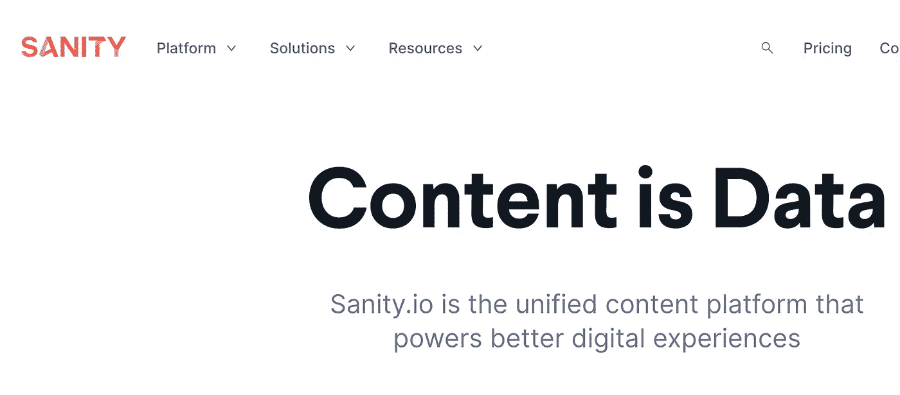

# 什么是 Sanity.io？

> 原文：<https://javascript.plainenglish.io/what-is-sanity-io-c0a58d66342f?source=collection_archive---------2----------------------->


我的一个朋友每天写“本周工作……”博客，记录他在工作中所学到的东西。我总是觉得他的文章很有见地。他激励我也这样做。

上周，我进入了 Next.js。什么是 Next.js，我们为什么要使用它？我想建立一个食谱应用程序，我的大多数入门应用程序都涉及到食物。我对 Next.js 的研究把我带到了 Sanity.io。

Sanity 是一个很棒的 CMS 团队工具，可以在内部使用，也可以在外部为客户使用。我的下一篇博客将关注 Next.js，而这篇博客将关注 Sanity。

让我们看看理智提供了什么。



[https://www.sanity.io/](https://www.sanity.io/)

我使用 localhost:3333 作为后端实现了 Sanity，而我的 Next.js 驻留在 localhost:3000 上。

Sanity 允许您构建您的数据，并具有在界面上编辑图像的能力。这消除了设计图像的大量时间。

对于文本值，您可以设置文本样式或使用简单的文本框，这限制了样式。这可以通过 Next.js 应用程序中的模式来实现。这一切都发生在一个名为 Sanity studio 的界面上。


[https://www.sanity.io/docs/sanity-studio](https://www.sanity.io/docs/sanity-studio)

就像任何好的数据库一样，我们的应用程序需要理解如何将数据从后端翻译到前端。这就是查询语言(GROQ)派上用场的地方。GROQ(图形关系对象查询)是一种声明性语言，旨在查询大量无模式 JSON 文档的集合。它的主要设计目标是表达性过滤，将几个文档合并成一个响应，并调整响应以适应客户端应用程序。

下面的代码片段是我们如何在 Sanity 中访问数据库中的特定值。你可以在这里找到操作符、语法、函数的列表，[https://www.sanity.io/docs/groq](https://www.sanity.io/docs/groq)


下图预览了我们的数据是如何由我们给它的字段生成的。GROQ 允许我们访问应用程序所需的任何值。


要实现健全运行:

```
npm install — global @sanity/cli && sanity init
```

对于 API 设置，我们需要运行以下命令:

```
npm install — save @sanity/client
```

我们需要提供以下信息:

```
const sanityClient = require('@sanity/client')
const client = sanityClient({
  projectId: 'your-project-id',
  dataset: 'bikeshop',
  apiVersion: '2019-01-29', // use current UTC date - see "specifying API version"!
  token: 'sanity-auth-token', // or leave blank for unauthenticated usage
  useCdn: true, // `false` if you want to ensure fresh data
})
```

projectId 是自动生成的，可以在 Studio 帐户的设置中找到。

这篇简短的博客基于我在 Next.js 应用程序中实现 Studio 的经验。在我的下一篇博客中，我将把重点放在使用 Sanity 作为后端来开始使用 next.js。

*更多内容请看*[***plain English . io***](http://plainenglish.io/)*。报名参加我们的* [***免费周报***](http://newsletter.plainenglish.io/) *。在我们的* [***社区***](https://discord.gg/GtDtUAvyhW) *获得独家获得写作机会和建议。*