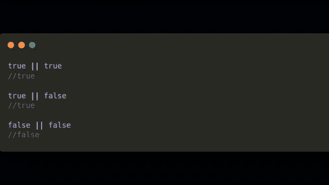

# JavaScript 中的短路计算是什么？

> 原文：<https://javascript.plainenglish.io/what-is-short-circuit-evaluation-in-javascript-f3d5dad82a50?source=collection_archive---------11----------------------->

有时我觉得科技世界充满了术语，但一旦你理解了这个概念，它会帮助你记忆东西。

让我们来理解这个俚语。👇


JavaScript 中有三种逻辑运算符:

*   逻辑与和
*   逻辑或||
*   逻辑不是！

或者给出以下输出:



> 请记住，JavaScript 中的逻辑操作符是从左到右计算的。

“短路”简单来说就是当 JavaScript 对一个 OR 表达式求值时，如果第一个操作数为真，JavaScript 不关心第二个操作数。

如果您运行以下条件:

```
(true || adkjf****##) 
```

JavaScript 将总是返回 true。

# 为什么这很重要？

因为我们可以利用这种短路！

在下面的例子中，我们有一个人对象，他有名字和年龄，但是我们不知道他的工作。我们可以使用||和短路评估来简化这一过程:


这里还有一个例子:


**感谢您的阅读！**

**希望你学到了一些东西。**

*更多内容请看*[***plain English . io***](http://plainenglish.io/)