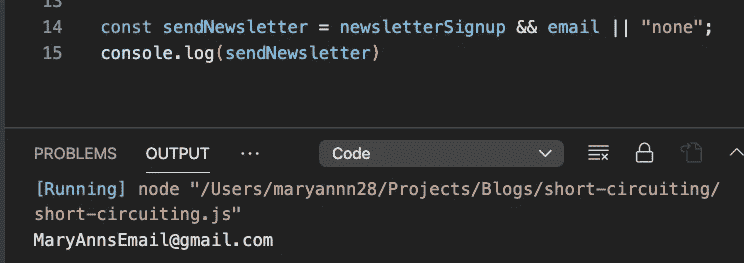

# JavaScript 中的短路是什么？

> 原文：<https://javascript.plainenglish.io/what-is-short-circuiting-in-javascript-745c0aff02c3?source=collection_archive---------14----------------------->

我最近一直在通过使用不同的在线资源和书籍来提高我的 JavaScript 技能。我第一次学习 JavaScript 是在一个紧张的编码训练营，在那里我们有两周的时间尽可能多的学习。

在第三周，我们必须完成一个基于两周知识的项目。可以理解的是，有了这么多的填鸭式教学，忘记某些术语也就不足为奇了。在这种情况下，我知道什么是逻辑运算符，也知道如何使用它们，但是“短路”这个术语完全忘记了，直到我最近遇到它。我已经有太多的“啊哈！”最近的时刻，短路是其中之一。

# 短路？

短路是缩短和简化“如果”语句的书写方式。这与逻辑运算符**&&【AND】**和 **|| (OR)，**一起使用，它们是从左到右求值的表达式。

编码的美妙之处在于没有一种正确的方式来写东西。我见过如此多的变体，结果都是同一个答案，有些只有 10 行长，有些可以用一行表达出来。短路对于消除不必要的“混乱”非常有用。

为了给出一些背景，我将提供每个例子进行比较。

# **或逻辑运算符(|| )**

在上面的 **if/else** 示例中，我们要求用户提供他们的名字，我们将名字存储在 **firstName** 变量中。如果 firstName 是有效的(因为我们输入了“Mary Ann”，所以它是一个“ **truthy** ”值，所以我们可以将它作为他们的用户名。但是，如果用户没有提供名字，我们会说用户的名字只是“guest”。很简单。

嗯，我们可以通过简化这个评估来进一步简化它！

要将 if/else 语句编写为 OR ( ||)逻辑运算符，我们只需编写上面的第 11 行，const username = first name | | " guest "。如果**或||** 或| |**运算符**左边的名字是一个" **truthy"** 值，它将返回一个响应作为用户名。否则，如果 firstName 是“ **falsy** ”(没有提供名字)，它将移动到第二个操作数，也就是 guest，并返回它。

# 逻辑运算符(&&)

使用 AND (&&)逻辑运算符，**左**的条件**和右**的条件**都需要结果为真才能满足条件。使用 AND 逻辑运算符的一个很好的情况是需要检查多个条件。**

另一个真实的例子，假设我们有很多人在我们的网站上购物。在注册过程中，我们可以询问他们是否也想收到简讯。假设我有一个函数，它向所有提供了电子邮件并选中了“发送简讯”复选框的成员发送每周简讯，下面是我们如何编写 if/else 语句。

如果电子邮件的条件为 true**和** newsletterSignup 为真，它会返回他们的电子邮件地址，这样我们就可以给他们发送时事通讯。否则，如果他们标记为假，没有电子邮件…嗯，我们什么也发不了。这很容易，但是有多少代码会堆积起来，这是一个相当令人吃惊的问题。

我们可以使用**和(& &)逻辑运算符来缩短和简化这个过程。**

现在关于结果输出有趣的是，它说“真”而不是我们从 if/else 语句得到的电子邮件。我们把电子邮件和时事通讯放在同一个顺序里，那又怎么样呢？虽然是的，我们想给这个人发送时事通讯，但这不是我们想要存储在 sendNewsletter 变量中的响应。我们想要那封邮件。我们得到 true 的原因是因为返回的值是最后的*值的含义，即停止求值的表达式。*

*为了解决这个问题，我们需要做的就是**切换** " *email* **"** 和 *newsletterSignup"* 来改变我们的条件顺序。我们将首先评估 newsletterSignup 是否真实，然后评估电子邮件是否存在，或者是否真实。因为第二个条件符合这一点，所以它返回最后一个评估的条件，我们将其转换为 email。*

**

*尽管简化我们的代码使事情更容易阅读，但是请记住，条件语句不应该总是这样简化，如果这样做没有意义的话。整个目标是让你的代码更容易理解，更易读，而不是因为。*

*我希望这对你有所帮助！**快乐编码！***

**更多内容请看*[*plain English . io*](http://plainenglish.io/)*