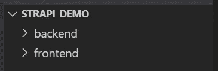
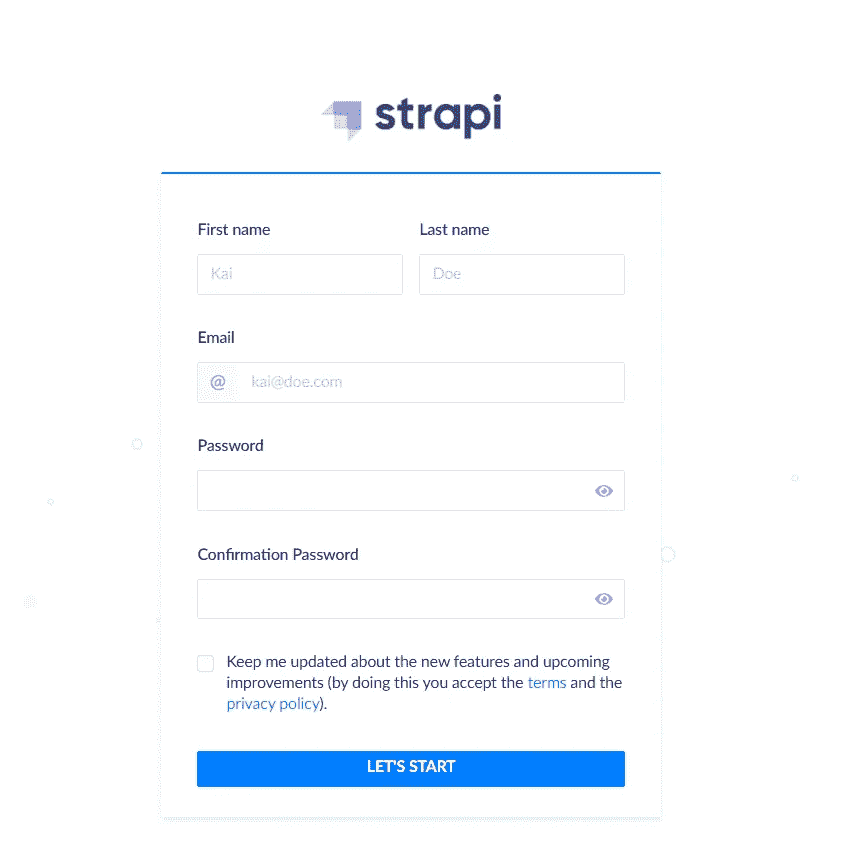

# 什么是 Strapi，为什么您应该使用它

> 原文：<https://javascript.plainenglish.io/what-is-strapi-and-why-you-should-use-it-ce4e653f5c6e?source=collection_archive---------2----------------------->

## Strapi 是一个用于连接前端和后端的无头 CMS。


Photo by [Christina @ wocintechchat.com](https://unsplash.com/@wocintechchat?utm_source=medium&utm_medium=referral) on [Unsplash](https://unsplash.com?utm_source=medium&utm_medium=referral)

前一年，我刚开始写博客的时候。我想为我的内容创建一个博客。所以我花了几天时间在网上研究开博客的最佳方式。

我遇到过 WordPress、MERN·斯塔克、Gatsby、Strapi、Ghost、React、Wix、Hashnode、Medium、Vocal、Newsbreak、Quora 等等。

是的，我知道这对于写博客来说有点多，但是我已经做到了。

其中最好的方式是从 WordPress.org，因为它是快速和免费的。从这里，我了解了斯特拉皮。

# **为什么要用 Strapi？**

假设你想从 React.js 开始一个博客，你不知道后端的东西，比如 Node，Express，Ruby on Rails。因此您可以使用 Strapi 来实现这一点。

但是为什么我必须使用后端呢？管理您博客上的内容。你听说过 CMS(内容管理系统)。

假设你想写内容，并把它添加到草稿或出版它。为此，我们需要后端。这就是斯特拉皮的诞生。

让我们再举一个例子来解释:你是一个自由职业者，一个客户想要创建一个商业网站。您同意这一点，但客户希望每周管理内容。因此您可以使用 Strapi 来管理内容。

Strapi 可以帮助你在几分钟内完成后端，你只需要关心前端。

Strapi 也可以用于各种其他项目。

# 但是，什么是 Strapi？

Strapi 是一个开源的无头 CMS，用 api 连接你的前端和 Strapi 的后端。

这是一项面向开发者的开源免费服务。

您可以轻松了解 Strapi，并在几分钟内完成工作。

看一遍这个视频，你会在 3 分钟内完全成为一名职业选手。

可以用 React，Vue，Nuxt.js，Next.js，Angular，Svelte，Sapper，Flutter，把 Strapi 整合进去。

# Strapi 入门

Strapi 可以通过终端安装。创建一个名为 strapi_demo 的文件夹，并在其中创建两个文件夹，分别作为前端和后端。



Source: Author

React、Angular、Nuxt 或 Vue 将进入前端文件夹。我们将在后端文件夹中安装 Strapi。

打开您喜欢的代码编辑器，在终端中编写以下命令。

```
cd backend
```

cd 后端会将目录更改到后端文件夹。

现在将 Strapi 安装到您的项目中。

```
npx create-strapi-app **./** --quickstart
```

或者使用纱线。

```
yarn create strapi-app **./** --quickstart
```

该命令将帮助您将 strapi 安装到项目中。

命令中的`**./**`将帮助您在当前文件夹中安装 Strapi。`--quickstart`是一个有助于快速启动 Strapi 的标志。

根据你的网速，这需要时间。

完成安装后，您将被转移到本地主机:1337。你会看到一张类似的登记表。



Source: Author

写下你的名字，并填写其他细节。就是这样。

您可以通过观看下面的视频来启动 Strapi。

Source: YouTube

我们创建了一个 Strapi 项目。现在让我们在前端工作。

我们已经创建了一个 strapi_demo，并在其中创建了两个文件夹。

```
cd frontend
```

在这里你可以使用任何像 React，Angular，Vue.js 这样的框架或者库。

从后端文件夹获取数据。你可以使用 Axios 或者 JavaScript 中的 fetch。

让我们使用 Axios。为此，我们必须安装 Axios。

确保您在前端文件夹中。

```
npm install axios
```

现在你可以从后端获取数据。

```
import axios from 'axios';

axios.get('http://localhost:1337/').then(response => {
  console.log(response);
});
```

您还可以使用 post 请求向前端添加数据。

```
import axios from 'axios';

axios
  .post('http://localhost:1337/', {
    name: 'Nitin Sharma',
    description: 'A Web Developer writing content on Medium',
    categories: [6],
  })
  .then(response => {
    console.log(response);
  });
```

# 接下来呢？

Strapi 提供了一个格式良好的文档。转到 [Strapi 的文档](https://strapi.io/documentation/developer-docs/latest/getting-started/quick-start.html#_9-consume-the-content-type-s-api)了解更多信息。

使用 React、Angular、Vue 等来使用您的 API 有多种来源。

[*如果你喜欢看这样的故事，并想帮助我成为一名作家，可以考虑成为一名中等会员*](https://nitinfab.medium.com/membership) *。它每月花费 5 美元，给你* [*无限制访问媒体内容*](https://nitinfab.medium.com/membership) *。如果你通过我的链接注册，我会得到一点佣金。*

就这些——谢谢。