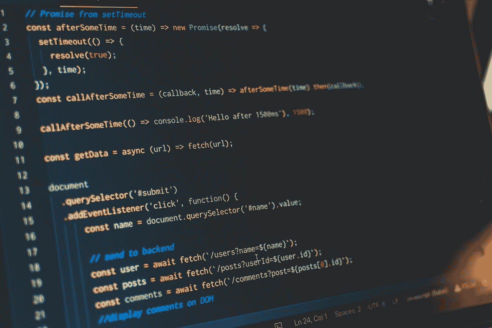

# JavaScript 中的 Symbol.for 是什么？

> 原文：<https://javascript.plainenglish.io/what-is-symbol-for-in-javascript-e91b93f9d9ad?source=collection_archive---------16----------------------->



Photo by [Pankaj Patel](https://unsplash.com/@pankajpatel?utm_source=medium&utm_medium=referral) on [Unsplash](https://unsplash.com?utm_source=medium&utm_medium=referral)

`Symbol.for`是 JavaScript 中`Symbol`的内置方法。是为了什么，`Symbol`和`Symbol.for`有什么区别？

# 符号. for

像 Symbol 一样，`Symbol.for`也总是为给定的键返回一个`Symbol`。与`Symbol`不同的是`Symbol.for`将返回相同的`Symbol`,如果密钥被注册一次的话。当第一次调用`Symbol.for(key)`时，一个带有给定键的`Symbol`将被生成并存储在全局符号注册表中。它变成了全球性的`Symbol`。

这是两者的区别。

用`Symbol`

```
let symbol1 = Symbol('foo');
let symbol2 = Symbol('foo');symbol1 === symbol2   // false
```

但是用`Symbol.for`

```
let symbol1 = Symbol.for('foo');
let symbol2 = Symbol.for('foo');symbol1 === symbol2   // true
```

下面是解释。

```
// the symbol `foo` doesn't exist, a symbol is created.
let symbol1 = Symbol.for('foo');// the symbol `foo` has been created and registered, so return it.
let symbol2 = Symbol.for('foo');// both are the same symbol
symbol1 === symbol2 // true
```

# Symbol.keyFor

这是`Symbol.for`的反向调用。当`Symbol.for(key)`创建一个全局符号时，`Symbol.keyFor(key)`返回该符号的键名。

```
let symbol1 = Symbol.for('foo');Symbol.keyFor(symbol1);  // 'foo'
```

`Symbol.keyFor`不要返回本地符号的名称。而是返回`undefined`。

```
let globalSymbol = Symbol.for('foo');
let localSymbol = Symbol('foo');Symbol.keyFor(globalSymbol);  // 'foo'
Symbol.keyFor(localSymbol);  // undefined
```

# 最后

符号保证是唯一的。它通常用作对象的属性键，这样属性就不会互相破坏。在现代的库/框架中，比如`React`、`node-Redis`等等，符号被大量使用来标识不同的属性和类型。大多数浏览器都支持它，除了 IE。如果你想知道你的浏览器上是否有，你可以在[的网站上查看。](https://caniuse.com/?search=symbol)

感谢您的阅读。

*更多内容请看*[***plain English . io***](http://plainenglish.io)