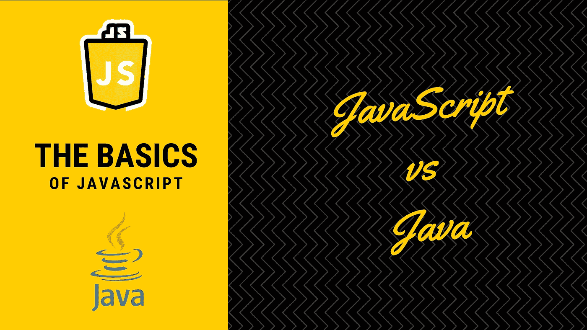
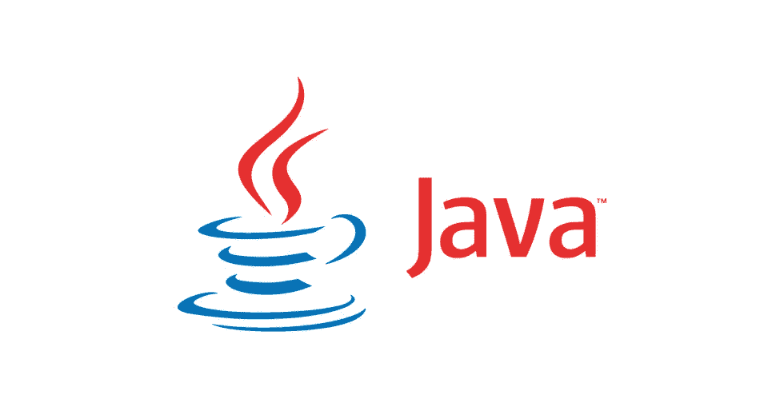

# Java 和 JavaScript 有什么区别？

> 原文：<https://javascript.plainenglish.io/what-is-the-difference-between-java-and-javascript-3af8cbc4b1ba?source=collection_archive---------13----------------------->

## JavaScript 基础知识

## 开始编程时，你需要问自己的唯一答案是 Java 和 JavaScript 相关的。

好吧，这篇文章旨在回答这个在 IT 界新人中非常流行的答案。

如果你问自己这个问题，你可能开始编程，并考虑选择合适的语言。我们会发现这不是真正的问题。

两者都是编程语言，它们实现了相同的目标，即使用编程来自动化一些任务。

# JavaScript 是什么？

JavaScript 是一种轻量级编程语言(“脚本语言”)，大部分时间用于使网页具有交互性。您还可以使用非常流行的 NodeJS 在服务器端使用 JavaScript。

这是 JavaScript 的主要优势，它可以在各种平台上运行:浏览器、服务器、物联网，甚至移动设备。

通过编写脚本，这意味着代码可以在运行时序列化和执行(但是，有一种缓存机制可以优化引擎内部的运行时性能)

# Java 是什么？

Java 是一种面向对象的编程语言。Java 承诺，“一次编写，随处运行”。

这要归功于**一个虚拟机平台**，它允许你创建可以在几乎所有平台上运行的编译程序。

这是一种非常流行的语言，广泛应用于工业界，尤其是银行业。

# JavaScript 和 Java 的区别

## 静态类型和编译

**Java** 是一种强类型语言，这意味着你应该给它们一个类型，并在使用之前声明它们。在 Java 中，变量的类型在编译时被检查。Java 只能用机器码编译运行，强制编译。

**JavaScript** 具有弱类型化，你可以在运行时改变变量并将其重新分配给不同的类型。这也导致了一个常见的问题，当你期望一个变量是一个数字，而它是一个字符串。

打字稿有助于这种衔接。

JavaScript 代码只是文本，由引擎在运行时解释和缓存。这有一些好处，比如“空中”更新或代码的延迟加载

## 范例

*   Java 只面向对象，所有代码都是使用类编写的，并在运行时给出对象实例。
*   **另一边的 JavaScript** 本来是设计成使用函数和原型的函数式语言。

现在有一些类不像它们的 Java 版本那样高级，但是允许某种面向对象编程(OOP)。

使用 [Typescript](https://www.typescriptlang.org/) ，您可以模拟类型化和封装的行为。

您有更多的自由，也更容易使用 JSON，这是世界上最常用的数据格式。但是请记住，编写代码的方式要保持一致。

## 并发

*   **Java** 使用线程来管理并发性，当程序增长时会变得复杂，需要在线程间同步数据。
*   **JavaScript** 使用事件来管理并发性，它是一种单线程语言，使用某种队列(称为事件循环)来处理操作。您可以通过在多个线程上启动同一个应用程序来模仿多线程(以 web 服务器集群为例)

# 我应该从 Java 还是 JavaScript 开始比较好？

一般来说，我只能建议学习面向对象编程来学习编码的最佳实践。

*   **Java** 给了你一个你需要尊重的环境，这是非常值得学习的。

Java 总体上有很好的性能，通过确保类型，它对代码有很强的信心。

你可以在服务器端、桌面上使用它，也可以在 Android 上使用。

*   JavaScript 更加狂野，因为你可以自由地做任何你想做的事情，这要归功于无需打字和处理类和函数的能力。

JavaScript 驱动了网络和几乎所有的网页。你也可以在服务器端使用 [NodeJS](https://nodejs.org/en/) ，在桌面上使用[electronic](https://www.electronjs.org/)，或者在移动应用上使用类似 [React Native](https://reactnative.dev/) 的东西。

两种语言都很好，你应该都学。你可以在这里学习 Java，尽管就设置和知识而言，从 JavaScript 开始可能更容易。

[**🇫🇷为法国人🥖我提议将⚡️编码 Spark 和 abonner 合并成一份新闻简报，以收取相关技术的费用**！](https://codingspark.io/?referral=medium)

*更多内容请看*[***plain English . io***](http://plainenglish.io)