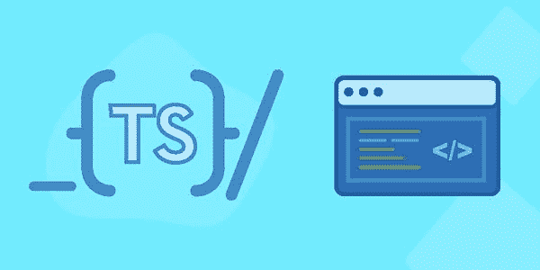

# TypeScript 中类型和接口的区别是什么？

> 原文：<https://javascript.plainenglish.io/what-is-the-difference-between-type-and-interface-in-typescript-d41719acad22?source=collection_archive---------3----------------------->

***TLDR；*** `*interface*` *是一种描述数据的方式***，比如一个物体。与接口不同，* `*type*` *可以为任何类型引入名称，包括原语、联合和交集类型。**

**

# *什么是接口？*

*界面看起来像这样:*

*The definition and usage of a newly created interface “Human”*

*上面我们定义了一个名为`Human`的接口，然后用它创建了一个变量`james`。接口在某种程度上是有用的，因为我们可以始终确保我们创建的对象具有相同的形状(属性)。如果我们碰巧用接口`Human`创建了一个不同形状的变量，TypeScript 会显示一个错误。*

*TypeScript error when the variable doesn’t match the defined interface*

*够简单吗？很好，我们继续。*

# *什么是类型？*

*当创建一个`type`时，你实际上并没有创建一个新的*类型*，你是在为一个类型创建一个新的**名称**，这就是为什么它被称为[类型别名](https://www.typescriptlang.org/docs/handbook/advanced-types.html#type-aliases)。*

*在你感到困惑之前，这里有一个类比:*

*本有一台笔记本电脑，但他不称之为笔记本电脑，而是称之为他的 ***代码制作者*** *，因为本就是那样的急躁。**

*从上面我们可以看到，type `Laptop`和`CodeMaker`的属性完全一样。为什么我们需要创造另一种具有完全相同属性的类型，就因为本想像其他人一样称它为“代码制造者”而不是笔记本电脑？这不太公平。*

*约翰说:“如果本把他的笔记本电脑叫做**，那么我想把我的笔记本电脑叫做***”。****

**This does not look very efficient at all…**

**好吧，在你开始尖叫“说重点！”别担心，我快到了。所以现在我们有三个不同的名字，本质上描述同一件事。让我们简化一下，做一些`type`能做而`interface`不能做的事情。**

**Ben 和 John 不需要定义`Laptop` 3 次，他们可以创建`Laptop`的类型别名，并随意命名。当然，即使他们给他们的笔记本电脑取了不同的名字，它毕竟还是一台笔记本电脑。所以下面这条线是完全合法的。**

```
**const benAndJohnsLaptops: Laptop[] = [bensLaptop, johnsLaptop]**
```

***与总是引入命名对象类型的接口声明不同，一个* ***类型别名声明*** *可以引入任何类型的名称，包括原语、并集和交集类型。***

**我们也可以给[原始类型](https://www.typescriptlang.org/docs/handbook/basic-types.html)一个类型别名，这是`interface`做不到的。以以下示例为例:**

**Creating a type alias for a primitive type**

# **接口与类型**

**下面是接口可以做什么和类型可以做什么的快速分解。**

## **1.两者都支持继承，尽管语法不同**

## **2.接口支持合并声明，而类型不支持**

## **3.类型支持为基元类型、联合和元组创建别名。接口不**

## **那么…我什么时候应该使用**界面**以及什么时候应该使用**类型**？**

**首先想想你想先实现什么，然后决定用哪一个。你需要遗产吗？接口。需要为基本类型创建别名吗？键入。需要[合并申报](https://www.typescriptlang.org/docs/handbook/declaration-merging.html)吗？接口。**

**我是否帮助您理解了接口和类型之间的区别？请一定在评论中告诉我。如果我没有，让我知道我错过了什么，我会尽力而为。**

## **进一步阅读**

*   **[打字稿文档-界面](https://www.typescriptlang.org/docs/handbook/interfaces.html)**
*   **[类型脚本-接口与类型别名的比较](https://www.typescriptlang.org/docs/handbook/advanced-types.html#interfaces-vs-type-aliases)**