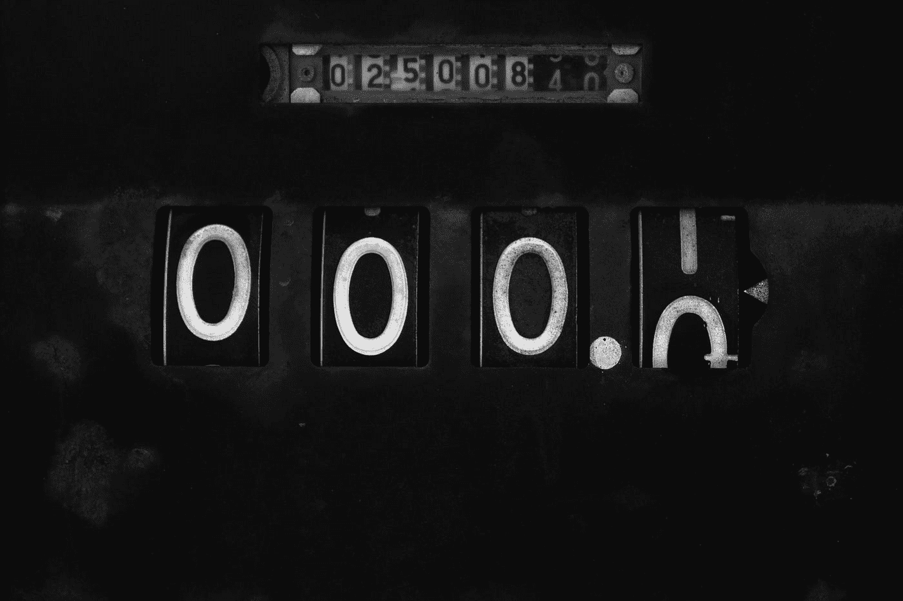

# 什么是浮点精度误差？

> 原文：<https://javascript.plainenglish.io/what-is-the-floating-point-precision-error-20c84072eed6?source=collection_archive---------8----------------------->



Photo by [Scott Rodgerson](https://unsplash.com/@scottrodgerson?utm_source=medium&utm_medium=referral) on [Unsplash](https://unsplash.com?utm_source=medium&utm_medium=referral)

如果您熟悉 JavaScript 或任何其他编程语言，您可能会遇到这样的问题:

```
***console***.***log***(**0.1** * **0.2**) 
// Returns 0.020000000000000004
// Should return 0.02
```

尽管`0.1 * 0.2`等于 0.02，我们还是以某种方式得到了这个长数字，并以一个随机数字结尾。这是怎么回事？JavaScript 坏了吗？我们对数学的理解错了吗？实际上，这就是所谓的浮点精度误差。

# 二进制如何不同地处理数字

在我们日常生活中使用的正常基数 10 中，我们可以将一个数字(如 0.1)表示为一个有限的数字——也就是说，它可以表示到一位小数。然而，如果我们试图把它写成二进制，我们会得到一些奇怪的东西:

```
**0.0001100110011001101** ... repeats to infinity
```

所以二进制中的 0.1 是一个重复的十进制。这意味着，如果我们对这个数字进行四舍五入，比如说，四舍五入到 4 位小数，我们得到 0.0001，当我们转换回以 10 为基数时，就是 1/16，与原始值 1/10 略有不同。

# 什么是浮点

在计算中，准确性和性能之间存在一种平衡。为了试图建立一种平衡，一个小组提出了一种被称为浮点的标准类型，它是由 IEEE 754 T2 标准定义的。

这需要一个数字，比如 0.1，用二进制表示。正如您可能已经猜到的那样，由于 0.1 是二进制中重复的十进制数，所以浮点表示将 0.1 限制在特定的小数位数。其表示如下所示:

```
SIGN | EXPONENT | MANTISSA
**0**      01111011   **10011001100110011001101**
```

32 位浮点类型用科学记数法表示我们的数字，过去您可能已经看到它显示为 1 x 10–4。对于二进制，我们使用 x2，因为它的基数是 2，所以一个例子是 1 x2–4。因此，浮点二进制表示被分成几部分:

*   第一个数字是符号，所以如果是负数，它就是 1。
*   接下来的 8 个数字是指数，也就是 x 2 的乘方。
*   接下来的 23 位是尾数，也就是乘以 x 2 的数字。

这给了我们一个平衡，我们可以参考大量的数字，同时仍然有一个良好的性能。

# 回到 0.1

在我们的浮点记数法中，我们将二进制中的 0.1 限制在特定的小数位数。我们转换成二进制的数学符号如下所示:

```
SIGN | EXPONENT | MANTISSA
**0**      01111011   **10011001100110011001101**# is the equivalent in mathematical notation of ...
**1.600000023841858** * **2**^-4
```

如果你把 1.600000023841858 x 2–4 输入谷歌，你会得到 0.10000000149 的值。正如我们所说，由于二进制以不同的方式表示数字，这意味着某些数字在正常情况下不会以 10 为基数时会重复小数，当我们试图以二进制表示它们时，我们必须将它们四舍五入到一定数量的小数。

当我们回到以 10 为基数时，这种舍入就出现了，这意味着我们曾经精确的以 10 为基数的数字现在是 0.10000000149。现在，如果我们试图在计算中使用它，我们会得到一个舍入误差，这就是为什么`console.log(0.1 * 0.2)`返回 0.0200000000000000004。

# 我能避免它吗？

有些语言有十进制数据类型，这是解决这个问题的一种方法。但是，你不一定需要这个。对于像这样的简单错误，您可以将数字四舍五入到所需的十进制长度。总的来说，这是计算机试图平衡速度和性能的一个有趣的例子。

如果你关注 Javascript，有一个新的标准被提出来试图解决这个问题，它可以在 GitHub 上找到。

*更多内容尽在*[*plain English . io*](http://plainenglish.io/)