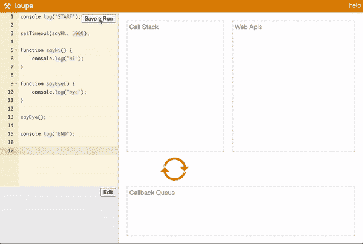

# JavaScript 事件循环如何工作

> 原文：<https://javascript.plainenglish.io/what-is-the-javascript-event-loop-84d21ef276ee?source=collection_archive---------3----------------------->

## 看看调用栈、Web APIs 和回调队列是如何协同工作的

[Loupe](http://latentflip.com/loupe/?code=JC5vbignYnV0dG9uJywgJ2NsaWNrJywgZnVuY3Rpb24gb25DbGljaygpIHsKICAgIHNldFRpbWVvdXQoZnVuY3Rpb24gdGltZXIoKSB7CiAgICAgICAgY29uc29sZS5sb2coJ1lvdSBjbGlja2VkIHRoZSBidXR0b24hJyk7ICAgIAogICAgfSwgMjAwMCk7Cn0pOwoKY29uc29sZS5sb2coIkhpISIpOwoKc2V0VGltZW91dChmdW5jdGlvbiB0aW1lb3V0KCkgewogICAgY29uc29sZS5sb2coIkNsaWNrIHRoZSBidXR0b24hIik7Cn0sIDUwMDApOwoKY29uc29sZS5sb2coIldlbGNvbWUgdG8gbG91cGUuIik7!!!PGJ1dHRvbj5DbGljayBtZSE8L2J1dHRvbj4%3D) by Philip Roberts will be used for demonstrations

**事件循环**是 JavaScript 在浏览器中用来处理多段代码执行的系统。它由调用栈、Web APIs 和回调队列组成。它负责赋予 JavaScript 异步编程能力。

JavaScript 是一种单线程的异步语言，具有基于“运行到完成”事件循环的并发模型…等等，什么？继续读下去，希望在你读完的时候，这句话会有意义。

*必备知识:基本的 JS 函数、console.logs 和*[*Web API*](https://developer.mozilla.org/en-US/docs/Web/API)*如 setTimeout 和 addEventListener。*

## 我们来分解一下

**单线程:**当我们说 JavaScript 是单线程语言时，这意味着它一次只能“处理”一个命令，从上到下。

**异步:**等等，JavaScript 怎么可能是异步单线程的？嗯，从技术上讲，浏览器及其 Web APIs 赋予了 JavaScript 异步能力；语言本身实际上没有这种能力。异步函数允许代码稍后运行(在我们的回调队列中),否则会降低 web 应用程序的加载速度。

**“运行至完成”:**这告诉我们，在下一个函数执行之前，每个 JavaScript 函数都将完整运行。如果一个函数需要很长时间运行，web 应用程序基本上会暂停，等待它完成，然后继续下一个函数。这就是所谓的“阻塞堆栈”。浏览器及其异步 Web APIs 稍后将帮助我们解决这个问题。

**调用堆栈:**这是一个堆栈(是的，就像[堆栈](https://www.studytonight.com/data-structures/stack-data-structure)数据结构一样)，代码在这里一步一步执行。JavaScript 函数以后进先出的顺序添加(push())和移除(pop())到堆栈中。JavaScript 中只有一个调用栈，这就是为什么它是单线程的。像 Java 这样的多线程语言可以有很多栈同时运行代码。在调用堆栈运行完所有同步 JavaScript 之前，浏览器中呈现的页面不会是交互式的，理解这一点很重要。

**Web API:**这些异步调用(即 addEventListener、setTimeout)由浏览器提供，为 JavaScript 引擎提供额外的功能。将 Web API 推送到调用堆栈后，它将被发送到一个单独的 Web API 容器，一旦触发了一个动作(即“点击”事件、计时器结束、HTTP 请求)，回调函数将被添加到回调队列中。

**回调队列:**这是一个[队列](https://www.geeksforgeeks.org/queue-data-structure/)数据结构，它以 FIFO(先进先出)的顺序添加来自 Web APIs 的回调函数。在调用栈运行完所有的同步 JavaScript 之后，回调队列一次一个函数地出队到调用栈上，然后执行。

## 同步调用堆栈示例

让我们看看正在运行的一些同步代码。本例中只使用了调用堆栈:

[Loupe](http://latentflip.com/loupe/?code=JC5vbignYnV0dG9uJywgJ2NsaWNrJywgZnVuY3Rpb24gb25DbGljaygpIHsKICAgIHNldFRpbWVvdXQoZnVuY3Rpb24gdGltZXIoKSB7CiAgICAgICAgY29uc29sZS5sb2coJ1lvdSBjbGlja2VkIHRoZSBidXR0b24hJyk7ICAgIAogICAgfSwgMjAwMCk7Cn0pOwoKY29uc29sZS5sb2coIkhpISIpOwoKc2V0VGltZW91dChmdW5jdGlvbiB0aW1lb3V0KCkgewogICAgY29uc29sZS5sb2coIkNsaWNrIHRoZSBidXR0b24hIik7Cn0sIDUwMDApOwoKY29uc29sZS5sb2coIldlbGNvbWUgdG8gbG91cGUuIik7!!!PGJ1dHRvbj5DbGljayBtZSE8L2J1dHRvbj4%3D)

如您所见，我们从顶部开始，首先将 console.log("START ")发送到调用堆栈。它在运行后被删除。然后我们向下移动到被调用的 sayHi 函数。将该函数添加到堆栈中，然后将其中的 console.log 添加到该函数的顶部并执行。每个都按 FIFO 顺序删除，并使用 sayBye()重复相同的步骤。最后一次运行的代码是 console.log("END ")，然后被删除，我们的堆栈再次为空，因为它已经完成了代码的运行。

让我们增加一些复杂性(但仍然没有异步 Web APIs)来更好地理解调用栈如何运行代码。如果一个函数在另一个函数内部被调用，会发生什么？看一看:

[Loupe](http://latentflip.com/loupe/?code=JC5vbignYnV0dG9uJywgJ2NsaWNrJywgZnVuY3Rpb24gb25DbGljaygpIHsKICAgIHNldFRpbWVvdXQoZnVuY3Rpb24gdGltZXIoKSB7CiAgICAgICAgY29uc29sZS5sb2coJ1lvdSBjbGlja2VkIHRoZSBidXR0b24hJyk7ICAgIAogICAgfSwgMjAwMCk7Cn0pOwoKY29uc29sZS5sb2coIkhpISIpOwoKc2V0VGltZW91dChmdW5jdGlvbiB0aW1lb3V0KCkgewogICAgY29uc29sZS5sb2coIkNsaWNrIHRoZSBidXR0b24hIik7Cn0sIDUwMDApOwoKY29uc29sZS5sb2coIldlbGNvbWUgdG8gbG91cGUuIik7!!!PGJ1dHRvbj5DbGljayBtZSE8L2J1dHRvbj4%3D)

答案是肯定的。在其他函数内部调用的函数将在堆栈中运行，然后在完成调用它们的函数中的代码之前运行完成。请注意 sayWhatsUp 函数在调用堆栈中是如何堆叠在 sayHi 函数之上的。

## 异步 Web API 示例

我们先来看看 setTimeout Web API。如您所知，setTimeout 有两个参数，一个回调函数和一个回调执行前的时间(毫秒)。让我们看看当我们将 sayHi 函数作为 setTimeout 的回调函数传入时会发生什么:

[Loupe](http://latentflip.com/loupe/?code=JC5vbignYnV0dG9uJywgJ2NsaWNrJywgZnVuY3Rpb24gb25DbGljaygpIHsKICAgIHNldFRpbWVvdXQoZnVuY3Rpb24gdGltZXIoKSB7CiAgICAgICAgY29uc29sZS5sb2coJ1lvdSBjbGlja2VkIHRoZSBidXR0b24hJyk7ICAgIAogICAgfSwgMjAwMCk7Cn0pOwoKY29uc29sZS5sb2coIkhpISIpOwoKc2V0VGltZW91dChmdW5jdGlvbiB0aW1lb3V0KCkgewogICAgY29uc29sZS5sb2coIkNsaWNrIHRoZSBidXR0b24hIik7Cn0sIDUwMDApOwoKY29uc29sZS5sb2coIldlbGNvbWUgdG8gbG91cGUuIik7!!!PGJ1dHRvbj5DbGljayBtZSE8L2J1dHRvbj4%3D)

我们的 setTimeout 函数在调用堆栈中处理后被发送到 Web APIs 容器。3000 毫秒(3 秒)后，回调 sayHi()被发送到回调队列，在那里等待同步代码结束运行，然后出队并在调用堆栈中运行。需要注意的是:我们设置的 3000 ms 时间是回调运行之前的最短时间。如果当 3000 毫秒结束时，我们的同步代码仍在调用堆栈中执行，则回调仍必须等到所有代码完成后，才能发送到调用堆栈。让我们将 setTimeout 时间设置为 0，并查看实际情况:

[Loupe](http://latentflip.com/loupe/?code=JC5vbignYnV0dG9uJywgJ2NsaWNrJywgZnVuY3Rpb24gb25DbGljaygpIHsKICAgIHNldFRpbWVvdXQoZnVuY3Rpb24gdGltZXIoKSB7CiAgICAgICAgY29uc29sZS5sb2coJ1lvdSBjbGlja2VkIHRoZSBidXR0b24hJyk7ICAgIAogICAgfSwgMjAwMCk7Cn0pOwoKY29uc29sZS5sb2coIkhpISIpOwoKc2V0VGltZW91dChmdW5jdGlvbiB0aW1lb3V0KCkgewogICAgY29uc29sZS5sb2coIkNsaWNrIHRoZSBidXR0b24hIik7Cn0sIDUwMDApOwoKY29uc29sZS5sb2coIldlbGNvbWUgdG8gbG91cGUuIik7!!!PGJ1dHRvbj5DbGljayBtZSE8L2J1dHRvbj4%3D)

这清楚地展示了回调队列是如何直到调用栈为空时才运行的，即使 setTimeout 函数已经超时。

让我们看一个例子，看看“阻塞”是如何在调用栈中发生的，以及 Web APIs 如何帮助解决这个问题。让我们的 sayBye 函数说三次“再见”。我们将添加一个带有 click 事件监听器的按钮，每当它被点击时，监听器记录“我被点击了”。在添加事件侦听器之前，我们将调用 sayBye3Times 函数:

[Loupe](http://latentflip.com/loupe/?code=JC5vbignYnV0dG9uJywgJ2NsaWNrJywgZnVuY3Rpb24gb25DbGljaygpIHsKICAgIHNldFRpbWVvdXQoZnVuY3Rpb24gdGltZXIoKSB7CiAgICAgICAgY29uc29sZS5sb2coJ1lvdSBjbGlja2VkIHRoZSBidXR0b24hJyk7ICAgIAogICAgfSwgMjAwMCk7Cn0pOwoKY29uc29sZS5sb2coIkhpISIpOwoKc2V0VGltZW91dChmdW5jdGlvbiB0aW1lb3V0KCkgewogICAgY29uc29sZS5sb2coIkNsaWNrIHRoZSBidXR0b24hIik7Cn0sIDUwMDApOwoKY29uc29sZS5sb2coIldlbGNvbWUgdG8gbG91cGUuIik7!!!PGJ1dHRvbj5DbGljayBtZSE8L2J1dHRvbj4%3D)

如您所见，调用堆栈被所有在 say by 3 次中调用的 console.logs 阻塞，因此我们的 click 侦听器没有被实例化，我们的单击被忽略。让我们看看如何使用异步 Web API setTimeout 来改进这一点:

通过将 sayBye3Times 函数放在 setTimeout 函数中并使其异步，我们的事件侦听器不再被阻止进入调用堆栈，并可以被发送到 Web APIs 容器进行实例化。现在，即使在执行 sayBye3Times 功能时，也可以记录我们的点击。

## 结论

现在，这似乎更有意义了: *JavaScript 是一种单线程的异步语言，它的并发模型是基于“运行到完成”事件循环的。*

感谢您的阅读，请随时在 [LinkedIn](https://www.linkedin.com/in/kylefarmer85/) 上与我联系！

*更多内容尽在*[*plain English . io*](http://plainenglish.io/)