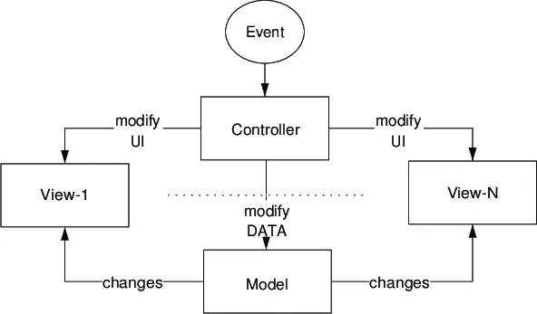

# 什么是模型视图控制器(MVC)？

> 原文：<https://javascript.plainenglish.io/what-is-the-model-view-controller-mvc-d4d51b642565?source=collection_archive---------10----------------------->

## MVC 的初学者友好解释。

Photo by [Per Lööv](https://unsplash.com/@perloov?utm_source=medium&utm_medium=referral) on [Unsplash](https://unsplash.com?utm_source=medium&utm_medium=referral)

我知道你们大多数人都听说过并熟悉这个概念。在本文中，我们将看看什么是 MVC，并以一种初学者友好的方式揭开它的神秘面纱。

MVC 是模型视图控制器的首字母缩写。

模型视图控制器是最常用的软件架构设计模式之一。

这个概念非常有用，因为它主要促进了有组织的编程，并将应用程序功能和架构分开。

模型视图控制器设计模式将应用程序架构分为三个部分，主要是模型、视图和控制器。这三个主要部分协调工作，以确保一个简单高效的应用程序架构。

这种设计模式最初是在 20 世纪 70 年代早期为桌面计算开发的，但是随着时间的推移，它已经被广泛地用作开发 web 应用程序的设计模式。

MVC 表示模型。

Image from [Research Gate](https://www.researchgate.net/profile/Jan-Wielemaker/publication/254852917/figure/fig3/AS:669454635630607@1536621831811/Model-View-Controller-MVC-design-pattern-Controllers-modify-UI-aspects-of-a-view.png)

## **型号**

模型是包含数据逻辑的地方。

模型负责管理应用程序的数据、逻辑和规则。

该模型还确保了与数据库的交互。
模型还负责与控制器的高效通信。

根据相关的框架，模型有时可以负责更新视图。

## **查看**

视图负责确保 UI 对最终用户可见。

应用程序架构的这个组件还负责与控制器通信。

视图主要由 HTML 和 CSS 组成。

## **控制器**

应用程序设计模式的这个组件接收来自用户的输入，比如用户单击链接或访问页面。

视图或 URL，并使用这些信息来处理请求(PUT、GET、DELETE 和 POST)。

控制器从模型接收数据，并将这些信息传递给视图。

在传递该信息之后，控制器将把该信息传递给视图，以便呈现给用户。

大多数通用框架都实现了 MVC 的使用。

实现使用这种设计模式的一些框架包括:

*   烧瓶(蟒蛇皮)
*   Django (Python)
*   Laravel(PHP)
*   快递(JS)
*   主干(JS)
*   Ruby on Rails(Ruby)
*   辛纳特拉(红宝石)
*   代码点火器(PHP)

这些是实现该框架使用的一些框架。

我希望这篇文章简单地解释了 MVC 是如何工作的。如果你觉得这篇文章有帮助，请不要犹豫，与他人分享。

## **更多阅读:**

 [## 算法和数据结构挑战—实现冒泡排序

### JavaScript 中的冒泡排序挑战 freeCodeCamp 的一个面试准备问题的解决方案。

javascript.plainenglish.io](/algorithm-and-data-structure-challenge-implementing-bubble-sort-34403eecc87)  [## 你应该知道的 8 种 JavaScript 数组方法

### JavaScript 中的数组方法你需要用例子来了解。

javascript.plainenglish.io](/8-javascript-array-methods-you-should-know-81947c9e46de) 

*更多内容看*[***plain English . io***](http://plainenglish.io/)