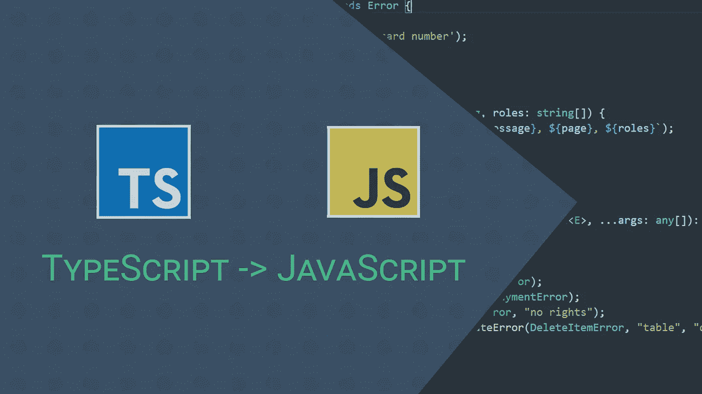

# 使用 TypeScript 最痛苦的是什么？

> 原文：<https://javascript.plainenglish.io/what-is-the-most-painful-part-of-using-typescript-62c3a7c4d9c5?source=collection_archive---------17----------------------->

## **一般使用 TypeScript 最痛苦的部分是什么？**

处理来自 JavaScript 的值。

## **为什么？**

对来自输入源(比如 html 表单)的值感到困难的原因是**你事先没有确切的数据类型**。我的意思是，你不能用输入值来写函数，因为输入值可以是任何东西，另一个函数，一个数字，一个字符串，一个对象，或者其他任何东西。这就是为什么许多程序员在这种情况下尽量避免使用名为“any”的类型。一个具有高级 TypeScript 知识的软件开发人员从不使用“any”类型，因为这等于根本不使用 TypeScript，而只是编写本地 JavaScript。

问题很明显:**有什么方法可以将一个 JavaScript 值放入 TypeScript 上下文中？**简短的回答是:是的。详细答案，我们来看一个例子:

您有一个输入值——不管它来自什么源——您希望对它使用 TypeScript 上下文。但是如何将未知类型的输入值传递给 TypeScript 提供的类型系统呢？这是一个经常被误解的过程，虽然流程非常简单。

首先，让我们明确我们的目标是什么。在 JavaScript 中，大多数情况下我们需要一些值级验证。多亏了所谓的“动态类型系统”，我们可以在运行时做到这一点。您不需要为此键入脚本。在这种情况下，JavaScript 的缺点是我们在运行之前没有类型信息，因为这种语言没有静态类型系统。这正是 TypeScript 对我们工作的贡献。TypeScript 只有一个静态类型系统，这意味着它将存在于我们的程序中，直到我们编译它。结合使用 TypeScript 提供的静态类型系统和 JavaScript 使用的动态类型系统，我们可以模拟强类型编程语言的功能。换句话说，我们可以在运行时和编译时验证我们的值。让我们看一下我们的例子。给定一个输入值，它将是一个如我们所期望的代表用户的对象。

关键是 isValidUser 函数及其用法。isValidUser 函数是一个所谓的[类型守卫](https://www.typescriptlang.org/docs/handbook/advanced-types.html)，这是一个 TypeScript 特性。它用于在静态类型级别检查一个值，然后在检查后利用该块中 TypeScript 提供的可能性。实际上，这意味着如果在 if 中使用 IsValidUser 函数，就可以在 if 的给定分支上为测试值实现类型安全。为什么？因为在测试之后，TypeScript 类型系统可以从一个给定值可靠地确定它将来可以是什么类型。因此，在 if 的真实分支中，如第 29 行所示，user1 的静态类型将是 user，尽管这个 user1 值以前是作为一个简单的 JavaScript 值包含的，没有静态类型。如果您愿意，可以在 isValidUser 类型保护函数中使用任何其他检查，这很好，因为它允许您在编译和运行时检查给定值。

类型保护函数有一个特殊的返回值，它只不过是一个带有关键字的结构，正如您在示例中看到的那样。类型保护函数体中的任何内容都可以是任何内容，唯一的要求是返回一个逻辑类型。这个 true / false 值将决定被测试的值是否属于返回值中指定的类型。类型保护函数的输入参数应该总是被测试的值。未知的内置 TypeScript 类型非常适合类型保护，因为它有助于避免使用 any 类型。

如果你问我，你可能想把类型保护函数放在有相关类型定义的文件中。

例如:

总之，在 TypeScript 中，官方的建议是通过正确使用类型保护函数将没有静态类型的值传递给静态类型系统。