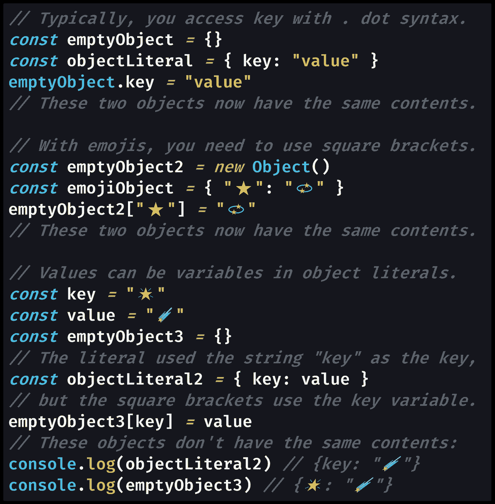

# JavaScript 中的对象文字语法是什么？

> 原文：<https://javascript.plainenglish.io/what-is-the-object-literal-syntax-in-javascript-d6d309383106?source=collection_archive---------12----------------------->

## 您使用花括号`{}`在 JavaScript 中声明对象。以这种方式写出一个新的对象被称为创建一个对象文字，这意味着花括号`{}`是对象文字语法。


Photo by [Cristina Gottardi](https://unsplash.com/@cristina_gottardi?utm_source=medium&utm_medium=referral) on [Unsplash](https://unsplash.com?utm_source=medium&utm_medium=referral)

在 JavaScript 中，有很多方法可以创建新的对象，但是我们几乎总是使用对象字面语法,`{}`。

> “对象可以使用`[new Object()](https://developer.mozilla.org/en-US/docs/Web/JavaScript/Reference/Global_Objects/Object/Object)`、`[Object.create()](https://developer.mozilla.org/en-US/docs/Web/JavaScript/Reference/Global_Objects/Object/create)`或*文字*符号(*初始值设定项*符号)初始化。对象初始值设定项是一个逗号分隔的列表，包含零对或多对对象的属性名和关联值，用大括号(`{}`)括起来。— [MDN 文档](https://developer.mozilla.org/en-US/docs/Web/JavaScript/Reference/Operators/Object_initializer)

当我们编写花括号`{}`时，我们创建了一个没有属性的空对象，这与用`[new](https://developer.mozilla.org/en-US/docs/Web/JavaScript/Reference/Operators/new)`关键字:`new Object() // same as {}`调用`[Object()](https://developer.mozilla.org/en-US/docs/Web/JavaScript/Reference/Global_Objects/Object/Object)`构造函数是一样的。

我们通常希望在创建新对象的同时指定某些对象属性(也称为对象键)。

毕竟，对象只是键值对的集合。

要立即用属性及其值初始化新对象，可以使用带有逗号分隔的键值对列表的对象文字语法。每个对象键都需要赋值。



[View raw code](https://gist.github.com/DoctorDerek/10feca58ed300bd43884da51f9723966) as a GitHub Gist

虽然上面的例子没有显示，但是可以使用任意数量的键值对[，用逗号](https://medium.com/coding-at-dawn/how-to-convert-an-array-to-a-string-with-commas-in-javascript-79e212506c2) : `{keyA: "1", keyB: "2"}`隔开。

然而，需要注意的一点是，对象文字语法将只接受变量作为对象值，而不是对象属性。

使用`{}`的对象文字语法在使用 [JSON 格式](https://medium.com/swlh/what-is-json-used-for-in-javascript-programming-9d71284359a9) (JavaScript 对象符号)时也是一样的，这很有意义。

类似的数组字面语法是使用方括号`[]`而不是花括号`{}`。对于一个数组，键将是每一项的索引，从最后一项的索引`0`开始。

正如你可能猜到的，当你[将一个数组转换成 JSON 格式](https://medium.com/p/94daf35b8c21)时，你会在调用`[JSON.stringify()](https://medium.com/javascript-in-plain-english/how-to-check-for-a-string-in-javascript-a16b196915ff)`得到的 JSON [字符串](https://medium.com/javascript-in-plain-english/how-to-check-for-a-string-in-javascript-a16b196915ff)中找到方括号`[]`而不是花括号`[]`。

您还会听到用于字符串的术语“文字语法”，这里您使用[单引号或双引号](https://usemoneyball.com/admin/articles/3d00bf720bcd) ( `'`或`"`)或[反引号文字](https://thebittheories.com/the-3-advantages-of-backtick-literals-in-javascript-f6beade4a9cf)，(```)来指定一个字符串文字，一个 JavaScript 的[原语类型](https://medium.com/p/671909def6ca)。

在每种情况下，您都可以使用“文字语法”指定您真正想要的[对象](https://medium.com/p/3b2632330296)、[数组](https://medium.com/javascript-in-plain-english/how-to-check-for-an-array-in-javascript-6ad20f7a0e21)或[字符串](https://medium.com/javascript-in-plain-english/how-to-check-for-a-string-in-javascript-a16b196915ff)。

这就是对象字面语法——花括号`{}`的一个时髦词，它可能包括逗号分隔的键值对列表。

**快乐编码！**🍧🍨🧁🍫🍪


Photo by [Cristina Gottardi](https://unsplash.com/@cristina_gottardi?utm_source=medium&utm_medium=referral) on [Unsplash](https://unsplash.com?utm_source=medium&utm_medium=referral)

德里克·奥斯汀博士是《职业编程:如何在 6 个月内成为一名成功的 6 位数程序员 》一书的作者，该书现已在亚马逊上架。