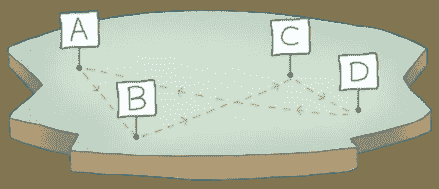
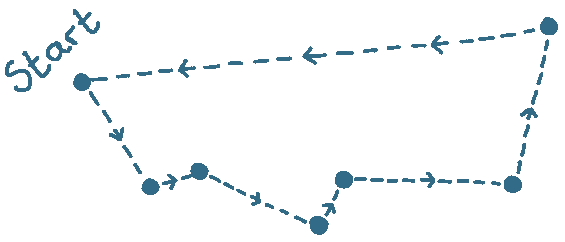

# 什么是旅行推销员问题？

> 原文：<https://javascript.plainenglish.io/what-is-the-travelling-salesman-problem-77fd73195279?source=collection_archive---------16----------------------->

旅行推销员问题是一个经典的计算机科学问题，众所周知没有有效的解决方案。

# 我为什么要在乎？

现实生活中有许多问题与旅行推销员问题非常相似。

了解这样的问题有助于你认识到什么时候你会面临同样难以解决的问题。

# 在 5 分钟或更短时间内

这就是‘旅行商问题’(或 TSP):“*给定一个城市列表，访问每个城市一次，然后返回出发城市的最短路线是什么？”*

这听起来很简单，但是当我们增加足够多的城市时，计算机就不可能在现实的时间框架内解决这个问题。

我们来看看为什么。

# “暴力”方法。

只有一种方法可以找到旅行推销员问题的最短解决方案，我们必须依次尝试每一种可能的选择。

我们举一个简单的例子，四个城市:

我们将从 a 开始。我们可以去 B、C 或 D。接下来，让我们想象一下我们去 B。从那里，我们可以选择访问 C 或 D。一旦我们到达其中任何一个城市，我们就旅行到剩下的城市，然后返回 a。

概括一下:从我们的第一个城市开始，我们可以选择下一步去哪里。一旦我们选择了其中的一个，我们还有剩下的`2`个城市可以选择。从那里，只剩下`1`城了。

这意味着我们必须尝试的路线总数是`3 x 2 x 1 = 6`。

现在让我们添加另一个城市“E”:

一旦我们选择了一个地方开始，我们现在有一个选择`4`其他城市参观。从每一个中，我们必须选择剩下的`3`中的一个来进行下一次访问。从每一个*到那些*，都有`2`个城市可供选择..你明白了。

五个城市的可能排列数是`4 x 3 x 2 x 1 = 24`。我们增加了一个城市，但现在有四倍的选择！

其中一些路线是重复的(我们走的是同一条路线，但方向相反)，所以可以打折。尽管这并不能真正帮助我们，因为可能的路线数量仍然会增长得非常快。

仅 10 个城市，就有`181,440`条可能的路线。再加一个就有超过`1.8 million`了。当我们到达仅仅 15 个城市时，就有超过`43 Billion`条可能的路线！

有了足够多的城市，路线的数量变得如此之大，以至于我们无法在合理的时间尺度内计算它。

有一种相对更有效的方法可以使用[动态编程](https://medium.com/basecs/speeding-up-the-traveling-salesman-using-dynamic-programming-b76d7552e8dd)来计算所有可能的排列，但这并不重要——它在规模上仍然变得太慢。

# 求解 TSP

既然我们不能真正解决这个问题，我们所能做的就是寻找一个好的近似值。

一种方法是使用最近邻法:

从一个随机的城市开始，选择最近的城市并去那里。继续选择最近的城市，直到你去过所有的城市一次，然后再回到起点。

这是找到近似解的最简单算法，但还有其他算法(复杂性不同)通常可以找到更短的路线。

直到最近，最好的一直是 1976 年由尼古拉斯·克里斯托菲德斯开发的算法。

克里斯托菲德斯的算法能够找到最多比“完美”行程长 50%的“T2”解。

2019 年，Karlin，Klein 和 Oveis Gharan 证明了一个最初在 2010 年开发的算法实际上可以比克里斯托菲德斯的算法快一点点。

这听起来可能不重要，但它证明了*有可能改进该算法，并为更多的解决方案打开了大门。*

# 乔装打扮的 TSP

很容易将旅行推销员问题斥之为纯粹的学术问题，不适用于日常发展。然而，它确实具有现实意义。

“最后一英里分娩”是常用的例子。这是将某物从运输中枢运送到其最终目的地的过程。例如，亚马逊卡车将数百个包裹运送到各个家庭。

但当您仔细观察时，其他问题开始看起来像 TSP:

*   在仓库中挑选物品以完成订单的最快方式是什么？
*   我们如何安排一条巴士路线在最短的时间/距离内到达所有的车站？
*   电气元件布线的最短方法是什么？

旅行推销员问题是一类叫做“NP-hard”的问题。我们将在另一期讨论“NP-hard”，但是了解像 TSP 这样的 NP-hard 问题将有助于您认识到自己在工作中遇到了类似的问题。

需要计算集合中所有可能的排列吗？这听起来很像旅行推销员问题。

# 想知道更多吗？

查看以下链接:

*   [演示 TSP 多种算法的优秀页面](https://cse442-17f.github.io/Traveling-Salesman-Algorithms/)
*   [用动态规划加速旅行商](https://medium.com/basecs/speeding-up-the-traveling-salesman-using-dynamic-programming-b76d7552e8dd)
*   [一篇关于 2019 年改进的连线文章，以及对新算法的解释](https://www.wired.com/story/computer-scientists-break-the-traveling-salesperson-record/)
*   [尼科斯·克里斯托菲德斯 1976 年的论文，描述了他的算法](https://apps.dtic.mil/dtic/tr/fulltext/u2/a025602.pdf)
*   [卡林、克莱恩和奥韦伊斯·加兰 2019 年的论文](https://arxiv.org/abs/1908.00227)

*订阅我的* [*简讯*](https://www.baseclass.io/newsletter/) *先收到这个。*