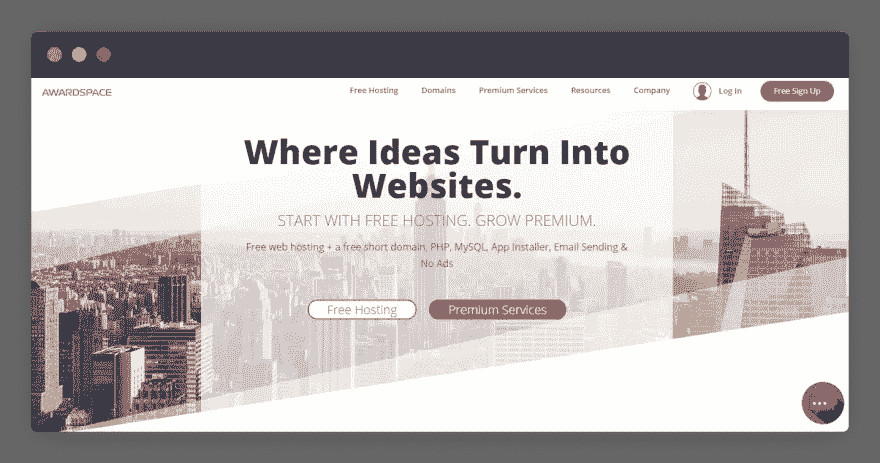

# 为您的网站提供 22 项免费托管服务

> 原文：<https://javascript.plainenglish.io/what-is-web-hosting-and-22-good-hosting-for-your-website-718c4a6c001e?source=collection_archive---------13----------------------->

# 什么是虚拟主机？

虚拟主机是一种允许你在互联网上发布网站的服务。当用户想看到你的网站时，只需要在浏览器上输入该网站的地址(域名)即可。此时，服务器将接收信息，进行处理并将结果返回给用户。

# 流行的虚拟主机类型

通常，web 项目在规模、访问者数量、服务器处理需求水平等方面会有所不同。，所以人们将虚拟主机分为 6 种主要类型，以满足客户的需求:

# 1.共享虚拟主机:

您的网站与其他网站托管在同一台服务器上。这种类型的优势是成本低，通常适合个人博客和中小型企业。

# 2.虚拟专用服务器(VPS):

也共享一个服务器，但它会给你一个额外的虚拟私人服务器完全访问配置网站。在我看来，这种类型的安全性比共享虚拟主机更好。如果你的网站已经足够大，有很多流量，我推荐使用 VPS 来托管你的网站。

# 3.专用主机:

它给你一个专用的服务器，而不与其他网站共享服务器。您可以完全控制，例如集成您喜欢的适当应用程序、更改操作系统、重新配置服务器……但是，使用成本有点高，需要知识。设置服务器服务的好方法。

# 4.云托管:

这是一个运行在云计算环境中的虚拟服务器，该解决方案目前可以说是炙手可热。我真正喜欢这项服务的是，如果服务器有问题，它会立即自动转移到另一台服务器上，它有助于用户随时访问你的网站。同时网站的使用成本。

# 选择托管时要记住的事情

# 1.速度

根据谷歌的说法，网站加载速度也被认为是一个 SEO 因素，因为它将直接影响用户体验。报告称，如果一个网站的加载时间超过 2s，就会让客户更容易离开。因此，您应该仔细考虑您所提供的服务器服务的速度。

为了估计服务的速度，你应该浏览一下你想使用的主机类型的评论网站。这里有很多人已经和将要对你计划使用的主机进行最诚实的评论。然而，你也应该注意找到真正值得信赖的评论网站，因为很多时候人们的判断只是基于该产品从联盟营销中获得的佣金。

# 2.支持；

在我看来，最好是选择虚拟主机，有良好的客户支持服务，如 24/7 支持，可以通过多种方式联系，如电话，电子邮件，消息的支持团队，支持高素质和热情的工作人员…此外，你也可以通过评估的方式，支持人员回答客户的问题，在支持页面或文章提供使用服务的知识。服务是由服务人员编写的…

# 3.托管服务的效用:

通常，当您选择考虑托管时，您通常会关注该服务提供的配套工具，例如:

带宽:网站发送给用户的数据量。通常情况下，托管服务会提供无限的套餐，但也有服务会在带宽超过允许的阈值时收费。

存储:网站的存储空间(用于存储图片、HTML、CSS、JavaScript)是否有限？

免费域名注册:网站免费域名注册。

可用于托管的网站数量。

网站包含 CDN 吗？
…

正如你所看到的，每个托管服务将提供不同的工具。所以你要明确你要建什么类型的网站，你要建什么类型的网站，存储量，流量大不大？…这样我们就可以选择提供适当工具的虚拟主机。

# 4.服务器存储位置:

从服务器向用户传输数据所需的时间在很大程度上取决于服务的服务器位置。那就是在选择托管的时候，要注意那个服务的服务器在哪里。比如我们在越南的时候，最好选择在越南的服务器，如果没有，就选择在新加坡、东京等亚洲地区提供服务器的托管。

# 5.扩展能力:

就我而言，我也是一个创建网站的初学者。因此，不可能详细计算出网站需要使用的带宽、存储量、速度等。所以在选择主机服务时，我也会关注主机的可升级性是否容易。

还有一种情况我需要提请大家注意，那就是降低到较低包装的能力。因为在现实中，我们的网站不会使用软件包提供的所有工具。此时，您应该考虑更有吸引力的软件包，以降低服务器的成本。

# 6.安全性:

当我们选择虚拟主机时，这被认为是一个非常重要的因素。评估托管安全性的一些标准是:

*   网站有 SSL 证书吗？
*   防火墙的安全级别好吗？
*   网络管理版本是否定期更新？
*   可以备份网站的数据吗？
*   有没有可能检测出网站中嵌入的恶意软件(恶意软件)？

# 7.托管价格:

这被认为是我用来评估主机的最终标准。通常，注册网站主机的平均价格通常在 5 美元到 10 美元之间。

然而，今天在市场上有许多令人难以置信的价格托管服务提供商。那么有了这些价格，你到底该不该为网站选择呢？

其实在我看来，看情况；不是所有价格便宜的主机提供商都不好。然而，当你决定选择这些主机时，我有一些注意事项:

**关注促销:**主机将为我们提供前一至两年的使用促销价。然而，他们会收取标准费用(通常很高)。所以，买之前要仔细看资料！

**产生的成本:**很多主机提供商会让套餐价格真的很便宜，但是当我们付费的时候，会涉及到很多服务和成本。

**限制一些实用工具:**其实在使用免费托管的时候，往往会有广告嵌入网站或者限制网站的带宽、存储、延迟。因此，您应该仔细阅读该服务提供的实用程序！

# 免费静态网站托管服务

静态网站是具有固定内容的网站，通常使用三种主要语言:HTML、CSS 和 JavaScript。此外，还可以使用前端 JavaScript 库或框架来创建 React、Vue.js、Nuxt 等这类网站。通常，这些网站不会有一个数据库，但将通过 API 使用数据，存档文件。它通常用于登录页面、产品介绍、信息页面。

现在我们将深入了解更多关于免费静态网站托管服务！

# 1.网络生活:

网络免费计划的突出特点是:

*   从 Git 自动构建。
*   部署在全球边缘网络上。
*   带宽:100 GB/月。
*   网站数量:不限。
*   可以恢复到任何版本。

[Netlify](https://www.netlify.com/)

# 2.GitHub 页面:

GitHub 页面免费计划的主要特点是:

*   网站最大可达 1GB。
*   带宽:每月 100Gb。
*   您可以通过 CNAME 手动设置网站的域名。
*   网站支持 HTPPS。

[GitHub 页面](https://pages.github.com/)

# 3.渲染:

免费渲染包的亮点是:

*   带宽 100 GB/月。
*   闪电般的 CDN。
*   可以自定义具有完整 SSL 功能的域。
*   在 Git 上自动部署。

[渲染](https://render.com/)

# 4.韦尔塞尔:

Vercel 免费计划的亮点是:

*   利用边缘网络提高网站性能。
*   无限的网站和 API。
*   可以自定义具有完整 SSL 功能的域。
*   提供无服务器功能。

韦尔塞尔

# 5.浪涌:

无浪涌计划的突出特点是:

*   提供 404.html 页面功能。
*   无限的网站和 API。
*   可以自定义域。
*   易于通过 CLI 部署。
*   无限的网站。

[增兵](https://surge.sh/)

# 6.毛刺:

无故障计划的亮点是:

*   每小时提供 4000 个请求。
*   服务器处理 512MB 的内存。
*   512MB 存储容量。
*   缺点:如果网站不采取任何行动，将在 5 分钟后休眠。

[小故障](https://glitch.com/)

# 7.主持人:

Hostman 自由计划的参数是:

*   允许创建 10 个网站。
*   100 GB/月带宽。
*   从 Git 自动构建。
*   免费 SSL 证书。
*   用 CDN 服务部署网站。

主持人

# 8.弗利克:

Fleek free 计划的规格如下:

*   支持编辑域。
*   提供 HTTPS 服务。
*   3GB 存储空间。
*   无限的网站。
*   在 Git 上自动部署。

[弗利克](https://fleek.co/)

# 免费虚拟主机服务

# 1.000 网络主机:

000webhost 免费计划的参数是:

*   1 个网站。
*   300MB 存储空间。
*   可用带宽 3GB。
*   **缺陷:**
    —无邮箱账号。
    —没有全天候支持服务。

[000 网络主机](https://www.000webhost.com/)

# 2.FreeHostingNoAds:

FreeHostingNoAds 免费计划的参数是:

*   1 个域名。
*   3 个子域。
*   1GB 存储空间。
*   有自动化网站建设软件。
*   带宽 5GB/月。
*   全年无休的支持服务。
*   提供一个电子邮件帐户。
*   **缺陷:**
    —没有免费的 SSL 支持。
    —无每周数据备份服务。

自由的主人

# 3.奖励空间:

奖励空间释放计划的规格如下:

*   5GB 带宽。
*   1000MB 存储。
*   全天候支持。
*   1 个域和 3 个子域。
*   1 个电子邮件帐户。
*   **缺陷:
    —** 不支持 CNAME 记录。
    —不支持数据备份。
    —不提供 404 页的编辑。

[奖励空间](https://www.awardspace.com/)

# 4.无限免费:

无限免费套餐的规格如下:

*   无限存储。
*   无限带宽。
*   免费子域。
*   域的免费 SSL。
*   免费 DSN 服务。
*   **缺陷:**
    —加载时间慢

[无限自由](https://infinityfree.net/)

# 5.自由寄宿

FreeHostingEU 免费计划的参数是:

*   4GB 带宽/月。
*   网站的 5 个域名。
*   提供网站建设工具。
*   扩展名为. eu5.net 的自由域。
*   免费托管 Wordpress 和 Joomla。
*   **缺陷:**
    —无数据备份
    —无杀毒程序。

[FreeHostingEU](https://www.freehostingeu.com/)

# 6.免费虚拟主机区

免费虚拟主机区域免费计划的参数是:

*   无限带宽。
*   1.5GB 存储。
*   每周数据备份。
*   全天候支持。
*   **缺陷:**
    —如果没有 1 次就诊/月，账户将自动删除。

[免费虚拟主机区](https://freewebhostingarea.com/)

# 为网站提供良好的虚拟主机服务

# 1.A2 托管

A2 托管包的参数是:

*   价格:2.99 美元
*   1 个网站。
*   100GB 存储。
*   全天候支持服务。
*   无限带宽。
*   亚洲提供的服务器。
*   **缺陷:**
    —无自动数据备份。
    —续订价格可能高于初始价格。

[A2 托管](https://www.a2hosting.com/)

# 2.宿主

HostGator 包的参数是:

*   价格:2.75 美元--> 6.95 美元
*   1 个网站。
*   免费域名 1 年。
*   无限带宽和存储。
*   免费 SSL/HTTPS。
*   全天候支持。
*   **缺陷:**
    —额外服务所需费用。
    —加载时间相当慢。

[HostGator](https://partners.hostgator.com/9WO6j4)

# 3.蓝色主机

Bluehost 软件包的规格如下:

*   价格:3.95 美元-> 5.95 美元
*   1 个网站。
*   免费域名 1 年。
*   50GB 存储空间。
*   免费 SSL/HTTPS。
*   网站免费 CDN。
*   全天候支持。
*   **缺陷:**
    —续费价格有点高。
    —无数据备份。

[蓝色主机](https://www.bluehost.com/track/haycuoilennao3/)

# 4.梦幻主机

DREAMHOST 包的参数是:
*

*   价格:3.95 美元--> 4.95 美元
*   有一个网站建设者。
*   有数据库数据备份。
*   无限带宽和存储。
*   免费 SSL/HTTPS。
*   Wordpress 的许多实用功能。
*   全天候支持。
*   **缺陷:**
    —多花钱买邮件托管。

[梦幻主持人](https://www.dreamhost.com/)

# 5.名字便宜

NameCheap 包的参数是:

*   价格:1.58 美元--> 4.88 美元
*   有一个网站建设者。
*   免费托管 3 个域名。
*   免费 SSL/HTTPS。
*   20GB 无限存储和带宽。
*   全天候支持。
*   **缺陷:**
    —无数据备份。
    —储存限制

[名贱](https://namecheap.pxf.io/e4g021)

# 6.稳定宿主

稳定主机包的参数是:

*   价格:1.75 美元-> 5.95 美元
*   有一个网站建设者。
*   最多 1 个网站。
*   无限的存储和带宽。
*   全天候支持。
*   **缺陷:**
    —不支持垃圾邮件过滤。

[稳定主机](https://www.stablehost.com/)

# 7.鹰主人

Hawk 主机包的参数是:

*   价格:2.99 美元
*   免费 Weebly 网站建设者。
*   不限域名。
*   免费 SSL/HTTPS。
*   无限带宽。
*   全天候支持。
*   10GB 存储空间
*   **缺陷:**
    —存储容量有限。

[霍克主持人](https://www.hawkhost.com/)

通过这一点，我希望这篇文章能为你的网站开发和设计提供有用的虚拟主机，如果你有任何问题，请发邮件给我，我会尽快回复。希望大家继续支持网站，让我能写出更多好文章。祝您愉快！

相关文章:

*   [免费静态网站托管](https://us.niemvuilaptrinh.com/article/15-free-hosting-for-front-end-developers)
*   [免费图片 CDN](https://us.niemvuilaptrinh.com/article/7-free-storage-cdn-for-image)
*   [网站免费内容交付网络](https://us.niemvuilaptrinh.com/article/top-free-cdn-service-for-website)