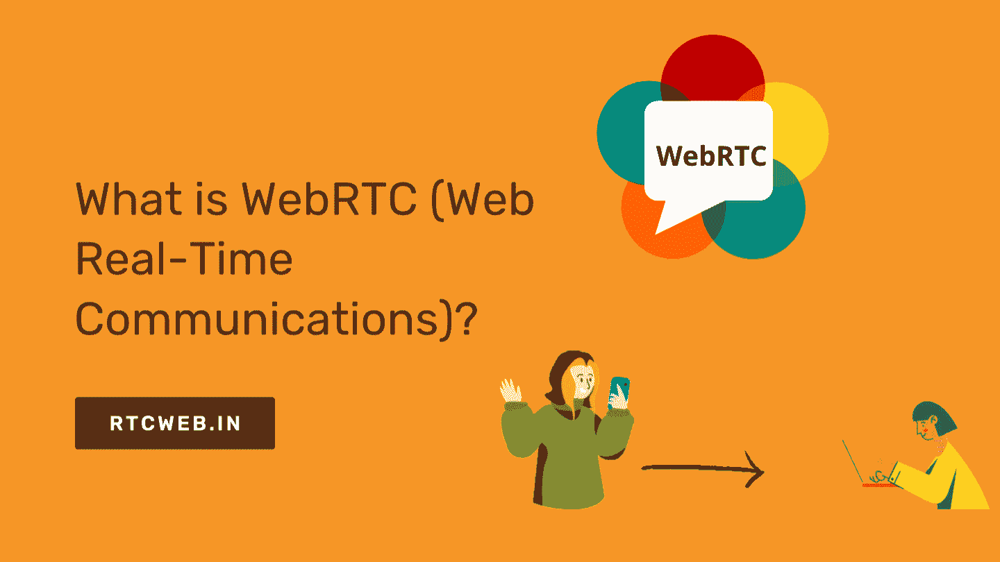

# 什么是 WebRTC (Web 实时通信)？

> 原文：<https://javascript.plainenglish.io/what-is-webrtc-web-real-time-communications-fc8e5ca10cde?source=collection_archive---------14----------------------->

WebRTC 允许您在浏览器之间创建对等连接。这是 Google Hangouts、Skype 和世界各地许多其他实时通信服务背后的技术。

本教程的主要目的是展示使用一个名为" [WebRTC](https://rtcweb.in/?utm_source=medium&utm_medium=article&utm_campaign=What_is_WebRTC&utm_id=medium.com) "的简单 JavaScript 库是多么容易，它提供了使用 HTML5 在您自己的 web 服务器上创建视频聊天应用程序的所有功能。我们将构建一个应用程序，其中两个用户可以通过他们的浏览器相互交谈，而无需在任何一方安装任何特殊的软件。

用户体验应该感觉像一个普通的电话，所以我们也将有音频。为了做到这一点，我们需要从两端获得一些基本信息，连接它们，来回发送消息，断开连接，重新连接，并重复。

这听起来并不太难，但是需要几个步骤。我在那里找到了几个教程，但是，它们中的大多数都没有给出足够详细的关于引擎盖下发生了什么。这就是为什么我决定为我的访问者写这份指南。

# **你在找什么？**

WebRTC 标准是一组支持开发和部署实时通信应用程序的技术。

这些包括浏览器、媒体服务器和客户端，使您可以在计算机或移动设备上与不同位置的其他用户进行视频聊天。

# 为什么要使用这项技术？

开发人员希望使用 WebRTC 而不是传统方法(如使用 SIP VoIP 呼叫)的原因有很多。最重要的原因是，如果你正在开发一个需要语音通信的应用程序，那么你很可能需要将它开发成一个 web 应用程序，而不是从 Skype 等其他程序中打电话。

与通过现有服务进行呼叫相比，构建自己的解决方案的另一个好处在于成本:如果你的公司有自己的 PBX 系统，当试图呼叫使用 Twilio 等服务的其他人时，可能会产生成本。

相比之下，如果您构建自己的解决方案，您可以通过不必支付与这些服务相关的额外费用来节省资金，并且还可以避免由于第三方系统的问题而可能出现的任何停机问题。

# **为您的企业选择 WebRTC 的理由**

WebRTC 是一项新技术，允许您从浏览器进行实时视频通话。这篇文章将探讨为什么企业应该研究这种类型的沟通，以及它如何以他们从未预料到的方式给他们带来好处。

我们都有过这样的经历:你在美国东部时间今天下午 4 点有一个重要的电话，但是突然发生了一些事情，你需要取消？或者也许你只是在正常工作时间太忙了，没有时间回到需要做的事情上来。

不管怎样，如果你现在不采取行动，别人可能会在你意识到之前接管你的电话或任务。这每天都在发生——我们不想因为缺乏沟通而失去我们的客户！这就是 WebRTC 的用武之地…原因如下:

## 1)实时视频通话

实时视频会议比以往任何时候都更加经济实惠。使用云计算服务，如 Google Hangouts、Skype、Zoom、GoToMeeting 等。，您不再需要每月支付数百美元购买高端系统。

这些平台中的大多数允许你主持会议以及参加其他人可能主持的其他会议。这意味着您可以与住在城市另一端、世界各地的人联系，甚至是那些远程工作的人，而不必预先花费数千美元。

## 2)更容易集成到移动设备中

许多公司使用移动设备在组织内部进行通信。如果您使用传统的电话线、电子邮件、短信、即时消息和基于网络的应用程序，那么在两个人之间安排一次会面将需要许多步骤。

然而，使用 WebRTC，这个过程几乎可以立即发生。只要双方都有连接到互联网的计算机，任何支持 HTML5 音频/视频功能的设备都可以轻松地创建语音或视频呼叫。

唯一需要的就是某种形式的软件，比如 Chrome、Safari、Firefox、Opera、IE 11+、Edge、Vivaldi、Brave、Dolphin 浏览器、UCBrowser、Yandex 浏览器、微软 Edge、三星互联网、iOS、Android、Linux、Mac OSX 等

## 3)轻松的音频会议和屏幕共享

WebRTC 提供的另一个优势是用于音频电话会议时的易用性。除了使视频通话成为可能之外，WebRTC 还可以很容易地将音频会议添加到一起，这样每个参与者都可以清楚地听到彼此的声音。

有几种可用的方法，包括 VoIP 软电话解决方案，为用户提供进行在线音频会议所需的一切。其中包括日程安排、拨号、添加参与者、记录会话、分发记录、管理文件以及设置多个同时连接。

此外，屏幕共享工具的存在使您能够与同事共享屏幕，同时维护隐私和安全。允许组织更轻松、更快速地协作，尤其是对远程团队而言。

## 4)安全通信

尽管大多数通过互联网的通信都是不加密的，但不同 IP 地址之间传输的数据仍然必须通过不同的路由器。

不幸的是，由于网络体系结构的原因，某些类型的信息传输必须经过加密才能通过防火墙。通过加密视频流、音频信号、文件传输和 DNS 请求，组织可以确保相距遥远的员工之间的安全通信。

## 5)不再有拨号连接

有了 WebRTC，您不必担心在带宽不足时被锁在计算机外面。因为视频流不依赖于向服务器上传大量数据，所以在你真正开始发送内容之前，它不会降低你的连接速度。

通过使用对等技术，WebRTC 实现了跨网络的高效媒体分发，并消除了对集中式服务器存储的需求。

## 6)降低成本

如果你经营一家小公司或独自工作，并不总是有足够的钱投资昂贵的硬件来支持电话基础设施。

但是使用 WebRTC，您可以通过避免昂贵的设备升级来节省大量资金。无需额外费用，您将能够快速有效地扩展您的通信选项。

## 7)它在任何地方都适用

WebRTC 技术适用于人们可以访问宽带互联网服务的任何地方。无论他们是在家还是在路上，WebRTC 都能让他们自由地连接到世界上的任何地方。

## 8)节省时间

如果您想减少安排从未召开的会议所花费的时间，可以考虑使用 WebRTC 进行视频会议。与其花无数时间试图安排与住在千里之外的同事见面，不如邀请他们参加一个 WebRTC 会议，在那里你可以立即讨论业务事宜。

## 9)保护用户安全

通过保护公共互联网上的所有流量，企业可以避免他们的敏感信息暴露给黑客。

## 10)消除掉话

无论信号强度是弱还是强，如果一个人想说话，但另一个用户听不到他/她的声音，WebRTC 通过让第一个说话者独立于第二个听者调节音量来解决这个问题。

## 11)提高生产率

直接从 Google Hangouts 拨打高质量 Skype 电话的能力使员工能够更有效地参与团队会议。

## 12)提高客户满意度

当客户看到客户联系你是多么快速和简单时，客户满意度就会大大提高。

## 13)降低员工流动率

很多时候，员工离职是因为他们不喜欢在困难的条件下工作。

# 再多说几句-

希望这篇文章对你有所帮助，请在下面的评论区告诉我你的想法。此外，如果您正在寻找最好的定制 WebRTC 应用程序开发公司，那么请选择“ [RTCWeb.in](https://rtcweb.in/?utm_source=medium&utm_medium=article&utm_campaign=What_is_WebRTC&utm_id=medium.com) ”

这是最好的[定制 WebRTC 应用程序开发服务提供商](https://rtcweb.in/contact/?utm_source=medium&utm_medium=article&utm_campaign=What_is_WebRTC&utm_id=medium.com),拥有一个专业团队，他们可以用一个简单的框架完成漂亮的、以用户为中心的、经济高效的网站和混合移动应用程序开发。

**RTC web . in 如何为您提供帮助？**

*   经验丰富的 WebRTC 开发人员提供高质量和经济高效的服务。
*   从规划、安装到 WebRTC 实施和交付的端到端服务。
*   与不断发展的电信需求保持同步的可靠记录。
*   为您蓬勃发展的业务提供无缝连接/通信解决方案。
*   避免混淆的无术语方法。
*   我们使您能够专注于业务运营并获得 WebRTC 技术的回报。
*   卓越的售后支持和客户管理服务。

*更多内容尽在*[***plain English . io***](http://plainenglish.io/)