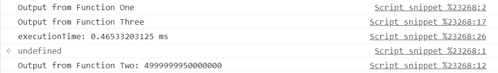

# 5 分钟后 Zone.js 是什么

> 原文：<https://javascript.plainenglish.io/what-is-zone-why-zone-8534350480dd?source=collection_archive---------1----------------------->

## 了解 Zone.js 的概念并开始使用

Working with Zone.js

# 什么是 Zone.js

我们执行的每个 JavaScript 代码都是在执行上下文中执行的。 **Zone.js** 是一种创建新上下文并让代码在那个**上下文/Zone** 中执行的方法。包含在区域中的任何代码，无论是同步的还是异步的，都在同一个上下文中执行。 **Zone.js 主要用于创建新的上下文**并在其中执行代码。

# 我们为什么使用 Zone.js

在本节中，我们将分析一个需要解决的问题陈述。在下面的代码中，我们有一些需要执行的同步函数，我们希望评估这些函数的总执行时间。让我们寻找代码来评估相同的。

[https://gist.github.com/Mayankgupta688/11f71441090c492e034daeeada891629](https://gist.github.com/Mayankgupta688/11f71441090c492e034daeeada891629)

在上面的代码中，整个执行是同步的，因此计算这段代码的总执行时间非常容易。执行这三个函数的总时间约为 311 毫秒。因为函数 2 有很多迭代，所以它花费了最多的时间。总执行时间如下所示:

现在让我们将异步函数添加到同一个执行中，看看效果如何。我们将在“ **executeTaskTwo** ”中添加 setTimeout，以便在一些延迟之后异步执行。

[https://gist.github.com/Mayankgupta688/171d4f70ca29d521b2c0fa18d0a743a2](https://gist.github.com/Mayankgupta688/171d4f70ca29d521b2c0fa18d0a743a2)

上述代码的执行会产生以下结果:

现在这个任务的执行时间减少到“ **.465 秒**”。由于没有考虑**异步执行时间**，因此这段代码的执行时间发生了巨大的变化。对于**只考虑同步部分**的时间，不考虑异步执行，给我们错误的结果。

为了迎合这种情况，我们需要部署一些机制，在这些机制中，所有异步和同步代码执行都可以被考虑到，这是由块内的任何函数触发的。对于这些场景，我们需要创建一个区域，任何异步或同步执行都将被视为同一区域/上下文下执行的一部分。然后，我们可以通过找出该区域的总执行时间来计算总时间。我们将很快看到使用 Zone 的钩子实现指定的代码

# 不同的 Zone.js 挂钩/事件

Zone.js 为正在创建的新上下文提供了一些特性/挂钩。这些挂钩连接到创建的每个区域。我们可以在同一区域下的代码执行时跟踪不同的阶段。以下是该区域可用的挂钩/事件:

1.  **onZoneCreated** :最初创建区域时执行
2.  **beforeTask** :在**“zone . run”**中的任务执行之前运行
3.  **任务后**:一旦“**区.运行**内的任务被执行
4.  **onError** :当“ **zone.run** 内的函数抛出错误时运行

# 向应用程序添加区域

一旦我们将 Zone.js 添加到应用程序中，我们就向窗口中添加了一个全局“Zone”对象。我们可以派生一个继承自“父”区域的新区域。

一旦 Zone.js 被添加到应用程序中，我们可以看到一个新的对象" **window.zone** "在全局级别上可用。由于创建的区域位于最顶层，因此父区域被标记为**“null”**。我们现在可以通过派生父区域来创建更多的区域。让我们在下一节中寻找相同的内容。

# 创建和分叉区域

我们在前面的例子中看到，只要将“zone.js”添加到应用程序中，就会创建一个父区域 **window.zone** 。从这个父区域创建更多的区域非常容易。下面的代码指定了从父区域派生区域的简单代码。可以使用“分叉”功能创建新区域。我们可以从现有区域派生出新区域。一旦新区域分叉，父区域将由区域对象的“父”属性指向。

在上面的代码中，我们从父区域派生出新区域，并在创建的新区域(myZone)中执行函数“createNewContext”。“myZone.run”表示我们正在“myZone”上下文中运行该函数。

我们可以在上图中看到，创建了一个新区域，这个新区域有一个特定的 Id，父区域用关键字“parent”映射。这些区域以指定的方式链接在一起。

# 使用 Zone.js 的优势

我们可以将这个库用于不同的用途:

1.  应用程序中的错误处理
2.  跟踪应用程序性能
3.  在区域级别维护变量
4.  跟踪应用程序执行和事件
5.  以角度表示变化检测机制
6.  在父区域级别创建全局数据

这些优势可以通过在 Zone.js 中使用不同的钩子来获得

# 添加区域规范

当使用“ **fork** ”创建一个区域时，我们可以向该区域添加挂钩。可以使用钩子来跟踪指定区域内的执行和失败场景。使用这些钩子，您可以维护一些可用于执行区域的全局变量，并提供错误处理能力。让我们寻找可用的挂钩来进一步了解优势。

[https://gist.github.com/Mayankgupta688/254e732acd1b5db834ccd16f21235fab](https://gist.github.com/Mayankgupta688/254e732acd1b5db834ccd16f21235fab)

在上面的代码中，我们可以看到区域中有多个可用的钩子。它可以帮助我们跟踪事件，例如:

1.  在当前指定区域下执行代码
2.  在区域内执行代码期间发生的任何错误
3.  创建区域时要执行的代码
4.  每次执行退出当前区域执行时

我们可以通过一些包含异步执行的示例代码来理解给定的钩子。由于我们将拥有异步代码，JavaScript 的执行将多次进入和退出该区域。

[https://gist.github.com/Mayankgupta688/0635cb4d5aeec5c25cb11a4529ae9189](https://gist.github.com/Mayankgupta688/0635cb4d5aeec5c25cb11a4529ae9189)

上述执行的输出给出了以下结果。在上面的代码中，我们在一个单独的区域内执行函数“executeUnderNewContext”。一旦执行了函数的同步部分，执行就移出了新创建的区域。该函数包含异步执行。在执行异步代码之前，代码进入创建的同一个“区域”,并在指定的区域内执行这个异步函数。

因此，通过分叉区域，我们可以在同一个上下文中执行一组同步和异步功能。

每次执行分叉区域中指定的函数调用时，都会调用这些钩子。甚至异步执行和事件执行都是在创建的区域内执行的。

在下一篇文章中，我们将讨论在您的应用程序中使用 Zone.js 的实时示例。