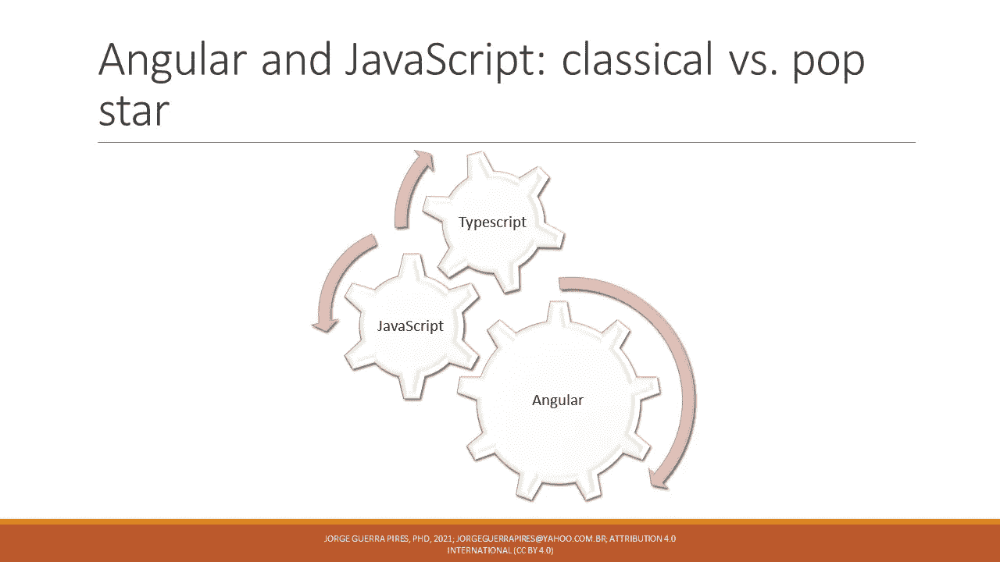
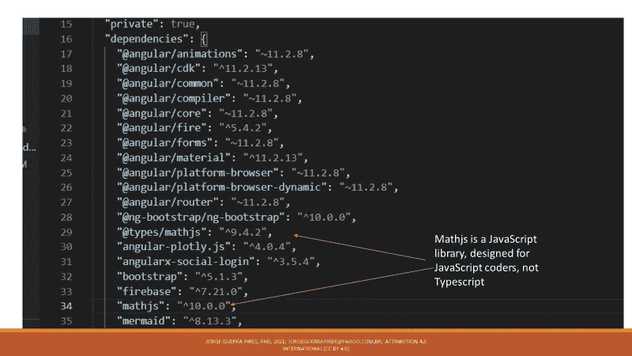
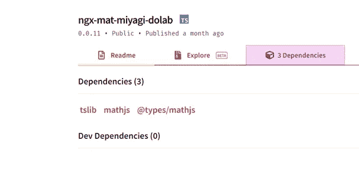
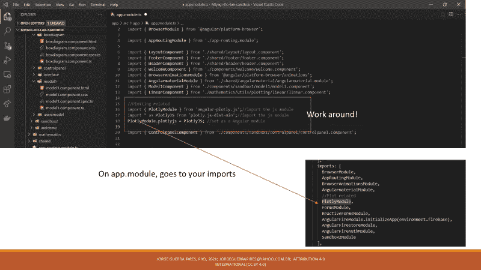
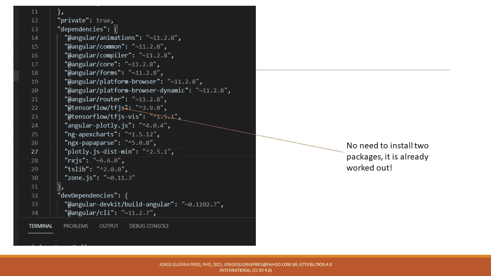
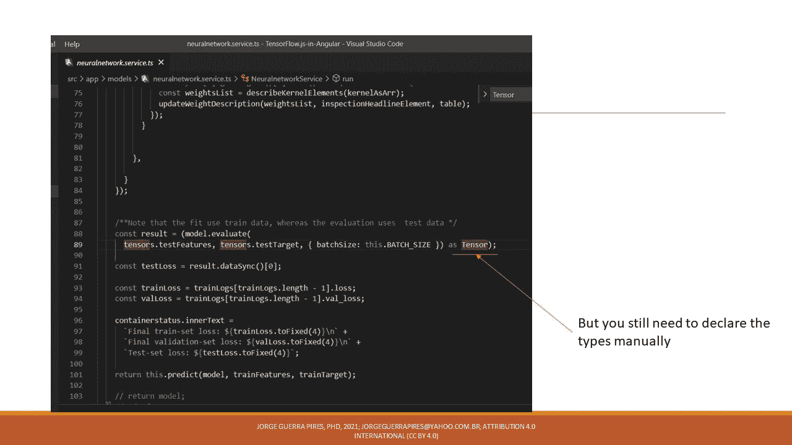
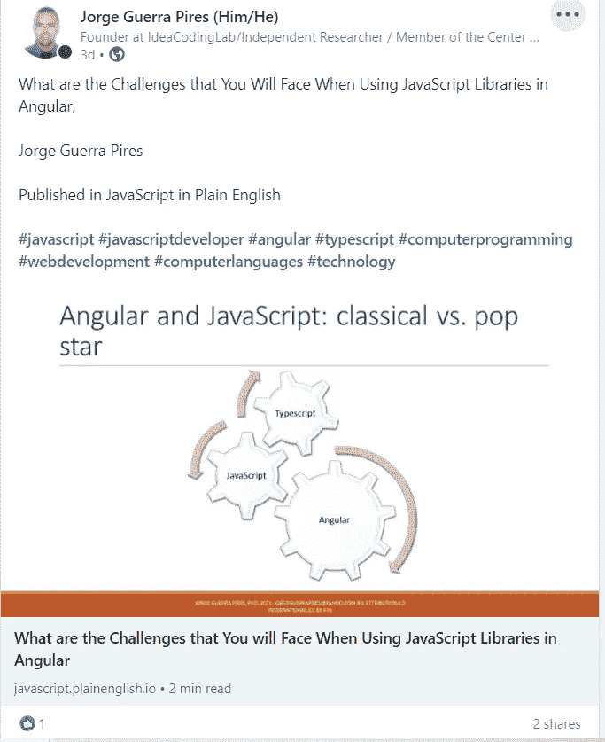

# 在 Angular 中使用 JavaScript 库时，您将面临哪些挑战

> 原文：<https://javascript.plainenglish.io/what-javascript-has-to-do-with-angular-6fdd45fd30b7?source=collection_archive---------15----------------------->

## 在 Angular 中使用 JavaScript 库时你将面临的挑战和挫折。

最近，我在一个名为**JavaScript-巴西，**的脸书小组上发了很多帖子，我非常感谢管理员们允许我的帖子！我还在社交媒体上使用了大量与角度相关的标签 JavaScript。我不确定人们是否知道这种关系，在这篇文章中，我想谈谈这个问题，试着让人们知道这种关系。开门见山: **Angular 一般用 Typescript 编程，这是一种 JavaScript 派生语言**。现在你可以停止阅读这篇文章了，没有必要让你呆在这里！用你的代码改变世界吧！使用生物数学上的[代码拯救生命](https://www.youtube.com/watch?v=CwoUq_QQT1s&t=10s)！请随意阅读剩余的论证！

> Angular 一般用 TypeScritpt 编程，这是一种 JavaScript 派生语言

Typescript is a typed version of JavaScript, and Angular is usually programmed in TypeScript

# 可以用 JavaScript 编码吗？

是的，你可以！

这是几个教程和书上说的，我没见过也没做过 JavaScript 的角度编码。我想你将要面对的问题，也是我在将代码从 [JavaScript 转换成 Angular](https://jorgeguerrapires.medium.com/problems-you-may-encounter-using-tensorflow-js-in-angular-7e28d118bc4d) 时一直面临的问题，例如；另一个例子是 Angular CLI 在 Typescript 中创建模板！我学会了用 Java(一种强类型语言)编程，然后我转向 Matlab，然后转向 JavaScript:它们都允许你做任何你想做的事情，JavaScript 是一种“多面性”语言，就像有些人喜欢说的那样。它有一些好处，但有些问题是人们从 TypeScript 中挑出来的，并声称他们可以改进；创建 TypeScript 和其他选项是为了解决 JavaScript 在编码时面临的一些问题。请注意，TypeScript 不仅仅是强制类型，它可以成为另一篇文章的主题！它是一种丰富且得到良好支持的语言，超越了 Angular，例如，NestJS 是用 TypeScript 编写的。

# 我可以在 Angular 中使用 JavaScript 库吗？

是的，你可以。你可能有两种场景:I)库知道 Angularii)图书馆不知道 Angular。在第一种情况下，一切正常，他们通常有第二个名为@types 的 npm 包，这个包完成剩下的工作，一切都很顺利。最后一种情况，您需要创建一个局部声明。JavaScript 存在的时间更长，尊重它是自然而明智的。[在一次演讲中](https://www.youtube.com/watch?v=AQOEZVG2WY0)，人们展示了为什么 TypeScript 会胜出:它尊重老人！

Javascript talking to Angular

## **场景 1:@ types 包存在**

有些库提供了第二个包，它必须安装在您想要使用的 JavaScript 包之后。以 Math.js 为例:它基于 JavaScript，而不是 TypeScript。解决方案是设计另一个名为 [@types/mathjs](http://twitter.com/types/mathjs) 的包。他们声称新发布的包不再需要这些额外的包，感谢上帝！

Math.js has a @type package, as so one can use it in Typescript based environments

ngx-mat-miyagi-dolab is a package that yours truly has created that uses mathjs, see the dependency

## **场景 2:类型上没有任何东西**

不幸的是，我无法在我的代码中找到这种情况的例子，但我知道它是可行的，因为我记得遇到过几次这种情况，并在互联网上使用解决方案，主要是堆栈溢出，一切都很顺利。由于这是一种“变通方法”，它可能会发生变化，因为 TypeScript 总是在变化。

看到那里有讨论。

 [## 在 angular 应用程序中使用外部 javaScript 库

### 在 Angular2+中添加外部 javaScript 库有 4 种方式。比如:npm 1 中的 tinymce lib。将库添加到…

stackoverflow.com](https://stackoverflow.com/questions/44945766/use-external-javascript-library-in-angular-application) 

我特别不喜欢这个解决方案:*你使用 typescript 是有原因的*，然后你又回到了老路上！除非真的有必要，否则我会反对这个解决方案。好消息是 Angular 是一个非常活跃的社区，事情变化很快，人们在晚上像蚂蚁一样工作。我很少遇到这种情况，以至于我无法在我的电脑中为你找到一个例子！

Photo by [Prabir Kashyap](https://unsplash.com/@i__prabir?utm_source=medium&utm_medium=referral) on [Unsplash](https://unsplash.com?utm_source=medium&utm_medium=referral). Angular community, creating all sorts of nice packages for you!

## **场景 3:用作模块**

# TensorFlow.js:案例思考

最近，我开始在 Angular 的 [TensorFlow.js 上开发应用程序，我一直面临着](https://jorgeguerrapires.medium.com/meet-my-project-tensorflow-js-in-angular-working-on-angular-based-machine-learning-apps-cce1874b7984)[一些挑战](https://jorgeguerrapires.medium.com/problems-you-may-encounter-using-tensorflow-js-in-angular-7e28d118bc4d)。好消息是 Angular 是用 typescript 编程的，它有自己的生命；例如，NestJS 也是 TypeScript。因此，typescript 的任何解决方案都适用于 Angular。

在我们的例子中,@type 已经包含在 JS 包中，但是这并不能解决所有的问题，我们必须注意这一点。最初，它可能很无聊，但在之后，它变得重复，这是一个好消息！事情开始可预测了！

# 结束语

要确定你能找到的所有情景是不可能的。如果你有你的，让我知道！我很乐意在这里补充！

另一件有趣的事情是，你可以通过寻找基于 JavaScript 的解决方案在 Angular 中做很多事情，比如在堆栈溢出中。除非是 Angular 特定的，我只是在 Google 上找 JavaScript。最近一直在把 JavaScript 里的[几个代码改编成 Angular](https://jorgeguerrapires.medium.com/meet-my-project-tensorflow-js-in-angular-working-on-angular-based-machine-learning-apps-cce1874b7984?source=your_stories_page----------------------------------------) 。

*购买我们的电子书来支持我的写作吧！* [*https://jorgeguerrapires . medium . com/my-selected-assays-from-medium-on-computer-programming-34578 bebb 63 a*](https://jorgeguerrapires.medium.com/my-selected-assays-from-medium-on-computer-programming-34578bebb63a)

===
*捐款*

给我买一杯☕☕☕☕☕咖啡或一本书！！📚📚📚📚📚
如果这些内容对您有用！是一次性捐款，不用再捐了！
[*https://www.buymeacoffee.com/jorgepires*](https://www.buymeacoffee.com/jorgepires)

现在你也可以支持我的任何项目了！🥰🥰
更多信息:[*https://jorgeguerrabrazil . wix site . com/ideacodinglab/publications*](https://jorgeguerrabrazil.wixsite.com/ideacodinglab/publications)

*访问我的课程:*[*https://www.udemy.com/user/jorge-guerra-pires/*](https://www.udemy.com/user/jorge-guerra-pires/)