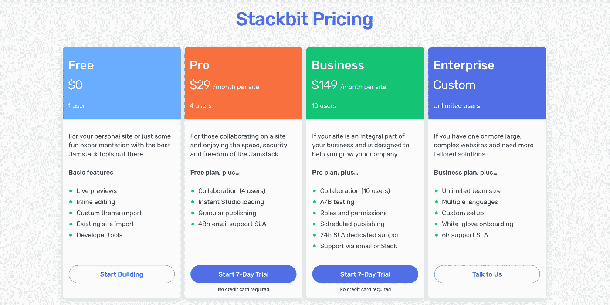
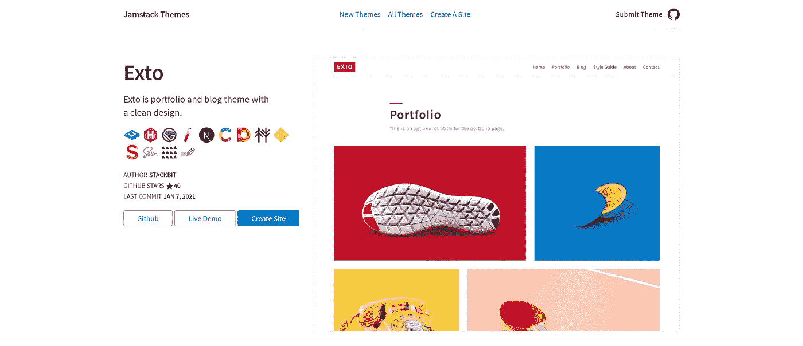
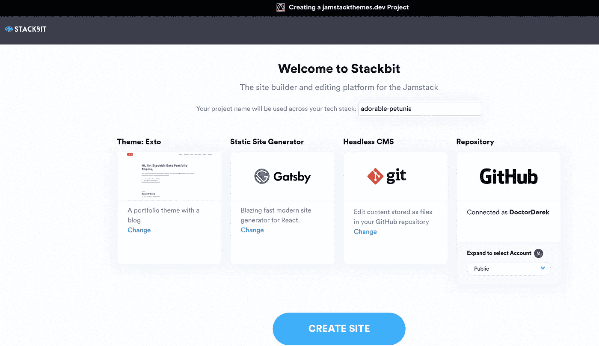
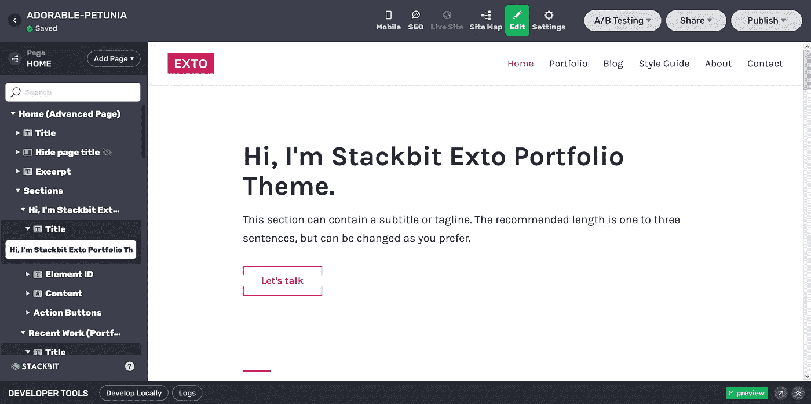
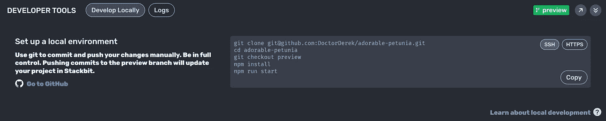
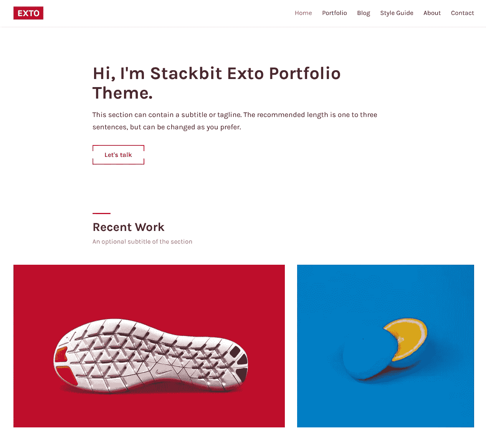

# 是什么让 Jamstack 服务定价对 Web 开发人员来说物有所值？

> 原文：<https://javascript.plainenglish.io/what-makes-jamstack-service-pricing-worth-it-for-web-developers-5ca3aed3d133?source=collection_archive---------11----------------------->

## 你会为新的 Stackbit 服务付费吗？你喜欢在你的项目中使用像 Jamstack 主题这样的网站的主题吗，还是你总是从头开始？总是建立自己的设计库更好吗？什么时候为了方便而付费是值得的？

Screenshot of [Stackbit](http://bit.ly/39TphGi) by [Dr. Derek Austin 🥳](https://medium.com/u/e5294c417caf?source=post_page-----5ca3aed3d133--------------------------------) | This post contains no affiliate links.

**Stackbit** 刚刚发布了他们的 Jamstack“即时站点”服务的定价计划，我很喜欢这项服务，以前也写过:

 [## 使用代码沙箱+堆栈位在 2 分钟内创建一个现代化的 React 站点

### 在这篇短文中，您将学习使用 CodeSandbox + Stackbit 来制作一个使用 Gatsby 的 React 网站(带有主题…

medium.com](https://medium.com/javascript-in-plain-english/make-a-modern-react-site-in-2-min-using-code-sandbox-stackbit-18e83c296073) 

我最初的印象是，任何人在一个小团队中制作网站都有很大的价值。29 美元和 149 美元的价格点是否足以分别吸引 4 个用户和 10 个用户的团队？

我仍然会随时使用 Stackbit 的自由层。我的意思是在优秀的 [Jamstack 主题](http://bit.ly/39LrcfY)网站上有一个**创建网站**按钮:

Screenshot of [Jamstack Themes — Exto](http://bit.ly/390mg7H) by [Dr. Derek Austin 🥳](https://medium.com/u/e5294c417caf?source=post_page-----5ca3aed3d133--------------------------------)

这个按钮启动 Stackbit，它将自己描述为“Jamstack 的站点构建者和编辑平台”。

Screenshot of [the Stackbit app](http://bit.ly/3irDcXT) after clicking Create Site by [Dr. Derek Austin 🥳](https://medium.com/u/e5294c417caf?source=post_page-----5ca3aed3d133--------------------------------)

大约 2 分钟后，我在 Stackbit 工作室，编辑刚刚出现在我的 GitHub 帐户中的 git 文件。

Screenshot of [Stackbit Studio](http://bit.ly/3c10ToR) by [Dr. Derek Austin 🥳](https://medium.com/u/e5294c417caf?source=post_page-----5ca3aed3d133--------------------------------)

我的存储库已经准备好使用 React 和 Gatsby(我最喜欢的静态站点生成器之一)进行主题的本地开发。

Screenshot of [Stackbit Studio](http://bit.ly/3c10ToR) by [Dr. Derek Austin 🥳](https://medium.com/u/e5294c417caf?source=post_page-----5ca3aed3d133--------------------------------)

当然，如果我决定不使用 Stackbit Studio，我也可以在本地编辑 Markdown 文件。我的 GitHub 知识库中有一个新网站，可以在 5 分钟内开发完成。我认为这是一个胜利。

Screenshot of [Stackbit Studio](http://bit.ly/3c10ToR) by [Dr. Derek Austin 🥳](https://medium.com/u/e5294c417caf?source=post_page-----5ca3aed3d133--------------------------------)

当然，还有一百万种其他的无头 CMS 选项可以使用，我个人也尝试过 Contentful、Sanity 和 Forestry。

我真正好奇的是，从事宣传册网站建设的人是如何接受这种服务的。我认为宣传册网站是自由网络开发者最大的市场之一。

快速、易于更新的静态网站非常适合作为企业的在线“营销手册”。有了合适的主题，为客户快速制作这些东西似乎真的很容易。

## Jamstack 主题是使用现代工具构建的，并在未来与在线 SaaS 服务一起部署吗？

在 Jamstack 主题上已经有十几个顺风 CSS 主题，我认为顺风 CSS 是市场的领头羊。已经有 Gatsby、Hugo、Next.js、Eleventy 的顺风模板。甚至还有一个名为 Gridsome 的 Shopify 入门应用程序是用 Tailwind CSS 构建的。

对我来说，这似乎是一个大趋势的开始，这个趋势就是减少启动一个新的 web 项目时的样板文件。

*(谁记得一个空白的* `*index.html*` *文件？)*

我认为 2021 年是开发网站有史以来最好的一年，我这样认为的很大一部分原因是，用 Stackbit 推出一个网站(在 Netlify 上，从我的 GitHub 上)是一种奇妙的开发者体验。

**你同意吗？**

Jamstack 主题使用现代工具构建并通过在线 SaaS 服务部署是 web 开发的未来吗？还是大多数 web 开发人员更喜欢使用每个数字代理和自由 web 开发人员特有的内部流程来拼接他们自己的 Jamstack 站点？

我很想听听社区对 Jamstack 服务的价值的看法。

Jamstack 即服务是 web 的未来吗？

让我知道你的想法。

Connect with me on [Twitter](https://twitter.com/askdoctorderek) and [LinkedIn](https://linkedin.com/in/derek-austin)

# 进一步阅读

*   2020 年 11 月，Sean C . Davis 为 CSS-Tricks 写了一篇精彩的文章，比较了静态站点生成器的构建时间(和特性):

 [## 比较静态站点生成器构建时间| CSS-技巧

### 有静态站点生成器(SSG)。试图决定从哪里开始令人不知所措。而大量的…

css-tricks.com](https://css-tricks.com/comparing-static-site-generator-build-times/) 

*   如果你想弄清楚一个新的静态站点生成器，Jamstack.org 有一个列表(截至发稿时有 322 个)。

 [## 静态站点生成器-顶级开源 SSGs | Jamstack

### 看看这个展示了一些最好的、开源的静态站点生成器。这是社区驱动，所以一定要…

jamstack.org](https://jamstack.org/generators/) 

*   [Jason Lengstorf](https://medium.com/u/6a98eb806571?source=post_page-----5ca3aed3d133--------------------------------) (又名 Blitz Jackson)是 Netlify 的首席工程师，所以他知道如何在 Jamstack 上做一些惊人的事情:

 [## 向 JAMstack 站点添加动态和异步功能——粉碎杂志

### 跳过服务器并使用 JAMstack 来构建和交付网站和应用程序可以节省时间、金钱和麻烦，因为…

www.smashingmagazine.com](https://www.smashingmagazine.com/2019/12/dynamic-async-functionality-jamsstack-websites/) 

*   如果您对 Jamstack 的概念不熟悉，或者可能还没有被说服，Gatsby Docs 对它的好处有一个很好的概述:

 [## JAMStack

### 了解如何使用 Gatsby 构建由 JAMStack 支持的网站，jam stack 是一种使用 JavaScript、API 和

www.gatsbyjs.com](https://www.gatsbyjs.com/docs/glossary/jamstack/) 

*   在你的生活中，可能会有一个时候，你不得不选择一个新的无头 CMS。Marcin Sulikowski 想要帮忙:

 [## JAMstack 网站的 15 个无头 CMS 的比较

### 无论是为了 SEO 还是为了保持用户友好，越来越多的人转向 JAMstack 这样的网站来寻找他们的…

naturaily.com](https://naturaily.com/blog/comparison-of-15-headless-cms-for-jamstack-websites) 

*   另一篇很棒的 *CSS-Tricks* 文章，这篇文章由[的迈克·瑞思穆勒](https://medium.com/u/603fc650f7e?source=post_page-----5ca3aed3d133--------------------------------)撰写，介绍了一个 11 个站点的完美灯塔性能审计:

 [## JAMstack 网站日益增加的复杂性以及如何管理它们

### 当您向静态站点添加任何包含用户生成内容或动态数据的内容时，构建过程的复杂性…

css-tricks.com](https://css-tricks.com/the-rising-complexity-of-jamstack-sites-and-how-to-manage-them/) 

*   我在第一次 jam stack Conf 2020(2020 年 5 月)之后做了一篇综述。我很喜欢在 Jamstack 周围成长起来的社区:

 [## 来自 Jamstack Conf 2020 的 10 条经验

### 在 5 月 27 日举行的 Jamstack Conf 虚拟会议上，我了解了 Jamstack 世界的最新动态…

medium.com](https://medium.com/coding-at-dawn/10-lessons-from-jamstack-conf-2020-96fcd48b8f3f) 

*   Stackbit 肯定是在争取代理市场，试图从自由职业者那里吸引业务，这一点我完全可以理解:

 [## 代理商和自由职业者的堆栈位

### 最后，你可以为客户项目使用 Jamstack 技术，给他们一个完整的内联编辑体验，A/B…

www.stackbit.com](https://www.stackbit.com/agencies/) 

**编码快乐！**😁🥞💻🔥💸

My mental image of the technologies behind Jamstack (Photo by [Ram HO 🇲🇽](https://unsplash.com/@itsmerevo?utm_source=medium&utm_medium=referral) on [Unsplash](https://unsplash.com?utm_source=medium&utm_medium=referral))

德里克·奥斯汀博士是《职业编程:如何在 6 个月内成为一名成功的 6 位数程序员》一书的作者，该书现已在亚马逊上出售。