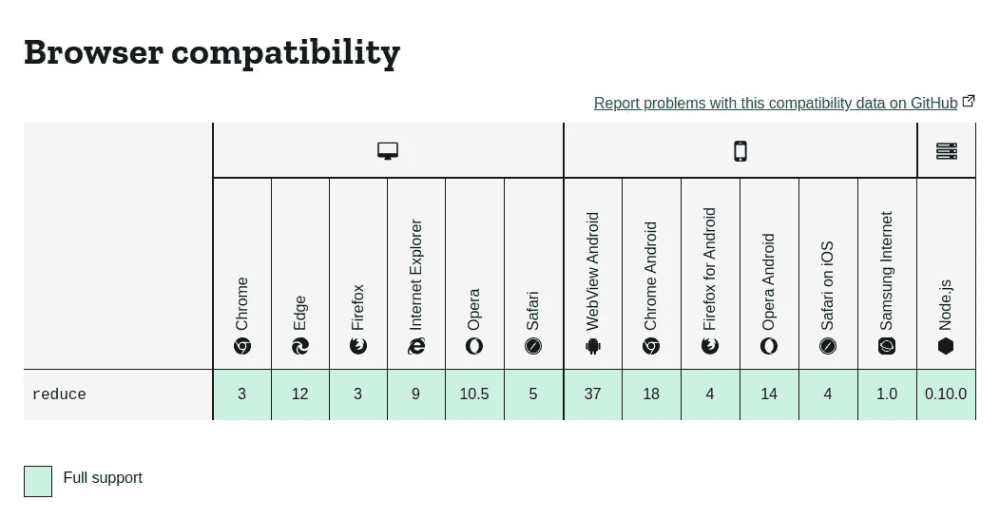
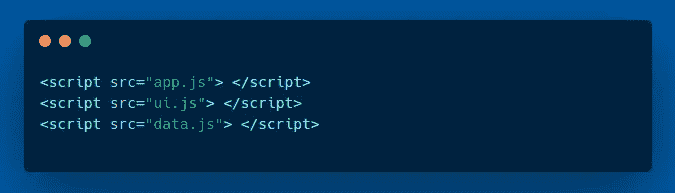

# 是什么让现代 Web 开发令人沮丧

> 原文：<https://javascript.plainenglish.io/what-makes-modern-web-development-frustrating-92d696ae1da3?source=collection_archive---------16----------------------->

## 为什么会这样

Base image by [@sharonmccutcheon](https://unsplash.com/@sharonmccutcheon) on [unsplash](https://unsplash.com/photos/KFqosh9fuDo). Code generated using [Carbon](https://carbon.now.sh/)

web 是开发人员构建应用程序的最受欢迎的平台之一。根据 [Stack Overflow 的 2020 年调查](https://insights.stackoverflow.com/survey/2020#technology-programming-scripting-and-markup-languages-all-respondents)，JavaScript 和 HTML/CSS 是最受欢迎的技术[自 2013 年](https://insights.stackoverflow.com/survey/2015#tech)以来一直如此。

尽管 web 开发如此受欢迎，但它也有令人沮丧的地方。这对于现代 web 开发和过去的 web 开发都是如此。然而，所有 web 开发的一个共同点是 JavaScript 的使用以及随之而来的问题。

JavaScript 基于一个名为 [ECMAScript (ES)](https://www.ecma-international.org/technical-committees/tc39/) 的规范。过去规范的进展非常缓慢。ES5 于 2009 年 12 月发布；上一个版本的 10 年后。ES6 也称为 ES2015，于 2015 年 6 月发布，比 ES5 晚了近 6 年。ES6 带来了许多改变 JavaScript 的新特性。此外，在 ES2015 之后，ES 的新版本开始更加一致地发布。JavaScript 终于变得更好了！然而，这也产生了新的问题。

# 问题

JavaScript 主要运行在 web 浏览器上。这就是 web 应用程序如此容易访问和流行的原因。市场上有很多浏览器在竞争。最重要的是，这些浏览器定期更新，并且有多种版本。这对最终用户来说是件好事，但对开发者来说却很复杂。这是因为浏览器运行在用户的机器上，开发者无法控制它。

对于桌面应用，我们经常会看到“此应用只能在 Windows 10 上运行”之类的软件需求。对于 web 应用程序，很难告诉用户类似“该应用程序运行在 Chrome v80 及更高版本上”的内容。对于大多数普通用户来说，跟踪浏览器版本是一项艰巨的任务，因为浏览器更新发布得如此频繁。忘记用户；即使是开发人员也很难跟踪浏览器版本及其支持的功能。

比如在 ES5 中引入了方法`Array.reduce` [。如果你要编写使用`Array.reduce`的 JavaScript 代码，它将不能在任何没有实现 ES5 的`Array.reduce`的浏览器中运行。这将包括在下图所示版本之前发布的所有浏览器版本。](https://262.ecma-international.org/5.1/#sec-15.4.4.21)

Source: [MDN](https://developer.mozilla.org/en-US/docs/Web/JavaScript/Reference/Global_Objects/Array/Reduce)

然而，让`Array.reduce`在旧的浏览器中工作是可能的。你可以在你的文件顶部放一个特殊的脚本来实现`Array.reduce`。这保证了`Array.reduce`可以在老版本的浏览器上运行。这被称为聚合填充。`Array.reduce`的自定义实现被称为 polyfill。

真正轰动的是 ES6 的发布，因为它带来了无法聚合填充的功能。这是因为它引入了诸如[模板字符串](https://262.ecma-international.org/6.0/#sec-template-literal-lexical-components)、`[import/export](https://262.ecma-international.org/6.0/#sec-imports)`语法、`[for…of](https://262.ecma-international.org/6.0/#sec-for-in-and-for-of-statements)`循环、[箭头函数](https://262.ecma-international.org/6.0/#sec-arrow-function-definitions)、`[let](https://262.ecma-international.org/6.0/#sec-let-and-const-declarations)`、[、](https://262.ecma-international.org/6.0/#sec-let-and-const-declarations)、[生成器](https://262.ecma-international.org/6.0/#sec-generator-function-definitions)等语言特性。创建方法和类的自定义实现是可能的。然而，创建语言语法的自定义实现是不可能的。

开发人员需要一种方法来编写现代 JavaScript 代码，并且仍然能够在较旧的浏览器中运行。这产生了现代 web 开发中使用的两个重要概念——传输和捆绑。

# 当今的解决方案

Transpilation 类似于编译。在 JavaScript 的上下文中，翻译就是将代码从一个 ECMAScript 版本转换到另一个版本的过程。无论你使用哪种前端框架，它都有办法将现代的 JavaScript 移植到旧的框架中。一些框架会隐藏这些细节，以减轻开发人员的负担。最流行的 JavaScript 翻译工具之一是 babel。

对于 JavaScript 生态系统来说，Transpilation 并不是一个新概念。在 ES6 推出的时候，我们已经有了像 [CoffeeScript](https://coffeescript.org/) 和 [TypeScript](https://www.typescriptlang.org/) 这样的语言，这两种语言都可以向下转换成 JavaScript。

Polyfills 现在也在使用，因为新的 API 一直在引入和起草。但是，与过去不同的是，您不必手动包含聚合填充。

有一个很好的工具叫做 [core-js](https://github.com/zloirock/core-js) ，它会自动为你做这件事。`babel`可以使用`core-js`,如果您将其配置为。这是一种让 babel 为您完成运输和多灌装的便捷方式。

还有一个很棒的服务叫做 [polyfill.io](https://polyfill.io/) ，它可以检测你正在使用的浏览器，并自动填充缺失的功能。

Transpilation 和 polyfilling 也为语言特性的实验打开了大门，甚至在它们发布之前。 [React 的 JSX](https://reactjs.org/docs/introducing-jsx.html) 也有[可能是因为 transpilation](https://betterprogramming.pub/how-react-jsx-works-under-the-hood-6b177a8a57e1) 。

与 transpilaton 和 polyfills 完美结合的工具是 [browserslist](https://github.com/browserslist/browserslist) 。这个工具维护一个数据库，其中包含哪些浏览器支持哪些功能。该工具还允许开发人员指定他们想要的目标浏览器。像`babel`和`core-js`这样的工具可以读取`browserslist`的配置。这就把决定要向下转换到哪个 es 版本以及要包含哪些聚合填充的负担从开发人员的肩上卸了下来。这些工具将使用`browserslist`配置自动做出这些决定。相当整洁！

捆绑销售完全是另一回事。在过去，如果您想在多个文件中编写 JavaScript 代码，您必须公开可以在这些脚本中使用的全局变量。因此，您最终会有多个脚本标记。例如:

Created using [Carbon](https://carbon.now.sh/)

然而，这在当时非常慢，因为浏览器使用了 [HTTP/1](https://en.wikipedia.org/wiki/Hypertext_Transfer_Protocol#History) 。这个版本的 HTTP 在处理多个请求时速度较慢。即使现在，并不是每个人都迁移到新版本 HTTP/2，但是[的采用正在逐渐增加](https://almanac.httparchive.org/en/2020/http2#http2-adoption)。

另一种方法是加载一个大文件。我们都知道处理一个有数千行代码的长文件是多么令人沮丧。对此的解决方案是以某种方式将这些多个文件缝合在一起，并创建一个包含所有代码的新文件。在 [Node.js](https://nodejs.org/en/) 发布之前，这个解决方案是相当可行的。

Node.js 带来了`[require](https://nodejs.org/en/knowledge/getting-started/what-is-require/)`语法。表面上看，这和`import`差不多。有一些不同之处，我们不会在这里讨论。最终，一个名为 [Browserify](https://browserify.org/) 的工具诞生了，它的目标是使在浏览器中使用 Node.js 编写的代码成为可能。这自然需要对 polyfill `require`施些魔法，让它在浏览器中运行。这个魔术最重要的部分之一是创建一个文件——一个包含应用程序中所有导入/必需代码的包。

后来，像 [Webpack](https://webpack.js.org/) 这样的工具紧随其后，它们引入的特性不仅捆绑了 JavaScript，还捆绑了其他文件类型，比如`css`和`svg`文件等等。Webpack 还可以配置为使用 babel 或 typescript，以便在构建包时能够传输和聚合填充代码。

Bundlers 也可以用来做其他整洁的事情，比如移除未使用的代码、[缩小](https://en.wikipedia.org/wiki/Minification_(programming))和[混淆](https://en.wikipedia.org/wiki/Obfuscation_(software))等等。目前，有少数捆扎机可供选择。

# 最后的想法

对于用户和开发者来说，Web 是最容易访问的平台之一。这种可访问性和易用性也产生了对 web 应用程序能够处理各种用例的需求。因此，网络技术和浏览器一直在发展。

随着技术和浏览器的发展，开发人员将需要支持旧版本的浏览器。使用允许开发人员维护向后兼容性的工具可能会令人沮丧，尤其是对初学者而言。这是因为有太多的概念和工具需要学习。除此之外，还有很多插件可以与这些工具一起工作。

然而，尽管有时会很复杂和令人沮丧，但我们现在拥有的解决方案是非常必要的。另一种选择是企业失去潜在客户，这是很难接受的。目前，我们能做的最好的事情就是为那些不想或不需要处理它的开发人员抽象出复杂性，让他们免受挫折。

总而言之，现代 web 开发相当复杂，但这使得设计和构建复杂的应用程序变得更加容易。初学者仍然可以在不深入复杂的情况下制作应用程序。有经验的开发人员应该能够理解复杂性，而不会不知所措。

# 进一步阅读

想了解更多关于 polyfills 的信息吗？这里有一篇由[大卫·吉尔伯森](https://medium.com/u/f735d3b0f2f3?source=post_page-----92d696ae1da3--------------------------------)撰写的关于 polyfills 的精彩文章。它甚至解释了 transpiling 和 polyfilling 之间的细微差别，如果这让你感到困惑的话。

 [## Polyfills:你想知道的一切，或者少一点

### 我们今天生活的浏览器世界非常棒。你可以使用承诺、获取和箭头函数以及常量和…

medium.com](https://medium.com/hackernoon/polyfills-everything-you-ever-wanted-to-know-or-maybe-a-bit-less-7c8de164e423) 

想弄清楚为什么 HTTP/1 对于多个请求比较慢，HTTP/2 是如何解决这个问题的？[这里](https://factoryhr.medium.com/http-2-the-difference-between-http-1-1-benefits-and-how-to-use-it-38094fa0e95b)是 HTTP/2 上 [Factory.hr](https://medium.com/u/b859a48da322?source=post_page-----92d696ae1da3--------------------------------) 的一篇文章。

 [## HTTP/2:HTTP/1.1 的区别，好处以及如何使用

### 关于如何为 ubuntu 设置 HTTP/2 和服务器推送使用的细节也可以在工厂 Github 上找到。

factoryhr.medium.com](https://factoryhr.medium.com/http-2-the-difference-between-http-1-1-benefits-and-how-to-use-it-38094fa0e95b) 

*更多内容请看*[***plain English . io***](http://plainenglish.io/)