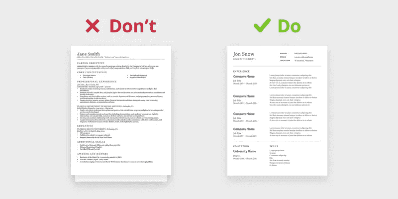

# 程序员应该在简历上写什么

> 原文：<https://javascript.plainenglish.io/what-programmers-should-write-on-their-resume-f5268e84c14a?source=collection_archive---------3----------------------->

## 一份有竞争力的简历的 8 个重要且关键的部分

Source: [Nikhil Yadav — Uxdesign](https://uxdesign.cc/how-to-design-your-resumes-3b86ff7d9f76)

你可以在网上找到很多程序员的简历模板。然而，这些信息大多已经过时或过于笼统。IT 行业在动态变化，新职业不断涌现，招聘也在变化。

新手要照顾好自己在社交媒体中的形象，但也不能忘记一份写得好的简历——这还是基础。所以我会一步一步的呈现你的简历里应该放什么，应该是什么样子，如何根据你应聘的岗位调整程序员的简历。

# 我们为什么不给开发者展示一个现成的简历模板呢？

开发人员简历应该看起来不同于前端开发人员。一个没有 IT 经验的程序员新手的简历结构和有这个行业经验的人略有不同。作为一名程序员，一个有工作经验的人应该把“工作经验”部分放在简历结构的更高位置——首先展示它们，在教育和课程之前。这样的差异有很多。

# 初级软件开发人员和初级前端开发人员——简历外观的差异

让我们更加关注程序员简历的外观。我将在初级开发人员和初级设计人员的例子中展示文档的美学和图形形式的差异。

# 优秀简历的特征——软件开发人员:

*   可读性
*   清楚
*   简历不应该是文本块。

如果你想找一份初级软件开发人员的工作，你的简历不一定要有特殊的视觉效果，但它应该易读，清晰，不应该是一段文字，最重要的东西应该突出出来。

# 一份好简历的特点——前端开发人员:

*   创造力
*   美感
*   有点 UX 风格

如果你在找一份初级前端开发人员的工作，你的简历应该显示出这个职位的一些关键特征，例如，创造力，美感，直觉。

在这种情况下，你的简历应该在图形方面进行提炼，记住至少要使用一点 UX 方法。如果缺乏灵感，可以使用 Canva 等免费提供的图形向导。

请注意，在将你的简历发送给公司后，它首先会被发送给招聘人员，即一个不会检查你的 GitHub 并将开始评估你的简历的非技术人员。

首先，HR 会关注平面设计(一份好看又清晰的简历效果会好得多)和那些有项目符号并吸引眼球的东西，然后他会去关注内容。这就是文档的美观如此重要的原因。

# 程序员的简历结构

让我们从基础开始，也就是说，初级程序员的简历应该包括什么:

# 1.个人和联系信息—我们在这一部分填写的内容:

*   名字和姓氏
*   城市(没有确切地址！)—如果您对重新定位持开放态度，请选择它。
*   电子邮件(必须是职业、姓名)
*   电话号码
*   链接到 GitHub
*   链接到 LinkedIn。

我们没有包括在本部分中的内容，即所谓的敏感数据:

*   出生日期和地点
*   性别
*   公民身份；公民资格
*   说明外貌、种族、出身或宗教的信息，关于婚姻状况和家庭的信息，暗示疾病或任何残疾。

简历尽量不要加照片，但是如果真的想拥有，还是值得选择最好的，当前的，背景统一的，没有所谓的“二次元高手”的。在 GDPR，雇主通常需要一个附加条款，同意在招聘过程中使用该图像。

# 2.总结“关于我”

专业的简历摘要很重要，因为这可能是你简历中唯一会被从头到尾阅读的部分。

因此，总结必须是强有力的，吸引人的，令人信服的。一份写得好的摘要会鼓励未来的雇主阅读简历的其余部分。

用简短的句子将你的注意力集中在你最重要的技能、优势和成就上——确保它们与对你潜在雇主最重要的东西一致。

## “关于我”部分应该包含什么？

*   用一两句话描述一下你为什么要找 IT 工作？
*   作为一名开发者，你都做了些什么？
*   这些活动的效果如何？
*   公司雇佣你会有什么好处？
*   你也可以在你的 LinkedIn 个人资料上使用这个摘要。

# 3.技术

这里值得放置所有你知道的和与 it 行业相关的技术。列表:编程语言、框架、库、数据库、工具等。(最好有项目符号)。—永远不要在简历中评估你的技术能力，这一点很重要，因为我们可以主观地这样做。

如果潜在雇主愿意，他们会在面试中通过实际任务或与技术人员的面试来评估他们。因此，不要指定给定技术的知识水平。只提你认识的。

# 4.培训/课程/证书

描述你的培训机构——持续了多长时间，进展如何，提供了什么技能，你学到了什么技术。

对于证书和课程，值得写的只有行业相关。可以在“兴趣”部分输入机器上完成的缝纫过程。

# 5.教育

我们进入最后完成的学校/大学——当你完成高等教育时，没有必要写普通中学。值得加一个大学，哪怕不是技术研究领域，而是人文领域。

提供:

*   开始和结束日期
*   大学或学校名称，
    方向
*   只进入你已经完成的学校。

# 6.外语

根据下面的划分，外语知识水平是 A1、A2、B1、B2、C1、C2。在这一部分，你应该主要补充你会的语言，至少在交际层面。只有当你想申请的公司要求时，才提供你的 A1 和 A2 语言技能。

# 7.专业经验

如果你有这方面的经验，只展示一个持续了一年或更长时间的。请按如下方式操作:

*   日期—月份和年份，
*   列出的职责范围—如果在某种程度上与 IT 行业相关，如果不相关—只输入雇佣期、雇主姓名和职位，并在 LinkedIn 上指明职责范围。
*   与之无关的经验——如上，

# 8.兴趣

确保在你的简历中提到他们，因为招聘者喜欢问他们。最好能指出最重要的，最有趣的。爱好可以告诉你很多事情，让你从其他候选人中脱颖而出，例如，通过与公司中某个给定团队的匹配棱镜。

简历中有趣的兴趣通常可以证明候选人的性格特征，从中可以推断出很多东西。因此，除了专业经验和教育，心理素质和能力也非常重要。

# 结论

我已经涵盖了程序员简历中应该包含的所有信息。记住不同职位和经验或缺乏经验的区别。在你开始写你自己的简历之前，注意你在互联网上的形象——LinkedIn，还有脸书和 GitHub。

查看如何在 LinkedIn 上创建个人资料，以及如何在 LinkedIn 上找工作。任何人都可以谷歌你的名字。尽量不要让任何信息破坏你作为 IT 行业求职者的形象。

*更多内容看*[***plain English . io***](https://plainenglish.io/)