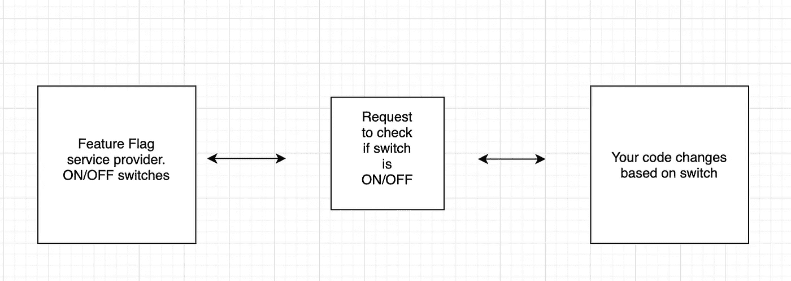
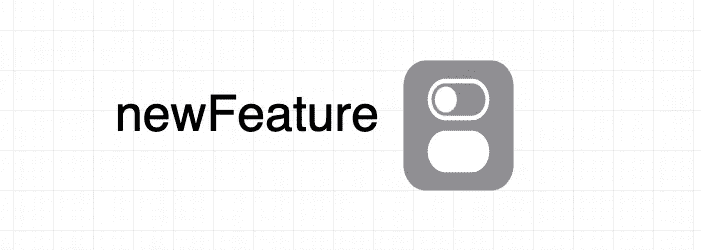
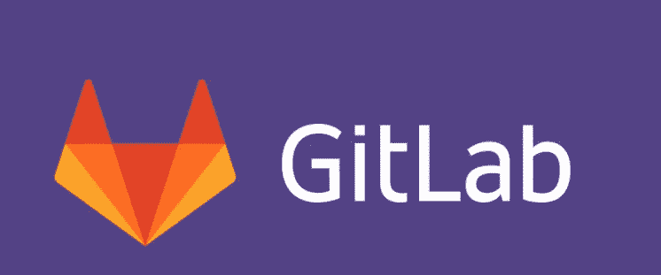
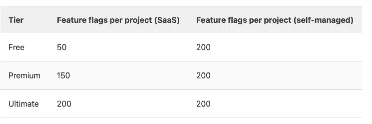
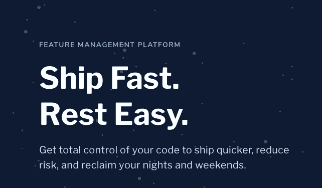
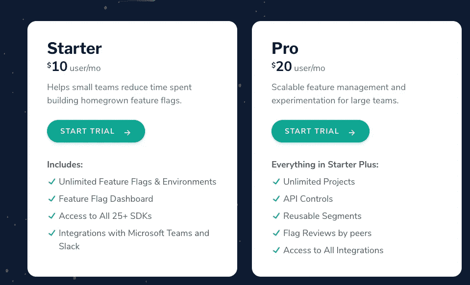

# 特征标志到底是什么？

> 原文：<https://javascript.plainenglish.io/what-the-hell-are-feature-flags-d91b8db8f121?source=collection_archive---------13----------------------->

## 近年来，功能标志已经成为许多公司不可或缺的一部分，但它们是什么呢？


Photo by [Afif Kusuma](https://unsplash.com/@javaistan?utm_source=unsplash&utm_medium=referral&utm_content=creditCopyText) on [Unsplash](https://unsplash.com/s/photos/doubt?utm_source=unsplash&utm_medium=referral&utm_content=creditCopyText)

功能标志有许多名称，如功能切换、功能开关等。但是不管名字如何，它们都指的是相同的开发技术。这种开发技术本质上允许您在运行时打开和关闭特性，而无需更改代码，只需打开和关闭第三方提供者上的开关(您当然可以实现自己的特性标记服务)



High level concept view of Feature Flags

让我们仔细看看。

首先，我们需要在第三方提供者中定义新的特性标志。

这在不同的服务之间会有所不同，但是想象一下这样的情况。



接下来，我们需要在代码中发出一个请求，检查我们的特性标志是开还是关。

```
const isNewFeatureEnabled = await getFeatureFlagFromThirdParty(newFeature)
```

然后我们会根据所述请求的结果选择一条或另一条路径。

```
if(isNewFeatureEnabled){
  newFunction()
} else {
  oldFunction()
 }
```

这提供了很多优势。仅仅通过打开和关闭一个开关，我们就可以执行这样或那样的代码。

想象一下，你现在正在把新代码推向生产，也许是一个新的特性，有了特性标志，你现在会感到安全得多，万一你的新代码引起可怕的回归，只需转动开关，你就可以回到以前的样子。无需通过复杂的重新部署进行回滚。

这只是冰山一角，功能标记服务还附带许多附加功能，如能够为一定数量的客户端激活代码(可能您想为 10%的用户群引入新功能)，可能您想进行 A/B 测试，等等。

**一些最著名的特征标志提供商是**

## **GitLab**



GitLab is an open DevOps platform

GitLab 提供了自己的特性标志服务，并且有一个自由层选项，每个自我管理的项目有多达 200 个特性标志(SaaS 有 50 个)。



GitLab 还提供了许多处理代码库的必备特性，这使它成为一个非常可行的选择，我建议您从特性标志开始旅程。

## 黑暗地发射



LaunchDarkly is specialized in FeatureFlag Management

launch crystally 为大多数语言提供了易于使用的 SDK。
作为一家专注于功能标志的公司，他们在定制方面有大量的选项，并且能够添加规则来划分谁将可以使用您的新功能。

这是有代价的，因为他们的定价是基于活跃用户的。



Pricing options for LaunhDarkly

## ConfigCat


ConfigCat logo

ConfigCat 也是领先的功能标志提供者之一。
他们有一个免费的层级选项，然后他们的定价是一个固定的月费，不依赖于您的组织用户。啊，他们甚至根据你的选择种植一些树。

它们有许多功能，如基于地区、电子邮件、订阅或任何其他自定义用户属性的目标用户细分。并支持 **%**

有了这些选项，再加上成百上千的开源项目，在你的下一个项目中引入特性标志应该是显而易见的。

*想想看，想到回滚代码只需一次切换，你晚上会睡得多好！*

*更多内容尽在*[*plain English . io*](http://plainenglish.io/)