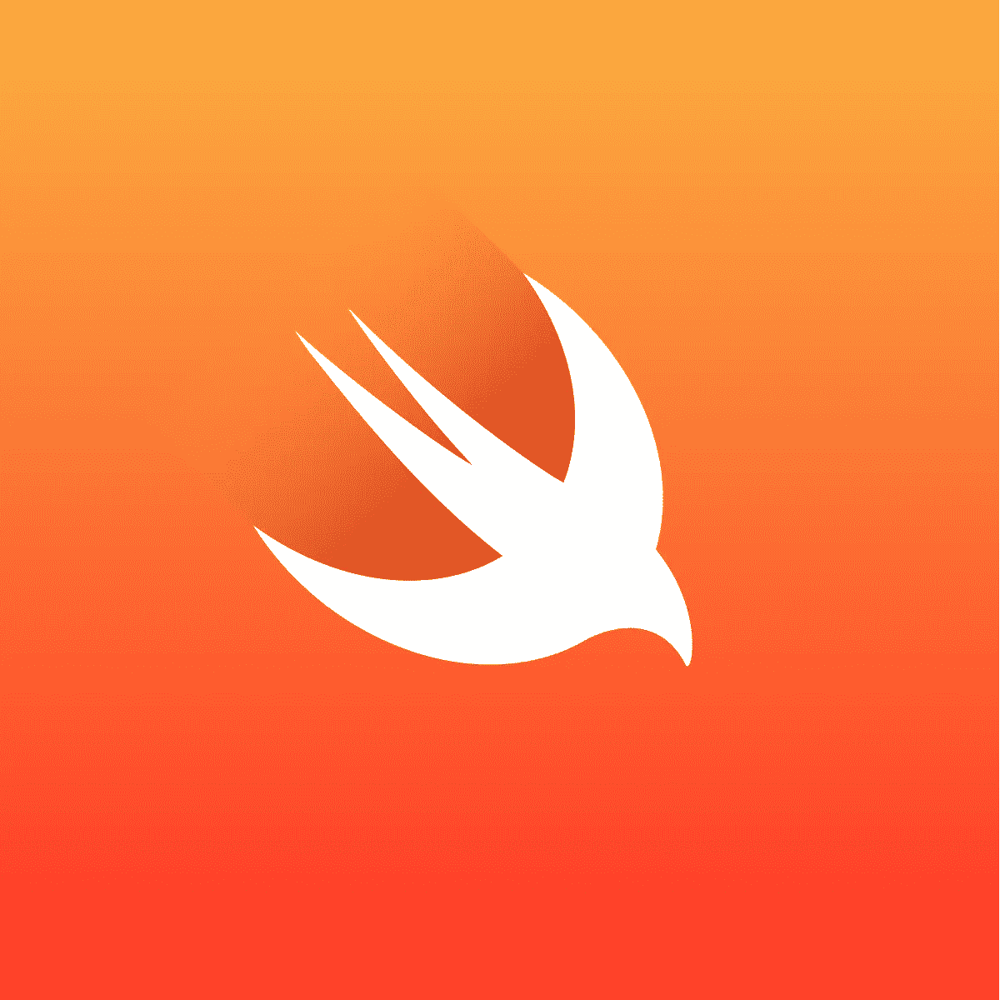

# 选择编程语言要考虑什么？

> 原文：<https://javascript.plainenglish.io/what-to-consider-when-choosing-a-programming-language-aea1011e647c?source=collection_archive---------20----------------------->

## 哪种编程语言最适合初学者？

亲爱的程序员们，

你想学一门语言却不知道该学哪一门？嗯，当谈到学习一门新语言时，要问的好问题是:如何选择一门编程语言？选择编程语言时，什么是重要的？选择编程语言要考虑什么？对于…，我应该使用哪种编程语言？2021 年找工作用哪种编程语言最好？

我应该学 Python 还是 Java？…选择语言时，不应受趋势技术的影响，而应考虑几个变量，例如:

*   你的目标是哪份工作？
*   你是想构建 web 应用、桌面应用、移动应用还是游戏？
*   你想快点找到工作吗？
*   你针对的是哪个操作系统:Windows，Linux，Android，iOS？
*   你的目标是 AI 和机器学习领域吗？
*   想通过学语言来学习编程基础吗？
*   …

有很多事情要考虑。有一点是肯定的，那就是你不想学一些已经过时的东西，比如 Flex！因此，考虑市场需求是一个重要因素。

以下是我根据自己的经验和浅薄的知识提出的建议:

# 1.Java 是为…

Java 一直是并且仍然是市场上需求旺盛的语言。考虑选择学习它:

*   客户端应用程序
*   安卓应用
*   后端网络应用

# 2.C#适用于…

C#也是一种流行的语言，有点类似于 Java。考虑为以下目的学习它:

*   游戏应用
*   网络应用
*   桌面应用

# 3.Python 适用于…

另一种流行语言，通常用于构建机器学习系统。考虑使用它:

*   学习编码和编程(真的很容易学)
*   数据科学领域
*   机器学习领域
*   后端应用

# 4.对…来说很快

我对这种语言了解不多。但我只知道它很受欢迎:

*   iOS 应用程序

# 5.用于…的 C++

C++以网站和优化目的著称。考虑为以下目的学习它:

*   游戏应用
*   数据库软件(重要的数据量需要强大的语言)
*   操作系统

# 6.HTML、CSS 和 JavaScript

这是 web 开发的必学课程。要成为一名网站开发者，你需要学习所有这些(顺序很重要)。这些是 web 开发的基础。并不是所有的语言都是编程语言，但是这三种语言对网络来说都是必不可少的。

*   网络应用
*   移动应用程序(一些框架可以构建 web 应用程序以及移动应用程序(例如:Angular 框架的 Ionic 和 React 库的 React native)。

# 最后的想法…

如果你在这个领域起步，并且你的目标是尽快找到一份工作，学习网络和移动开发将帮助你得到你想要的。它们并不复杂，基本的都能很快学会。

如果你有一个你想要实现的特定梦想，比如建造游戏，那么你有很多选择。你只需要在你生活的市场上快速搜索一下，看看什么更有需求。

如果你想学习乐趣和编码，没有什么比 Python 更好的了。它很容易学习编程概念，并可用于除游戏开发领域以外的所有领域！

我希望这对您选择编程语言的旅程有所帮助。最重要的是享受你的旅行，这样你就可以走得越远越好…

## 你会选择哪一个？对我来说，我在几年前就做出了选择——Java、Node.js、JavaScript、CSS、HTML，因为我热爱 web 领域，我一点也不后悔！

## 评论如下😉❤

## 感谢您宝贵的时间，希望这对您有用！

亲爱的读者，我希望这是明确和有用的。我希望你无论在哪里都是安全的，你的家人也是！坚持住。明天会更好！

**让我们联系一下**[**Linkedin**](https://www.linkedin.com/in/fatima-amzil-9031ba95/)**[**脸书**](https://www.facebook.com/The-Front-End-World)**[**insta gram**](https://www.instagram.com/the_frontend_world/)**[**Youtube**](https://www.youtube.com/channel/UCaxr-f9r6P1u7Y7SKFHi12g)**或**[**Twitter**](https://twitter.com/FatimaAMZIL9)**。********

****[www.fam-front.com](http://www.fam-front.com/)****

*****更多内容请看*[***plain English . io***](http://plainenglish.io/)****