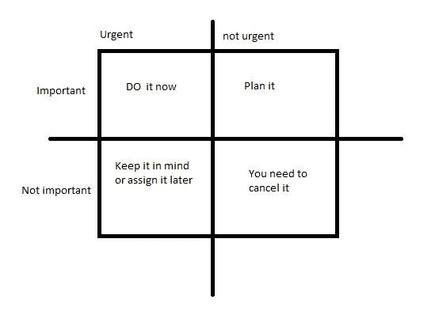

# 作为一名职业人士或学生，你应该消费什么类型的内容？

> 原文：<https://javascript.plainenglish.io/what-type-of-content-should-you-consume-as-a-working-professional-or-student-56fcb394fbf9?source=collection_archive---------14----------------------->

## 平衡平均内容消费。


[Illustration](https://www.freepik.com/free-vector/cartoon-working-day-scene-illustration_13900048.htm#page=1&query=illustrations&position=3&from_view=keyword)

新的刻板印象“**网飞和 Chill** ”越来越受到每一代人的欢迎，他们在空闲时寻求一些高质量的时间。但是，如果你是一名职业人士或学生，狂看电视可能是一个相当严重的问题。

在开始一些严肃的讨论之前，我需要给出一个免责声明，你有权利和自由观看任何你喜欢的节目，我没有操纵你的意图。

回到主题，你应该真正消费什么类型的内容，为什么这很重要？

第一件也是最重要的事情是**钱**。是的，你没看错。这个星球上没有免费的东西。我的意思是，你可以随便搜索任何免费的内容，对所有者来说没有任何真正的利润。

[](/2-technologies-you-should-master-in-2022-5251919743b1) [## 2022 年你应该掌握的 2 项技术

### 趋势技术带来充满希望的一年

javascript.plainenglish.io](/2-technologies-you-should-master-in-2022-5251919743b1) 

在做出任何类似“**一个免费的 YouTube 网站**”的想法之前，它真的是免费的吗？答案是否定的。所有内容创作者都在 YouTube 上创建内容，通过你在视频开始时观看的广告赚钱，或者增加他们的观看时间并获得付费品牌交易。

许多人肯定仍然有一个问题，**“当内容创作者获得报酬时，这是怎么回事呢**,**这对我们双方来说是一个双赢的局面**。我们开始享受内容，创作者通过广告或我们的月订阅费获得报酬。

是的，这是一种双赢的局面，但你是决定赢家的人。我无意凭空写一篇自我提升的文章。我可以继续写关于技术和编程的文章，这些文章最终会帮助我赚钱。

我想说的要点是，你应该从你所消费的内容中获得某种增长。无论你的知识增加了还是你的心理健康提高了。

[](/3-books-every-programmer-should-read-97ac12422cfb) [## 每个程序员都应该读的 3 本书

### 帮助我理解编程基础的书籍。

javascript.plainenglish.io](/3-books-every-programmer-should-read-97ac12422cfb) 

## 现实生活中的例子

让我们假设 Alice 有 10 个小时的空闲时间，并且他计划在空闲时间消费一些内容。

他应该消费的内容类型可以通过简单的 **60/40** 规则来决定。60%的内容应该帮助他提高知识、技能，或者帮助他开始新的事业，40%的内容可以是任何能帮助他放松和提神的东西。

[](/3-business-ideas-to-start-with-zero-investment-e5cf3629fe09) [## 零投资起步的 3 个商业理念

### #开始旁敲侧击

javascript.plainenglish.io](/3-business-ideas-to-start-with-zero-investment-e5cf3629fe09) 

详细计划如下—

```
Assume Alice has 10 hours of free time 
By 60/40 rule he must use 6 hours for quality content and 4 hours of entertaining content6 hours breakdown-
1 hour to learn a new skill like programming or finance
1 hour to watch something new and innovative
1 hour to read about new trends in world/news
1 hour to watch a programming tutorial 
1 hour to set his goals by reading few books
1 hour to plan his future 4 hours breakdown-
Literally watch any Netflix series or movie that Alice wanted to watch for refreshing your mindset
```

以上只是爱丽丝的一个例子，如果他有 10 个小时的空闲时间。你可以根据你的时间调整它。

这背后的主要意图是，除了周末，你每天至少要成长 1%的自己。自我成长对于在当今快节奏的世界中生存是非常必要的，我是认真的。你必须学习新事物，观察你周围发生的新趋势。

如果你处于学生阶段或者你是一名在职的专业人士，自我成长是非常重要的。请记录内容消费，并尝试至少消费 60%的内容，这些内容可以通过任何方式帮助你成长。

**你也可以使用流行的艾森豪威尔矩阵来做相应的计划**



Image made by the [author](http://aniketz.medium.com)

总结——我不是拥有数百万追随者的生活教练或激励大师。我只想让你每天至少增长 1%。在当今世界，自我成长是非常必要的。即使这篇文章仅仅获得了 **100 次浏览**，并且只有 **1 位读者**决定关注**自我成长**，那么这也将是我的胜利，我将感到满意，因为我能够影响我的至少一位读者。

不断进步，不断成长。祝你好运。

[](https://aniketz.medium.com/membership) [## 通过我的推荐链接加入 Medium-Aniket

### 作为一个媒体会员，你的会员费的一部分会给你阅读的作家，你可以完全接触到每一个故事…

aniketz.medium.com](https://aniketz.medium.com/membership) 

## 进一步阅读

[](https://bit.cloud/blog/meet-component-driven-content-applicable-composable-l24cw7ku) [## 满足组件驱动的内容:适用的、可组合的

### 自从 React 和 Angular 等技术出现以来，我们经常将术语“组件”与…

比特云](https://bit.cloud/blog/meet-component-driven-content-applicable-composable-l24cw7ku) 

*更多内容请看*[***plain English . io***](https://plainenglish.io/)*。报名参加我们的* [***免费周报***](http://newsletter.plainenglish.io/) *。关注我们关于*[***Twitter***](https://twitter.com/inPlainEngHQ)[***LinkedIn***](https://www.linkedin.com/company/inplainenglish/)*[***YouTube***](https://www.youtube.com/channel/UCtipWUghju290NWcn8jhyAw)***，以及****[***不和***](https://discord.gg/GtDtUAvyhW) *对成长黑客感兴趣？检查* [***电路***](https://circuit.ooo/) ***。*****