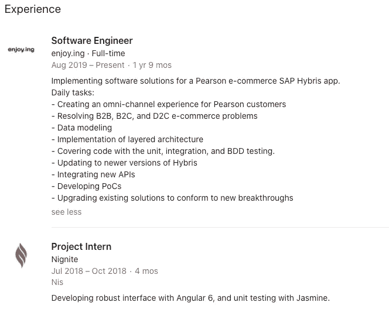

# 薪酬过低的开发人员必须知道什么才能加薪

> 原文：<https://javascript.plainenglish.io/what-underpaid-developers-must-know-to-increase-their-salary-b9e32db146e1?source=collection_archive---------16----------------------->

## 给低薪开发人员一些加薪的建议。

Photo by [Karolina Grabowska](https://www.pexels.com/@karolina-grabowska?utm_content=attributionCopyText&utm_medium=referral&utm_source=pexels) from [Pexels](https://www.pexels.com/photo/woman-holding-fan-of-us-dollar-bills-4968660/?utm_content=attributionCopyText&utm_medium=referral&utm_source=pexels)

报酬过低。每个人都觉得报酬过低。

你能做些什么来赚更多的钱？你为什么工资低？你能做些什么来增加你的薪水？

我是自由职业者，在一家咨询公司工作，现在在一家企业工作。以下是我的经历——好的、坏的和丑陋的。学以致用，避免我的错误。

让我们开始吧。

# 什么带来商业价值？

对于自由职业者来说，项目带来价值。你的报酬是基于你完成的项目。项目越多，职位越好。*你能为雇主完成很多项目吗？*你将会带来很多价值。

咨询公司出租你的工作时间。他们从你的工作中提成。时间越多越好。*你工作的持续时间衡量你的商业价值。*

企业关心工作的质量。这是我的亲身经历。商业价值是软件的质量。他们对速度或时间不感兴趣。商业价值就是软件质量。

如何将这些知识运用到你目前的薪水中？

我和一群朋友一起从事自由职业。我们分担项目预算和工作。你需要完成项目，获得更高的报酬。压力很大，几乎没有计划。我不喜欢这种商业模式，因为它会降低你的软件质量。*完成的自由职业项目越多，最终赚的钱就越多。*

咨询公司在乎时间。他们会付给你最低工资，因为客户不会提高小时价格。我不喜欢这种模式，因为它会导致倦怠。为了增加收入，对于咨询公司来说，要投入更多的时间。

企业客户衡量您的进步。*为什么？他们在做长期生意。他们看重你的知识、工作时间或项目数量。对我来说，企业模式最适合我。薪水取决于你的经验、知识和专长。*

以下是如何向经理要求加薪的建议:

“把要求加薪的过程视为对公司的一种价值主张。收集你的事实来证明你给公司带来了多少价值，这是基于你的业绩记录，这些业绩记录表明你带来了更多的收入。对形势采取不带感情色彩的立场，坚持事实。这不是你需要什么的问题。这是为了展示你对公司的价值，以及与你所在行业的其他人相比，你的薪酬为何偏低。”***——***[***迪安娜阿诺德***](https://salaryhackers.com/how-to-negotiate-your-salary-advice-from-8-managers/)

我们知道什么会带来商业价值，但公司是如何创造薪酬的？让我们试着回答这个问题。

# 公司薪酬策略是怎样的？

从我的经验来看，有两种策略:

*   **定性**
*   **数量型**

定性方法关注你的品质。你掌握的技能，你学的课程，你教的课程，你的专长。自己发展的越多，工资就越好。

我的团队成员，工作了 1.5 年，薪水比别人高。别人花的时间比他多。*为什么？*因为他的进步比队友好。公司重视质量的进步甚于数量的进步。

如果你的公司采用这种策略，你能做些什么？质量上的进步。致力于你的个人发展。改进工作，注意细节，提升自己。公司会重视你的进步，并给予很大的奖励。

通过业务成果来衡量你的工作质量。*把这些作为加薪的衡量标准。*

没有灵丹妙药。在疫情期间，为航空公司工作的同事被解雇了。他们带来了很多商业价值，但外部因素让他们失业。

对于量化策略，公司奖励速度。不是你的品质。非常适合快速软件开发人员。*你送货越快，你得到的报酬就越多。*

我不提倡这种类型的公司。*为什么？*每个开发者都有不忙的一天。bug 发生，外界因素，你无法工作。公司希望你能以一种持续的方式交付成果。你甚至可以从薪水中扣除一部分。

你如何利用这一点来增加你的薪水？

摆正自己的位置。适应薪酬策略。不要偏离薪酬策略。

当你的雇主重视质量时，不要加班。除非加班提高了你的质量。你加班没用没人管。

不要过度设计自由职业者的项目，交付要快。通过更快的交付，你可以证明你的价值。如果你今天很快，作为一个自由职业者，你会有一份不错的薪水。

# 经理们知道你的工作吗？

证明你的价值。创建好的工作报告。评估你的影响。把他们带到你的评估上来。给出你价值的有效例子，然后你用它们作为杠杆。

向你的经理提出此事。显示您何时解决了一个关键错误。展示您何时加快了构建过程。把意识带到你的工作中，并把你的提议建立在具体的例子上。

引起公众的注意。这里有一篇[关于如何做的好文章](https://twitter.com/nickbulljs/status/1369898220583813121)。可以在 LinkedIn 上获得关注。更新你的个人资料，陈述你的专长，给人留下深刻印象。

不时更新领英。*为什么？*您需要一个连接池。你可以在那里征求报价。*更新领英以获得杠杆效应，即使你已经被录用了。*

[My experience on LinkedIn](https://www.linkedin.com/in/zivce/)

网络的创造会让你好奇，而不是一个求职者。你不应该直接找工作。专注于工作机会。比尔·伯内特指出:

> 当你“了解故事”时，你只是一个好奇的人，他会和有趣的人交谈，在你感兴趣的工作领域做有趣的事情。你还不是一个求职者，这就是为什么你是一个很容易交谈的人。在进行这些对话时，重要的是你真的不是在追求工作——你只是在追求故事。如果你闻起来像伪装的求职者，你会被发现，这个过程不会成功。所以，真正依靠你的好奇心(不要把简历带到原型对话中)。

# 证明您为客户带来了价值

证明你是一项有价值的资产。

对于定性策略，您应该展示您的进展。即使它是可见的，也要做出具体的改进声明。

对于较小的团队，这是显而易见的，甚至没有显示您的质量。我的第一个雇主主动提高了我的工资。两周之后，我进步很大，以至于加薪了。

对于更大的团队，有必要展示一下。你需要提醒他们你的成功。提醒他们，否则你会和其他人一起迷路。

*你在咨询公司工作吗？*展示您迄今为止所做的工作。您已经完成了多少项目或小时。

当你证明自己有价值时，他们会把你留在身边。然后，您可以继续前进，要求加薪。*当你站在坚实的地面上时，你可以到达更高的地方。*

# 征求报价

了解您的美元价值，而不是风险敞口或您获得的经验。

**不要发脾气:**

*“我想要更高的薪水。我想要 X 美元的金额！”*

**这样做:**

*“我更多的是在 X 美元到 Y 美元的范围内，因为这是* ***公平报酬*** *对于我的经验水平。你对此有什么看法？”*

*难道每个人都想成为* ***公平的*** *吗？*不要定价，要报价。如果报价不适合你，建议一个让你满意的范围。

# 外卖食品

你应该想出工资策略。定位自己，融入其中。

然后，您就可以了解业务价值。努力获取更多信息并提高工资将是轻而易举的事情。

提供具体的还价，并附上出色工作的具体例子。证明你是一项有价值的资产。

## 你可能会喜欢的文章很少

 [## 如何协商薪水:8 位经理的建议|薪水袋

### “迈出这一步之前要做好准备，并确切知道你想要的是什么，以及你为什么想要这样做……

salaryhackers.com](https://salaryhackers.com/how-to-negotiate-your-salary-advice-from-8-managers/)  [## 赢得薪资谈判的 10 个简单电子邮件脚本

### 许多候选人对要求更高的薪水感到尴尬。许多人说，他们可能表现得很贪婪，或者冒着失去…

salaryhackers.com](https://salaryhackers.com/10-salary-negotiation-email-scripts/)  [## 对“你期望的薪水是多少？”的 3 个最佳回答(以及他们为什么工作)|工薪阶层

### 几乎每个工作面试都会问到薪资期望值的问题。这绝对是你面试成功的标志…

salaryhackers.com](https://salaryhackers.com/3-best-responses-to-what-are-your-salary-expectations-and-why-they-work/) 

[*更多内容看 plainenglish.io*](http://plainenglish.io/)