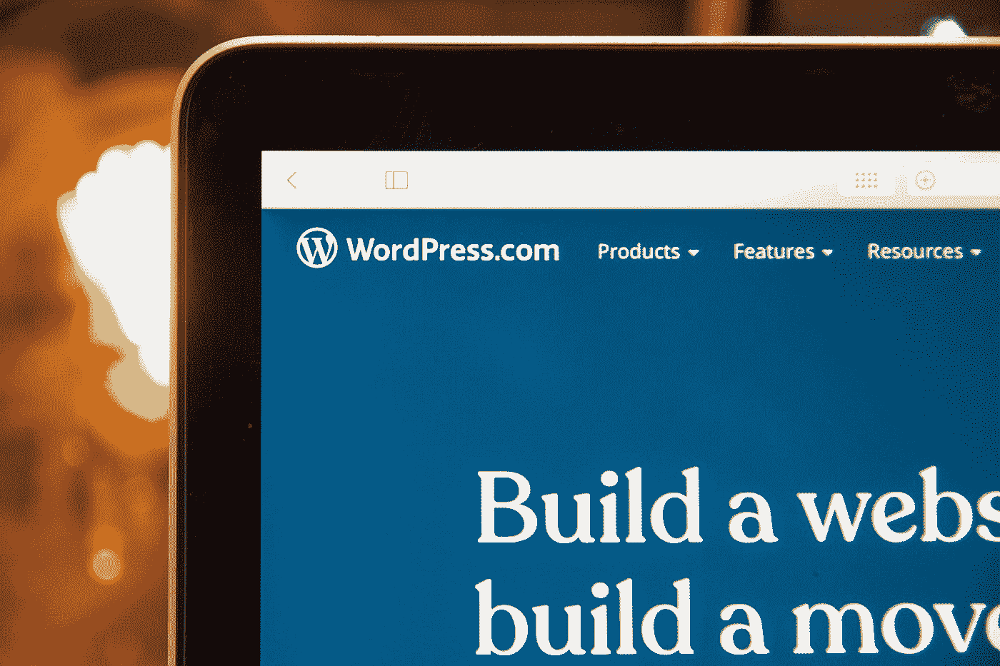

# 关于 CMS 和框架你需要知道什么

> 原文：<https://javascript.plainenglish.io/what-you-need-to-know-about-cms-and-framework-d5fbb12f7268?source=collection_archive---------19----------------------->

## 他们的缺点、差异和优点。

Photo by [Stephen Phillips - Hostreviews.co.uk](https://unsplash.com/@hostreviews?utm_source=medium&utm_medium=referral) on [Unsplash](https://unsplash.com?utm_source=medium&utm_medium=referral)

当你想到 CMS 和框架时，你可能会问自己以下问题。

*   它们是一样的吗？
*   两者有区别吗？
*   何时使用其中一种？
*   各有什么优缺点？
*   你喜欢 web 开发的世界吗，你经常使用 CMS 或者框架吗？
*   你不知道两者之间的区别，也不知道什么时候应该使用其中一个？

在本文中，您将发现每种方法的区别、优点和缺点，以便根据您将要开发的应用程序来决定何时使用其中一种方法。

让我们从快速解释它们的组成开始:

# 什么是内容管理系统？

内容管理系统(CMS)是指允许创建支持结构(框架)以由管理员和参与者创建和管理内容(通常是网页)的软件。

它是一个界面，可以控制网站内容所在的一个或多个数据库。此外，布局的内容可以独立管理，因此在任何时候，都可以通过更改样式以不同的方式查看相同的内容，而不必更改内容格式。

# 什么是框架？

框架指的是计算一个概念结构，该结构具有作为软件开发基础的已定义的支持。它可以得到程序和库以及其他工具的支持，以促进项目不同部分的开发和联合。简而言之，一系列允许和促进程序、应用程序或网站开发的工具。

解释完这些，你可能会质疑我之前一直用的是什么，CMS 还是框架？很容易产生这种怀疑，因为可以认为 CMS 是我们框架的一部分，但 CMS 也包含一个框架。

# CMS 和框架示例

有许多方法可以为网页编程，从不用任何内容管理器，只使用文本编辑器的“无框架”编程，到你可以直观地将元素放置在你想要的位置，并根据你的喜好调整网站的平台，几乎不需要知道如何编程。

然而，今天最常见的方法或实践是使用 CMS 或框架。

**CMS 示例:**

*   wordpress 软件
*   写日志（部落格）的人
*   Drupal
*   等等。，

    框架是一种抽象，其中具有一般功能的软件可以被修改以添加它自己的特征或功能。一般来说，不同的编程语言都有框架。

**框架示例:**

*   JavaScript 的角度
*   PHP 的 Symfony
*   等等。,

# CMS 还是框架？选什么？

在选择 CMS 还是框架来开发您的网页时，您应该考虑以下几点:

*   你有多少时间来建立你的网站？
*   你的网站的目的是什么，它应该有多灵活？
*   它的开发预算是多少？
*   你会用什么主机或者托管？

必须记住，如果你打算使用一个框架，你必须有编程知识，有足够的时间进行开发，并有一个良好的预算。

另一方面，如果你用的是 CMS，几乎不需要编程知识(虽然从来不疼)，网站可以做的比较快，预算可能也没那么高。因此，根据我们将要着手的项目，必须使用其中之一。

例如，如果一个网站仅仅是一个静态页面，一个博客，或者一般来说是一个没有特殊特征的网站，那么使用 CMS 是最理想的。

相反，如果要求页面具有特定的功能，是一个更加个性化的项目，并且需要编程知识，那么推荐使用框架。

# CMS 和框架的优缺点

## **CMS** 优势

*   你已经有了平台，你必须改变模板，页面已经可以工作了。
*   开发的时间和费用更少。
*   有一个很大的社区致力于 CMS 的支持和改进。

## CMS 的缺点

*   你必须适应平台上存在的模块。
*   可能不是客户要求的所有要求都得到满足。

## 框架优势

*   在发展方面，你有更多的灵活性。
*   它具有较高的可靠性。
*   如果不使用框架，则减少了时间。

## 框架缺点

*   你必须开发所有的模块来定制网站，因为默认来的是基本的。

通常以互补的方式使用两者，因为在许多情况下，平台被用作 CMS 下的基地。后来，通过框架，所需的模块被定制，或者为我们的站点开发新的模块。

不管你用什么系统来创建和开发你的网站，拥有编程知识是很重要的，因为，即使是很小的改变，定制你使用的模块总是好的。

当然，这总是取决于你想在什么上面建立你的网页，如果你只想在一个页面上放置静态信息(例如，食谱页面或关于特定主题的信息页面)或个人博客，使用 CMS 及其基本模块，你会有足够多的内容。

如果你想要的是一个专业网站的建设，具有高度的定制性(例如，网店，公司等。理想的情况是使用框架(可以使用 CMS 作为补充)，在框架中，开发人员可以修改必要的模块，或者创建自己的模块来响应特定的特性。

*更多内容尽在*[plain English . io](http://plainenglish.io/)