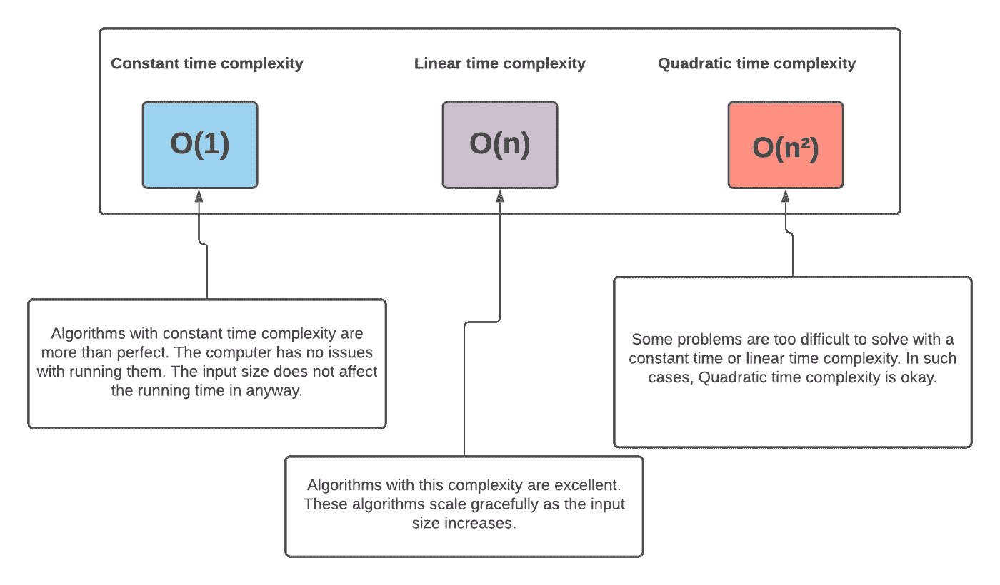

# 关于 P = NP，你需要知道的是，求解并为自己赢得 100 万美元

> 原文：<https://javascript.plainenglish.io/what-you-need-to-know-about-p-np-solve-and-earn-yourself-1-million-b8be95777803?source=collection_archive---------9----------------------->

Photo by [Tim Gouw](https://unsplash.com/@punttim?utm_source=medium&utm_medium=referral) on [Unsplash](https://unsplash.com?utm_source=medium&utm_medium=referral)

几周前，我的一个朋友联系我，帮助他们解释什么是 heck **P = NP** 。早在大学二年级的时候，我就对这个话题产生了兴趣。驱使我的是那东西上 100 万美元的价格标签。提供证明 **P = NP** ，否则( **P ≠ NP** )，一路笑到银行。对于天真的大学生来说，这是一个变得富有的好机会。

几年过去了，前景并不乐观。

我放弃了吗？是啊！

## **那么什么是 P 和 NP 呢？**

要理解这些概念，我们必须慢慢来，理解基础知识。我们需要熟悉算法及其复杂性。

我们知道算法是帮助我们解决问题的一系列步骤。只需查看下图:

Photo by [Daniel Hooper](https://unsplash.com/@dan_fromyesmorecontent?utm_source=unsplash&utm_medium=referral&utm_content=creditCopyText) on [Unsplash](https://unsplash.com/s/photos/chicken-wings?utm_source=unsplash&utm_medium=referral&utm_content=creditCopyText)

我不知道你是怎么想的，但这张照片让我垂涎三尺。好吃！

如果你想像图中那样自己做鸡翅，你可以买一只鸡，然后打电话给丹尼尔·胡珀，问问他是怎么做的。丹尼尔会把实现你目标的方法(步骤列表)发给你。

我们同样可以把算法看作是解决问题的一系列步骤。算法和食谱之间的唯一区别是，算法可以很容易地翻译成计算机程序。这是真的，因为对于算法来说，没有哪一步是理所当然的。一切都有明确的定义。常识推理没有应用的余地。

对于一个问题，可能有不止一种算法来解决它。这也适用于鸡翅，你会同意我的观点。爱管闲事的隔壁邻居马克可能有一个稍微不同的食谱来制作图中的鸡翅。如果我们有两种配方，那么我们必须小心使用哪一种。如果使用马克的食谱会花掉我们更多的钱，需要更多的时间来准备，那么选择胡珀的食谱是显而易见的。

一般来说，我们不希望算法在输入量增加时表现不佳。事先了解算法如何随着输入大小的增长而扩展是一个好主意。与输入大小相关的算法可伸缩性的度量被称为其**复杂度**。复杂性越低越好。有些算法非常好，无论输入大小如何增加，解决问题所需的时间都是**常数**。一个例子是返回数字列表中第一个数字的算法。你会同意我的观点，无论作为输入提交给算法的数字的大小，大小都不会影响执行的时间。无论是 10 个还是 1000000 个数字，算法都不关心，只返回第一个数字。像这样的算法据说有恒定的时间复杂度 O(1)**。**

其他算法有**线性时间复杂度** **O(n)。这类问题的一个例子是列出从 1 到 n 的数字。我们需要数 n 次。**

下图显示了这些复杂性:

## 多项式时间

我们通常可以将形式为 **nᶜ** (其中 c 是常数，n 是输入的大小)的复杂性称为多项式时间复杂性。这意味着上图中的所有复杂度都是多项式时间复杂度。更多的例子有**北部、n⁴、…、⁰北部、**等。多项式时间对计算机来说很棒，至少如果常数不是那么大的话。如果有足够的时间和资源，计算机甚至可以运行多项式时间复杂度的算法，而不是指数时间复杂度。

## 指数时间

指数时间复杂性具有形式 **Cⁿ，**其中 c 是常数**。**例子有 **2ⁿ、3ⁿ、4ⁿ等。**这个范畴内的算法一点都不伟大。他们就像马克的鸡翅食谱；随着输入大小的增加，它们需要很长时间来执行。它们通常是“坏市场”。对于多项式时间版本，需要指数时间的解决方案通常会被丢弃。

## 决策问题

决策问题是需要二元解决方案的问题。下面列出了一些决策问题的例子:

*   **x** 是整数吗？
*   讲师已经在上课了吗？
*   考试很容易。(可能是真的也可能是假的)

这些问题的答案要么是或不是，真或假，等等，因此二进制。

## 从公式 ***P = NP* 可知 **P** 是什么？**

**P** 表示多项式时间内可以解决的所有决策问题。这意味着，如果我们有一个决策问题，并且我们能够提出一个算法，可以在多项式时间内解决它，那么这个问题属于 **P-** 类问题。

## 那么什么是 NP 呢？

多项式时间的复杂问题对计算机来说是一股新鲜空气，不管它有多复杂。给足够的时间，计算机能解决它。然而，有一些困难的问题，人们不能在多项式时间内解决。这意味着所有被设计用来解决这些问题的聪明算法都存在于事物的指数方面。我们不能做得更好。然而，对于这些问题中的一些，即使我们没有多项式时间约束算法，我们也可以验证它们的答案是否正确。 **NP(非确定性多项式时间)**就是代表这些问题的类。任何在多项式时间内没有已知算法但其答案可以在多项式时间内验证的问题，都属于 **NP。**这些问题很难解决，但很容易验证。

## 一个 NP 问题的例子(质因数分解)

一个经典的 NP 问题是质因数分解。一个数的质因数分解是什么意思？如果给你 10，并要求你对它进行质因数分解，你要以质数乘积的形式返回它(即 10 = 2 x 5)。2 乘以 5 等于 10，2 和 5 都是质数。

所以问题是: ***如果我有一个数 Y 和另一个数 X 使得 Y > X，Y 有小于 X 的素因子吗？***

这是一个决策问题，也很难解决。还没人想出多项式时间求解的算法。但是，如果我给你一个数字，并声称这是一个解决方案，这是非常容易确认，如果这是真的。我们可以用几个简单的步骤在多项式时间内验证这个解。

## 为什么求解 P=NP 对计算很重要？

所以计算机科学的大问题是“如果一个问题是 NP 的，是否意味着它有多项式时间的解？”换句话说，P = NP 吗？这是一个还没有被证明的东西。没有人证明过他们的解可以在多项式时间内验证的所有问题都可以在多项式时间内解决。如果你能给出 P = NP 问题的正确解，那么你将为自己赢得惊人的 100 万美元。

证明 P = NP 或其他非常重要，它可以极大地改变计算的面貌。在现实世界中有实际应用的难题。计算机硬件技术、金融、生物技术等方面的问题。他们的解决方案会让我们的很多事情变得更好。然而，这些问题可能需要计算机甚至数十亿年才能解决。证明 P = NP 意味着我们将有解决这些问题的捷径。这是这里的大生意。100 万美元的价格标签与一个人将在这个世界上产生的影响相比算不了什么。

现在，人们普遍认为 P 不等于 NP。正是基于这种假设，密码学和其他计算算法蓬勃发展。不确定性无处不在。这个世界需要你的天才来解决这个问题。让我们确信，让你自己骄傲。万一你碰巧解决了，打电话给我要我的银行资料。

*更多内容尽在*[*plain English . io*](http://plainenglish.io/)