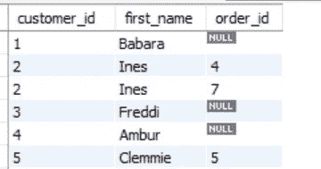

# 关于 SQL 连接，您需要知道什么

> 原文：<https://javascript.plainenglish.io/what-you-need-to-know-about-sql-joins-4c39034f4063?source=collection_archive---------15----------------------->

## 用一些实际例子来解释


Photo by [Paige Cody](https://unsplash.com/@paige_cody?utm_source=unsplash&utm_medium=referral&utm_content=creditCopyText) on [Unsplash](https://unsplash.com/s/photos/learn?utm_source=unsplash&utm_medium=referral&utm_content=creditCopyText)

今天，我们将看到不同类型的连接在 MySQL 中是如何工作的。这是第二部分。第一部分可以在这里找到[。](/learn-join-in-mysql-database-a-practical-approach-1933c5c6bae6)

# SQL 中的 JOIN 是什么？

加盟的目的是什么？

假设您有客户数据和他们的订单信息。现在，如果您想知道订购商品的客户的 id 和名字，您需要同时了解客户数据和订单数据。

可以想象`join`下面。

它创建一个临时表，根据某种条件组合两个或更多的表。

在我们的例子中，customer 表中的客户 id 与 orders 表中的 customer_id 相同。所以我们要根据这个条件来连接这两个表。

```
**USE** sql_store;**# get the desired info
SELECT** c.customer_id,
       c.first_name,
       o.order_id**# define the tables****FROM** customers c
**JOIN** orders o**# define the condition****ON** c.customer_id = o.customer_id
**ORDER BY** c.customer_id
```

然后你会看到下面的结果；


image by author

这被称为内部连接，因为结果中只显示了与`customer_id`相同的标准行。因此，只有当顾客点了他的东西，她的信息才会显示在这里。

# 外部连接

但是，如果您希望看到所有的客户，而不管他们是否点了菜，该怎么办呢？

在这种情况下，您必须使用左连接。left join 所做的是从左边的表(在我们的例子中是 customers 表)中取出所有的行，然后将适当的行匹配到右边(在我们的例子中是 orders 表)

```
**USE** sql_store;
**SELECT** c.customer_id,
       c.first_name,
       o.order_id
**FROM** customers c
**LEFT JOIN** orders o
  **ON** c.customer_id = o.customer_id
  **ORDER BY** c.customer_id
```

在这种情况下，你的结果是；



image by author

看，第一次，我们没有看到 customer_id 1，3，4。因为那些客户没有订购，在这个时候，我们连续获得客户 id，也知道谁打电话或没有。

# 自外部连接

假设，来自一家公司；您想知道员工经理的姓名，以及他们在哪里提交报告。

你有一些数据。在这里，每个员工都必须向另一个员工报告。这意味着您需要用不同的别名加入员工。员工的第一次是 e，经理的第二次是 m。

现在的问题是你必须把雇员数据和雇员数据连接起来。这称为自连接。这意味着您正在进入同一个表。但是如何区分两个表呢？

你必须使用别名。

MySQL 里怎么问！

```
**USE** sql_hr;
**SELECT**
  e. employee_id,
  e. first_name,
  m. first_name AS Manager
**FROM** employees e
**JOIN** employees m
    **ON** e. reports_to = m. employee_id
```

我们将一个雇员表称为`e`，将另一个雇员表称为`m`。现实中，两者同桌。

然后，您将获得向其他人提交报告的所有员工的姓名。因为我的条件是在“e. reports_to = m. employee_id”中给出的。

但是，如果您想知道是谁交付了还是没有交付，那么您只需要更改一件事。

```
**FROM** employees e
**LEFT JOIN** employees m
    **ON** e. reports_to = m. employee_id
```

在`JOIN`前写 `LEFT`就行了。然后你会看到；


image by author

看， **Yovonnda** 是唯一没有提交报告的经理。他刚刚收到了员工发来的所有文件。

# Using 子句

假设你想使用比`ON`子句最短的子句。你的专栏也一样

在这种情况下，可以编写`USING`子句。

```
USE sql_store;
SELECT
  c. first_name,
  o. order_id
FROM orders o
JOIN customers c
**-- ON o. customer_id = c. customer_id
 USING (customer_id)**
```

这里的列是相同的，即 customer_id。您想知道那个有`order_id`的客户的名字。

加入后，可以使用最后一种语法；

```
**USING (customer_id)**
```

# 自然连接

`Natural`子句用于根据两个连接表中的标准列来隐含 join 子句。语法很简单。

```
**USE** sql_store;
**SELECT**
 c.first_name,
 c.customer_id,
 o.order_id
**FROM** orders o
**NATURAL JOIN** customers c
```

通常，不鼓励在 MySQL 中使用该子句。因为 from in 无意中添加了一个新列，与另一个表中的另一列同名。

# 交叉连接

交叉联接将第一个表中的所有记录与第二个表中的所有历史记录结合起来。

假设你有 A，B 客户，和 X，Y，Z 产品。使用交叉连接，您会发现:

> A-X，阿-Y，阿-Z
> 
> B-X，B-Y，B-Z

使用这种连接的语法非常简单。这是你怎么做的。

```
**USE** sql_store;
**SELECT**
c.first_name AS customers,
p.name AS product
**FROM** customers c
**CROSS JOIN** products p
  **ORDER BY** c.first_name
```

# 联合加入

在 MySQL 中，Union join 用于将所有结果组合在一起。假设您需要查看一行中大于 2000 小于 4000 的客户点，您可以使用该子句。

下面是语法:

```
**USE** sql_store;
**SELECT**
c. first_name,
points
**FROM** customers c
**WHERE** points >'2000'
**UNION**
**SELECT**
c. first_name,
points
**FROM** customers c
**WHERE** points <'4000'
```

结果如下所示；


image by author

如果您有兴趣了解更多关于 MySQL 中的连接，请参考下面的文章。

[](/learn-join-in-mysql-database-a-practical-approach-1933c5c6bae6) [## 在 MySQL 数据库中学习 JOIN:一种实用的方法

### 电子商务数据库细分

javascript.plainenglish.io](/learn-join-in-mysql-database-a-practical-approach-1933c5c6bae6) 

*更多内容尽在*[***plain English . io***](http://plainenglish.io/)