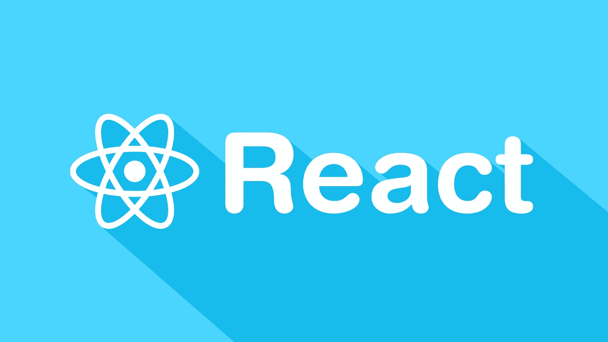

# 2021 年学 React 之前应该学什么

> 原文：<https://javascript.plainenglish.io/what-you-should-learn-before-learning-react-in-2021-5cb32d5f6dc4?source=collection_archive---------17----------------------->

学习 React 的先决条件—一个 JavaScript 库



我发现自己很适合写这个话题。我已经写了几篇介绍性的文章，关于那些来反应的人应该知道什么。这些文章在流行的技术平台上获得了一些关注，包括媒体和读者的各种反馈。

大部分文章都是我在 2020 年初一头扎进 React 并在 Heroku 上构建了一些像这个[计算器这样的简单项目之后写的。我还阅读了完整的 React API 文档。相信我，我没有虚张声势。我在工作中也做过一些个人的不太复杂的项目。从那以后，我学到了更多的 React 知识，尤其是 JavaScript 知识。](https://simplegooglecalculator.herokuapp.com/)

首先，React 是一个 JavaScript 库，不完全是一个框架，但尽管如此，它与其他著名的 UI 框架如 Angular、Vue.js、Backbone、Knockout 和 Ember、Svelte 并列。现在我肯定你在想为什么 React 不是一个框架而是一个库。但是它和上面列出的框架是一类的。

React 非常强大，每当讨论 JavaScript UI 框架或对其进行排名时，react 经常排名第一或第二。但是它不被认为是一个框架，因为 React 不具备框架的完整性。它是一个小库，需要使用 React 中没有内置的其他库来提供路由、状态管理、查询和获取、网络调用等功能。它基本上是一个渲染引擎。它被设计成提供核心功能，而这些第三方库是可选的，这样开发者可以有选择。

## **还是 JavaScript，别着急**

任何人来反应需要在 JavaScript 的基础上，高于初学者水平是好的。我怎么强调都不为过。新手会犯的最大错误就是直接跳到 React。这相当于本末倒置。React 是应用于 UI/web 开发的 JavaScript，它使用了特定的设计概念，这将在后面讨论。像其他 UI 框架一样，React 是使用 HTML、CSS、vanilla JavaScript、jQuery、AJAX 和其他语言和库的基本 web 开发的抽象，在基于微服务而不是 Java/Spring 和 C#/ASP.NET 提供的整体架构的前端框架出现之前，许多 web 开发都是基于这些语言和库进行的。

React 是用 JavaScript 写的(。js)文件和/或。jsx 提供了一种类似 XML 的方式来编写 React 组件。在 2018 年 React 16.8 发布时首次亮相的 React Hooks 之前，React 是用 JavaScript 类编写的。然而，它开始时是纯 JavaScript。有了 hooks，函数组件已经成为编写 React 的首选方式，使它成为核心团队更喜欢的习惯性 JavaScript。编写 React 应用程序时使用的是相同的函数、对象、承诺、回调和其他 JavaScript 概念。因此，如果没有至少高于初级水平的对 JavaScript 的理解，一个新手将会不知所措，并且总是会发现 React 很复杂。

让我重申，以上的网页开发初学者知识是必要的。一个人需要能够以一种基本的方式进行 web 开发，才能使用 React。一个人不可能在学习 React 的过程中就开始学习 CSS、HTML Dom 元素、事件监听器、Web API 的基础知识。这些都是先决条件，可以让初学者轻松掌握成为 React 开发人员的必备技能。虽然这是理想的，但这并不意味着聪明和专注的人不能同时学习所有这些，但为了获得最佳结果，拥有这些背景是有意义的。

## **React 的设计原则**

React 背后有一些设计原则，一般编程知识水平的人需要了解这些原则才能理解 React。核心团队已经概述了这些原则。

首先，React 哲学支持函数式编程模式，并且它们已经被广泛用于开发库的特性，比如由 React 钩子支持的有状态函数。函数式编程技术是 JavaScript 的重要组成部分，比如一级函数、高阶函数和不变性——所有这些都在 React 中得到了利用。React 核心团队的目标之一是让 React 尽可能成为地道的 JavaScript。这就把我带回到了一个问题上，对于新手来说，他们必须以 JavaScript 为基础才能适应 React。

第二，React 选择复合而不是继承。这个选择触及了设计模式争论的核心，这个争论是由著名的知识分子如四人帮提出的。他们在他们的“面向对象设计的第二原则”中提出:“比起类继承，更喜欢对象组合”。(第 31 页)”。 React 团队根据他们对[***【mixins】***](https://medium.com/@dan_abramov/mixins-are-dead-long-live-higher-order-components-94a0d2f9e750)(及其在基于组件的库中的复杂性和局限性)的经验，选择了一个[【强大的组合模型】](https://reactjs.org/docs/composition-vs-inheritance.html)。Mixins 替代其他编程语言中的 ***接口*** 。组件的组合为 React 提供了一种在浏览器中表达 UI 的强大方式。仔细想想，HTML DOM 是由包含其他元素的元素组成的树。因此，React 的组件模型是一个高级抽象，旨在使在浏览器上构建组件更容易，以管理复杂的 UI 开发。想想像 Gmail、脸书、谷歌地图、Twitter、Google Drive、GitHub、大多数现代博彩网站这样的热门应用，以及其他我们可以看到浏览器组件更新而无需重新加载页面的应用和网站。这是单页应用程序(SPA)背后的革命性理念，React 是使其更容易构建的 UI 框架之一。

第三，React 有一个虚拟 DOM，它是库和老式浏览器 DOM 之间的接口。然而，HTML DOM 的知识对于理解 React 正在做什么是必要的。例如，这是访问按钮和添加点击事件的简单方法。我们也可以使用 onclick 属性来实现。

```
var myButton = document.getElementById(“myButton”);
myButton.addEventListener(“click”, ()=>{
document.getElementById(“demo”).innerHTML = “Hello World”;
});
```

React 有一个名为 React DOM 的虚拟 DOM，它是 React 库和浏览器 DOM 之间的中介。与 React v17 一样，React DOM 使用 ReactDOM.render()或 ReactDOM.hydrate()(如果从 ReactDOMServer 呈现)将我们在 JSX 的 React 组件插入到 DOM 中。我们和浏览器 DOM 没什么业务往来。React 会处理好的。这是一个 Hello World 示例。

```
import React from ‘react’;
import ReactDOM from ‘react-dom’;
// (1) Inserts Hello World DOM Node into the browser ReactDOM.render( <h1>Hello, ThankGod!</h1>, document.getElementById(‘root’));// 
(2) If it is a componentclass HelloWorld extends React.Component {
render() {
return (<div>Hello, ThankGod!</div>)
}};
ReactDOM.render(<HelloWorld />, document.getElementById(‘root’));
```

更新组件而不重载页面是 UI 框架背后的主要动机之一。然而，当我们的 UI 改变时，呈现和更新哪个组件的机制是稍微困难的领域之一。React 使用不同的算法来更新页面上的组件。

第四，如前所述，React 使用 JavaScript XML (JSX)。js 文件。顾名思义，它是一种 JavaScript 符号，用于编写包含在 React 组件中的标记。这就像古老的 XML。示例:

```
const name = ‘ThankGod Ukachukwu’;
const button = <h1> Hello, {name} </h1>
```

一些人认为 JSX 违反了关注点分离的原则，即标记应该在一个单独的文件中(就像我们在竞争框架中有 HTML 文件一样)。然而，React 团队认为标记和呈现逻辑错综复杂地交织在一起。让我想起了我的老 JSP。在科技生态系统中一直有争论。JSX 的优势之一是它可以防止注入攻击，因为[“任何嵌入 JSX 的值在呈现之前都会被转义”。虽然一开始看起来并不直观，但它和 *HTML* 一样简单。它是一种标记语言，仅此而已。](https://reactjs.org/docs/introducing-jsx.html)

第五，React 最好用 JavaScript ES6 编写，但是它向后兼容 ES5。如果你使用 creat-react-ap 建立一个项目，它会自动添加 Babel，将你的 ES6 转换到 ES5，以便在旧的浏览器中运行。如果你需要使用 polyfills 来提供浏览器默认应该给我们的功能，有第三方库，比如[这个。](https://www.npmjs.com/package/react-app-polyfill)

第六，该库选择了声明式而不是命令式编程范式。简单来说，React 更喜欢严谨、简洁和简洁，尽可能隐藏程序的逻辑，而要完成的任务成为焦点。这是通知虚拟 DOM 的设计决策之一，库抽象了 DOM 并给了我们声明性操作它的超能力。例如，尽可能避免使用 *refs* 直接操作 DOM(来自 React 核心团队的官方建议)。

## **结论**

在本文中，我没有介绍 React，但是介绍了学习 React 的先决条件。这是在使用 React 进入 UI 库和框架世界之前应该知道的。基本上，一个人需要的是 JavaScript 和 web 开发技能的知识，这样他们就不会在 2021 年学习 React 时感到沮丧。

*更多内容请看*[***plain English . io***](http://plainenglish.io/)