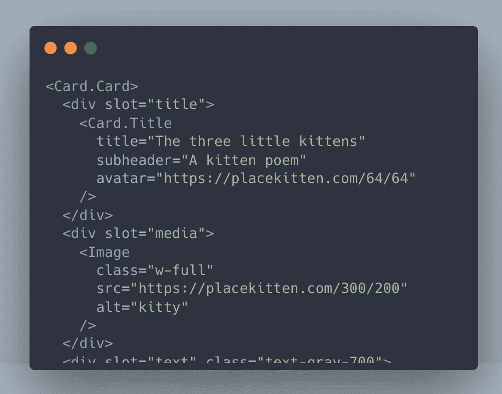
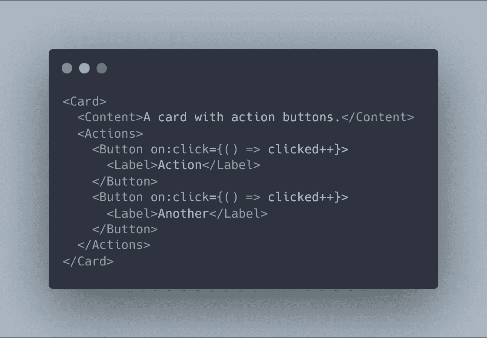
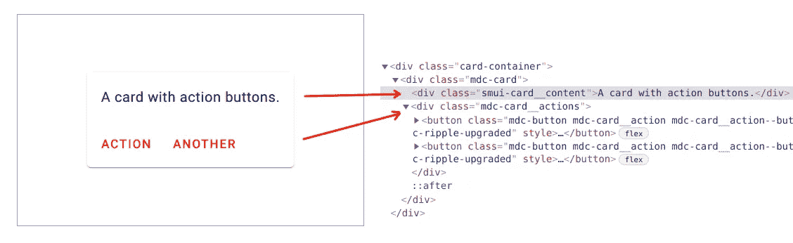
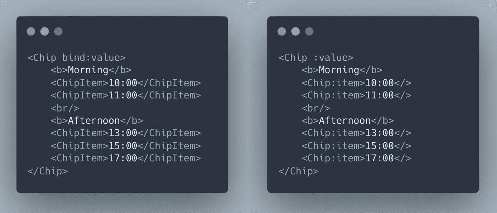
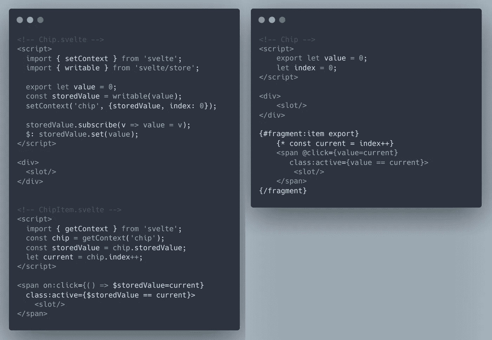

# Web 开发中输出的片段是什么

> 原文：<https://javascript.plainenglish.io/whats-exported-fragment-in-web-development-bd0ae16a0429?source=collection_archive---------12----------------------->

Photo by [Danny Meneses](https://www.pexels.com/@danny-meneses-340146?utm_content=attributionCopyText&utm_medium=referral&utm_source=pexels) from [Pexels](https://www.pexels.com/photo/photo-of-turned-on-laptop-computer-943096/?utm_content=attributionCopyText&utm_medium=referral&utm_source=pexels)

TLDR:导出的片段是组件模板的一部分，可以由父组件导出和控制，它可以帮助制作更简单的具有性能和大小优势的 web 应用。

许多 UI 框架有包装器组件，如`Content`、`Actions`，它们执行包装器的角色，其中一些没有任何逻辑/代码。所以把它作为一个独立的组件看起来开销很大。

SMUI 和 Smelte 是 Svelte 最流行的一些 UI 框架。我们在这里回顾一个问题。

## 1.顽固

我们来看组件`Card`(冶炼厂):

你看可以加槽`**title**`和槽`**media**`，很好，但是槽不让你换位置/顺序。如果我在`**media**`之后需要槽位`**title**`怎么办？老虎机就是不让你这么做。

所以插槽不太适合这种情况，最好使用子组件，你可以把它放在你需要的地方。

## 2.开销

让我们看看来自框架 SMUI 的`Card`

没有插槽，它使用组件(上例中的`Content`、`Actions`)，因此更灵活，但请注意它们的作用:

他们只是用类插入一个`div`。仅仅为了插入一个 div 元素而创建一个包含状态和上下文的完整组件值得吗？与只插入一个元素相比，它会产生开销(内存、性能和包大小)。

## 3.逻辑从属关系

另一点是，像`**Card.Title**`、`**Card.Actions**`这样的“内部”组件——它们被期望作为组件`**Card**`的一部分使用，所以从概念上来说，它们不是像现在这样的独立组件。虽然这不是什么大问题。

## 如何改善？

这三个子句都可以通过`**exported fragment**`来修复(你可以定义一部分模板，可以从组件中导出，[了解更多关于片段的信息](/how-fragments-can-help-in-your-web-development-5efc4d10f9da))。

`exported fragment`的优点:
1。灵活性——你可以把它放在你想放的地方(作为一个组件)
2。轻量级的，只是一个片段(不是一个完整的组件)
3。它在一个主组件内部(它是一个依赖代码)
4。它与一个组件共享一个范围(见下文)

导出的片段与主组件共享相同的作用域(相同的变量和函数)，因此它可以让您制定更简单的解决方案，例如，如果您需要主组件和片段之间的一些通信。

下面的例子包含了一个组件`**Chip**`，它可以让你在任意位置放置项目`**ChipItem**`:[版本，子组件在 Svelte](https://svelte.dev/repl/97b000a81b9f464fa2ce0ee7d071525b?version=3.38.3) 上，[版本，导出片段在 Malina.js 上](https://malinajs.github.io/repl/#/share/f9TOEVm9wgx?version=0.6.39)

让我们比较一下这两种方式:

Svelte on the left, Malina.js on the right

这里没有大的区别，我们只是调用组件`**Chip**`并在里面插入项目。
接下来是带项目的元件芯片:

Svelte on the left, Malina.js on the right (with exported fragment)

这两个片段给出了相同的结果，第一个看起来更复杂，因为它必须进行一些通信(上下文+存储)来共享“值”和“索引”。

在第二个例子中，变量“value”和“index”可用于组件和片段“item”——相同的作用域，因此不需要任何通信，组件本身变得更加简单。

顺便说一下，导出的片段更紧凑——与创建整个组件相比，包增长更少，内存/CPU 使用更少。
我检查了导出片段的包增长速度——我又添加了一个片段/组件，并检查了包的大小:

## **基本示例，以字节为单位的包大小:**

**苗条**:9170(3214 brot Li)
**malina . js**:4289(1820 brot Li)
**malina . js(片段)** : 4110 (1783 brotli)

## **额外组件+ 2 的示例调用:**

**苗条**:10616(3494 brot Li)
**malina . js**:4769(1961 brot Li)
**malina . js(片段)** : 4485 (1885 brotli)

## **束生长(brotli):**

**:+280 字节
**Malina.js** : +141 字节
**Malina.js(片段)** : +102 字节**

**如您所见，bundle 更小，使用导出的片段时增长更慢。一个简单的测试显示我有+8%的性能。**

## **结论**

**导出片段提供了一种更灵活的方法来控制子组件，以及移动和复制子组件的片段。当您的组件(片段)只是一个包装器或者与一个主组件有很深的连接时，您可以使用它。**

**因此，它可以提供更简单、更紧凑、更快速的解决方案。**

**它不是组件的替代品，只是在某些情况下多了一个功能。**

**如果不想错过 benchmark“Vue vs Svelte vs malina . js”就在 twitter 上关注[malina . js](https://twitter.com/malinajs)；)**

## **链接**

*   **[源代码示例](https://github.com/malinajs/fragment_comparison)**
*   **[在线编辑(REPL)](https://malinajs.github.io/repl/)**
*   **[GitHub](https://github.com/malinajs/malinajs)上的 Malina.js，Twitter[上的](https://twitter.com/malinajs)**
*   **文章:[片段如何帮助你的网站开发](/how-fragments-can-help-in-your-web-development-5efc4d10f9da)**

***更多内容请看*[***plain English . io***](http://plainenglish.io/)**