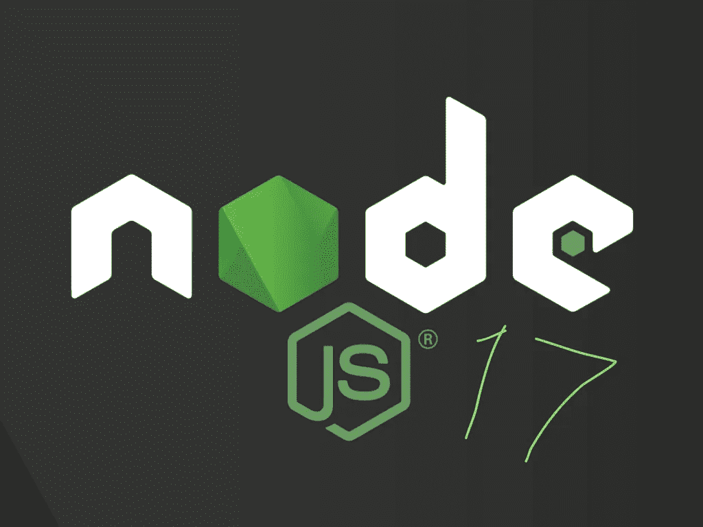

# Node.js 17 有什么新功能，我现在如何使用它？

> 原文：<https://javascript.plainenglish.io/whats-is-new-in-node-js-17-and-how-can-i-use-it-today-a8eb68f13a13?source=collection_archive---------14----------------------->



Node.js Logo with the number 17 added by Author

Node.js 17 是一个多月前发布的，在我的个人机器上运行了一个月后，我认为是时候写一篇关于它对 Node.js 社区意味着什么的帖子了。

在发布 Node.js 17 时，他们已经取代了 v16 作为当前发布的版本；这使得 Node.js 16 进入了积极的长期支持模式。对于 Node.js 16，这意味着它将一直是当前推荐的 LTS 版本，直到 2022 年 10 月，此后它将只保留错误和安全修复，直到 2024 年 4 月退役。

与所有奇数版本一样，Node.js 17 将只有很短的生命周期，其目标是在 2022 年 6 月 1 日寿终正寝(Node.js 项目在其网站【https://github.com/nodejs/release上有关于发布过程的文档)。

# 在机器上安装 Node.js 17

如果您想尝试新的 Node.js 特性，您需要将它安装在您的计算机上，如下所示:

## 苹果个人计算机

在 Mac 上安装 Node.js 最简单的方法是使用 Homebrew，它可以分两步完成。

首先，您需要安装 Homebrew(如果尚未安装),这可以通过在终端应用程序中运行以下命令来实现:

```
/bin/bash -c "$(curl -fsSL https://raw.githubusercontent.com/Homebrew/install/HEAD/install.sh)"
```

接下来你需要安装 **Node.js** 17 本身，为此只需运行:

```
brew install node
```

## Windows 操作系统

https://nodejs.org/en/download/current/[有一个简单易用的安装程序，只需点击下载并运行安装程序。](https://nodejs.org/en/download/current/)

# 新功能

## Readline 模块是模糊的

继续 Node.js 标准库的承诺,`readline`模块现在已经被给予了承诺待遇。

要使用 Node.js 的新 promises 版本，您需要从“node:readline/promises”导入库。一旦导入，你就可以像使用 async await 的其他 promise 库一样使用它。

下面是一个简单的例子，使用新的 promised`readline`编写一个简单的 CLI，它暂停一下，询问用户的名字，然后说谢谢。

```
import * as readline from 'node:readline/promises';import { stdin, stdout } from 'process';const rl = readline.createInterface({ input: stdin, output: stdout });const answer = await rl.question('What is your name? ');console.log(`Thank you ${answer}`);rl.close();
```

## OpenSSL 3.0 支持

另一个变化是 Node.js 17 将 OpenSSL 的版本升级到版本 3。其主要驱动因素是 Node.js 16 使用的 OpenSSL 1.1.1 将于 2023 年 11 月 9 日到期，Node.js 团队希望开始收集关于 OpenSSL 升级到 v3 的反馈。

作为升级 Node.js 以支持 OpenSSL 3.0 的一部分，决定使用 OpenSSL 的一个分支，该分支也引入了 QUIC API。使用这个分支的目的是使 Node.js 运行时能够使用 QUIC 和 OpenSSL 提供的成熟可靠的 TLS 功能。

## V8 JavaScript 引擎更新至 9.5

Node.js 17 的最后一个头条功能是升级到 9.5 版本的 V8 JavaScript 引擎，该引擎也用于谷歌 Chrome。

虽然这不是 Node.js 16 版本以来的主要版本变化，但它引入了一些值得注意的新特性:

*   WebAssembly 异常处理程序
*   [国际机场。显示 V2 的名字](https://v8.dev/blog/v8-release-95#intl.displaynames-v2)
*   [扩展时区名称选项](https://v8.dev/blog/v8-release-95#extended-timezonename-option)

# 概括起来

大多数企业不会在生产中使用 Node.js 17，因为与偶数编号的 LTS 版本相比，它的保质期有限。

也就是说，作为开发人员，我们需要使用该语言的最新版本，这样我们就可以继续向 Node.js 团队反馈这些新功能对我们日常开发的影响。

我在这里经常遇到的折衷办法是对大型生产项目使用 LTS 版本，对较小的内部项目使用最新版本，这样我就有机会使用最新版本及其新的 API。

如果你觉得这篇文章有帮助，请告诉我，如果你喜欢这篇文章，我鼓励你关注我，这样你就可以阅读更多我的文章。

如果你想支持我的帖子，并且你还不是 Medium 的成员，那么请随意加入 https://jonthanfielding.medium.com/membership 的。

*更多内容请看*[***plain English . io***](http://plainenglish.io)