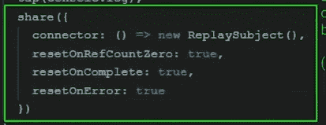

# 角度生态系统有什么新发现(Ng-Conf 21 更新)

> 原文：<https://javascript.plainenglish.io/whats-new-for-the-angular-ecosystem-ng-conf-21-update-56f365cc12bc?source=collection_archive---------3----------------------->

Photo by [AltumCode](https://unsplash.com/@altumcode?utm_source=medium&utm_medium=referral) on [Unsplash](https://unsplash.com?utm_source=medium&utm_medium=referral)

一致性是今年的 [**Ng-Conf**](https://www.2021.ng-conf.org/) 的主题，通常是所有事情的必做之事。今年的活动在网上举行，原因很奇怪，我们还不知道。

> **TL；灾难恢复:**视图引擎将被弃用，所有新的库和应用程序都将在 Ivy 中构建。艾薇在 Angular 语言服务中获得本机支持。默认情况下为严格模式。默认情况下为生产模式。内嵌 Sass。错误指引是一回事。您好[eslit](https://eslint.org/)。告别量角器。对[tailwindss](https://tailwindcss.com/)的本机支持。被动的讨论。请不要删除模块:O

Angular 和它的生态系统正在进化，不管它的价值是什么，我对这种进化可能会导致什么既兴奋又有点担心。以下是今年 Ng-Conf 会议上讨论的几个主题的总结:

*   **常春藤和视图引擎**

—从 V12 开始，视图引擎将被弃用，为最终从 v13 开始移除做准备。这使得常春藤现在成为默认。不过，视图引擎仍然可以与 ngcc 一起使用。

— Ivy 现在也将得到 Angular 语言服务的本地支持，带来更好的类型检查和更好的 IDE 集成。

*   **严格模式和生产模式**

—从 v12 开始，严格模式将成为新的 Angular 项目的默认模式，ng build 现在将默认构建产品。

*   **Sass**

—从 v12 开始，组件模板的内联样式将支持 sass，这在生产环境中带来了与在专用 Sass 样式文件中编写样式相同的优化和转换级别。像这样的事情现在将得到一流的支持(代码学分:ng-conf 2021):

inline sass supported natively supported in Angular v12+

*   **误差导管**

错误信息会有更好的解释，说明可能出了什么问题，还有链接，甚至视频材料来帮助调试最常见的错误(看着你`ExpressionChangedAfterItHasBeenCheckedError`)

Angular error guides, credits to ng-conf 21

*   **网络包 5 支持**

—从 v12 开始，Webpack 5 是 Angular 的默认版本。对 webpack 5 的支持带来了大量值得写一整篇文章的特性，其中一个在 ng-conf 中简单提到的特性是模块联合。可以把这看作是一种打包整个应用程序构建为另一个应用程序的依赖项的方式，创建某种多应用程序的应用程序，因为没有更好的术语。这种模式对于那些熟悉微前端的人来说更有意义，微前端在 Angular 社区中越来越受欢迎。下图显示了使用类似模式的带有 [Nx](https://nx.dev/) 和 Angular 的 monorepo，摘自 Manfred Steyer 的《企业角度》一书。

An app architecture based on domain-driven design

*   **你好，诚信通**

是时候将 Tslint 抛在脑后了(2019 btw 中已弃用)。Angular 社区现在有了从 Tslint 迁移到 Eslint 的简单工具。查看这个 github 回购:【https://github.com/angular-eslint/angular-eslint 

可以通过以下命令使用 Eslint 启动一个新项目:

commands to start Angular cli project with Eslint, credits to ngconf21

这意味着一些事情，例如，Angular 不再为我们配置 ng lint 命令，开发人员可以选择符合他们需求的林挺解决方案—不要选择 Tslint) —

*   **再见量角器**

量角器将在 2022 年底被取代。ng e2e 也不再开箱即用，而是让你选择配置一个适合你的 e2e 解决方案，比如 [cypress.io](https://www.cypress.io/) 或 [webdriver.io](https://webdriver.io/) (我看到 Angular 给你的是选项而不是意见，这让我想起了另一个 JavaScript ̶f̶r̶a̶m̶e̶w̶o̶r̶k̶库，我不记得它的名字了，ehm)。

*   **用@use 模块替换 Sass @ import**

Sass 不再推荐@import 语法，devs 现在应该考虑改用@use (eh)语法，这带来了一些新的可能性，如私有成员和命名空间等。目前这是可选的。

P.S .如果你的项目使用的是 node-sass，可以考虑改用 sass(那是 npm 上的包名，我在这里[链接一下](https://www.npmjs.com/package/sass))。

*   **TailwindCSS 原生支持**

—从 v11.2 开始，Angular 支持 TailwindCSS，从 v12 开始，支持将以更好的工具和配置继续，只需运行 [ng add ngx-tailwind](https://www.npmjs.com/package/ngx-tailwind) 即可享受 CSS 未来的一流支持。

还简要提到了其他几点，比如对可信类型的支持(还不完全支持)。但是我会在这里停止这个列表。

在接下来的几行中，我将对 Angular Core 团队的 Stephen Fluin 提到的一些观点给出我的看法:

*   **无功角度**:

*   **区域和模块**:我不介意去掉区域，尽管这可能会导致库解决完全控制变化检测的复杂性，这最终会让我们回到…区域。但是请不要让模块可选。谢了。

# RxJS

*   【RxJS 7 的新功能:

—它变小了，小了很多。版本 7 的内存大约为 51kb，而版本 6 的内存大约为 93kb。这几乎是 v6 的一半大小。让我们来看看大会上展示的对比:

rxjs 7 vs exjs 6 if we include all operators vs the most commonly used

这个承诺(双关语)很简单，同样的功率，占用空间更小。

v7 还带来了更好的 typescript 类型(支持 TS v 4.2)。

*   **新的特性、操作符等等**

v7 有许多新特性，但也有一些特性被弃用，最明显的是现在弃用了 toPromise()，取而代之的是两个新特性:firstValueFrom 和 lastValueFrom，这两个特性更具树抖动性。您还可以为其中的每一项提供默认值，如下所示:

New rxjs7 feature: firstValueFrom with default value

版本 7 还通过配置选项将多播操作符(多播、publisReplay、shareReplay 等)整合到现在推荐的 share()中，如下所示:

the new configurable share operator

除了 share 和 shareReplay 之外，这不赞成使用所有多播运算符。

v7 还引入了一个新函数:connectable(source$)使 source$ observable 可连接。

地图看起来像这样:

deprecated multicast operators in version 7 of rxjs

更多关于 RxJs 7 的信息可以在 Ng-Conf Youtube 频道上找到。

这就是我现在想分享的关于生态系统的全部内容。这是一个激动人心的时刻，Angular 正在开拓新的可能性。然而，值得记住的是，Angular 的特别之处在于它的*固执己见*(如果那是一个词的话)。

因为 Angular 固执己见，开发人员发现他们处在一个决策疲劳少得多的环境中，并且信任 Angular 推荐的做事方式。斯蒂芬在他的演讲结束时很好地总结了这一点，坚持己见很重要，但只有在没有权衡的时候。固执己见并不意味着拒绝任何必要的反馈或改进。

> 移动代码很容易，移动开发人员很难。

感谢 Angular 核心团队的会谈。我希望我们能尽快回到现场直播。

[*更多内容尽在 plainenglish.io*](http://plainenglish.io/)