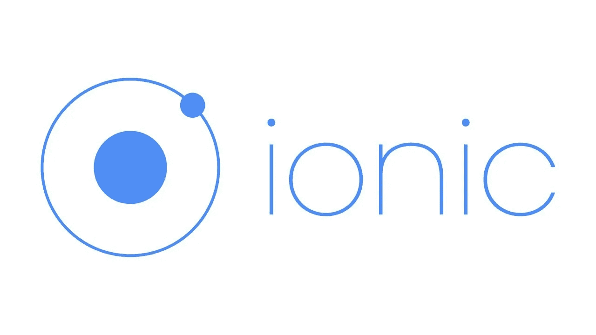

# 离子存储 v3 的新功能

> 原文：<https://javascript.plainenglish.io/whats-new-in-ionic-storage-v3-851aff67d8e6?source=collection_archive---------11----------------------->



## 介绍

如果你熟悉移动应用程序开发，你应该听说过 Ionic。

Ionic 是一个开源的移动 UI 工具包，用于构建高质量、跨平台的本地和 web 应用程序体验。它共享一个代码库，允许你使用网络技术编写你的移动应用。Ionic 最初只支持 Angular。但是到今天为止，它们支持其他 JavaScript 框架，比如 React 和 Vue。它们也支持普通 Javascript 的使用。

昨天，Ionic 宣布发布 Ionic Storage V3，这是一个开源库，提供了一种存储简单数据的简单方法。Ionic storage 允许开发人员构建单一代码库应用程序，同时为他们提供使用应用程序运行平台上可用的最佳存储引擎的优势。

离子存储最初只考虑了角度支持。看看 ionic 社区有多受欢迎，以及 ionic 对其他框架的支持，他们认为将 ionic 存储带到 Ionic 生态系统的其余部分是合适的。

## 有什么新鲜事？

Ionic storage v3 现在增加了对 Vue、React(包括普通 JavaScript)的支持。v2 中现有的角度实现仍然保留。

1.  在以前的版本中，Ionic storage 有一个名为`Localforage-cordovaSQLiteDriver`的驱动程序硬编码到库中，虽然它在原生移动设备上运行时更容易使用 SQLite，但它限制了其他存储引擎的选项。这种依赖性已经被移除，但是您仍然可以按照这里的 [SQLite 说明来安装它。](https://github.com/ionic-team/ionic-storage#sqlite-installation)

2.最初为基于手动承诺的方法构建的`**ready()**`函数已经被删除，因为现在有了`**async/await**`模式，Ionic Storage v3 现在用能够立即实例化数据库的`**create()**`函数代替了`**ready()**`。

## 装置

```
npm install @ionic/storage
```

使用 Angular 时，安装附加的`@ionic/storage-angular`库:

```
npm install @ionic/storage-angular
```

如果您想将 SQLite 用作存储引擎，请参见 [SQLite 安装](https://github.com/ionic-team/ionic-storage#sqlite-installation)说明。

## 使用

**使用 React、Vue 或普通 JavaScript**

```
Import { Storage } from '@ionic/storage';const store = new Storage({/* add your config here */});
await store.create();
```

**带棱角**

在 Angular using 服务和依赖注入中的使用需要导入`IonicStorageModule`然后注入`Storage`类。

首先，在`src/app/app.module.ts`中编辑您的 NgModule 声明，或者在您将在其中使用存储库的页面的模块中编辑，并添加`IonicStorageModule`作为导入:

```
import { IonicStorageModule } from '@ionic/storage-angular';@NgModule({
  imports: [
    IonicStorageModule.forRoot()
  ]
})
export class AppModule { }
```

接下来，将`Storage`注入一个组件:

```
import { Component } from '@angular/core';
import { Storage } from '@ionic/storage-angular';@Component({
  selector: 'page-home',
  templateUrl: 'home.html'
})
export class HomePage { constructor(private storage: Storage) {
  } async ngOnInit() {
    // If using a custom driver:
    // await this.storage.defineDriver(MyCustomDriver)
    await this.storage.create();
  }
}
```

或者，可以创建一个 Angular 服务来管理应用程序中的所有数据库操作，并将所有配置和数据库初始化限制在一个位置。当这样做时，不要忘记在您的`NgModule`中的一个`providers`数组中注册这个服务，并确保`IonicStorageModule`已经在那个`NgModule`中初始化，如上所示。以下是该服务的一个示例:

```
import { Injectable } from '@angular/core';import { Storage } from '@ionic/storage-angular';@Injectable({
  providedIn: 'root'
})
export class StorageService {
  private _storage: Storage | null = null; constructor(private storage: Storage) {
    this.init();
  } async init() {
    // If using, define drivers here: await this.storage.defineDriver(/*...*/);
    const storage = await this.storage.create();
    this._storage = storage;
  } // Create and expose methods that users of this service can
  // call, for example:
  public set(key: string, value: any) {
    this._storage?.set(key, value);
  }
}
```

## 应用程序接口

存储 API 提供了设置、获取和删除与键相关联的值的方法，以及清除数据库、访问存储的键及其数量以及枚举数据库中的值的方法。

**要设置一个项目，使用** `set(key, value)`:

```
await storage.set('name', 'Mr. Ionitron');
```

**要取回项目，使用** `get(name)`:

```
const name = await storage.get('name');
```

**删除项目:**

```
await storage.remove(key);
```

**清除所有项目:**

```
await storage.clear();
```

**保存所有密钥:**

```
await storage.keys()
```

**获取存储的键/值对的数量:**

```
await storage.length()
```

**枚举存储的键/值对:**

```
storage.forEach((key, value, index) => {
});
```

**启用加密时使用** [**离子安全存储**](https://ionic.io/docs/secure-storage) **驱动:**

```
storage.setEncryptionKey('mykey');
```

查看此[加密支持](https://github.com/ionic-team/ionic-storage#encryption-support)链接了解更多信息。

## 添加配置

存储引擎既可以配置特定的存储引擎优先级，也可以配置自定义配置选项以传递给 local feed。有关可能的选项，请参见本地饲料配置文件:[https://github.com/localForage/localForage#configuration](https://github.com/localForage/localForage#configuration)

**在 React/Vue/Vanilla JavaScript 配置中**

在`Storage`构造函数中传递配置选项:

```
const storage = new Storage({
  name: '__mydb',
  driverOrder: [Drivers.IndexedDB, Drivers.LocalStorage]
});
```

## 角度配置

```
import { Drivers, Storage } from '@ionic/storage';
import { IonicStorageModule } from '@ionic/storage-angular';@NgModule({
  //...
  imports: [
   IonicStorageModule.forRoot({
     name: '__mydb',
     driverOrder: [Drivers.IndexedDB, Drivers.LocalStorage]
   })
 ],
 //...
})
export class AppModule { }
```

## 结论。

Ionic Storage v3 不仅增加了对其他框架的支持，还定义了一种在应用中存储简单数据的现代方法，同时自动使用应用运行平台上可用的最佳存储引擎。

**编码快乐！**