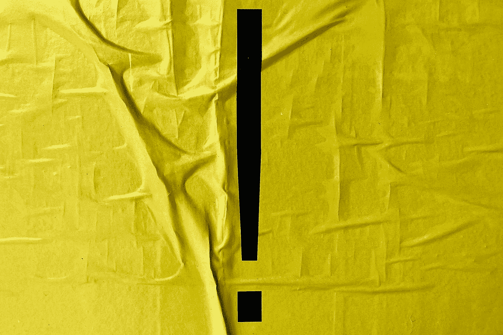
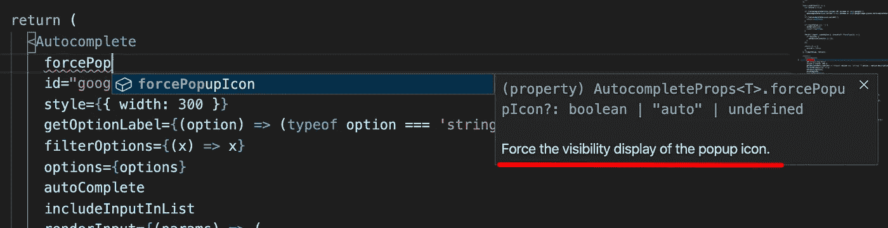

# Material-UI 版本 5 的新特性

> 原文：<https://javascript.plainenglish.io/whats-new-in-material-ui-version-5-5ebfaea0eba6?source=collection_archive---------0----------------------->

## Material-UI 现在是 MUI！



Photo by [Bekky Bekks](https://unsplash.com/@bekkybekks?utm_source=medium&utm_medium=referral) on [Unsplash](https://unsplash.com?utm_source=medium&utm_medium=referral)

Material-UI 刚刚发布了 5 版！

让我们来看看我最感兴趣的一些变化。

*我不会在本文中涵盖所有的变化，所以请务必查看他们的* [*版本*](https://mui.com/blog/mui-core-v5/) *以了解更多信息。*

# Material-UI 现在是 MUI！

你会注意到的第一件事是他们已经更名。Material-UI 现在是 MUI！你可以在这里阅读更多信息[。随着这一更名而来的是一个新的域名，](https://mui.com/blog/material-ui-is-now-mui/)[https://mui.com/](https://mui.com/)，一个更新的网站和文档页面，以及一个新的标志。


[https://mui.com/blog/material-ui-is-now-mui/](https://mui.com/blog/material-ui-is-now-mui/)

# `sx` 道具

`sx`属性是定义自定义样式的快捷方式。它公开了 CSS API 的超集，因此您可以指定任何有效的 CSS。您还可以访问主题。最棒的是`sx`道具在所有组件上都有。

下面是他们文档中的一个例子。

更好的是，四个组件将`sx`道具的子集公开为平面道具:盒子、网格、字体和堆栈。

```
<Typography color="grey.600">

// is equivalent to
<Typography sx={{ color: 'grey.600' }}>
```

# 动态道具

现在，您可以在调色板主题的内部和外部添加新颜色。

[https://mui.com/customization/palette/#adding-new-colors](https://mui.com/customization/palette/#adding-new-colors)

现在我可以使用一个按钮，并添加一个中性的颜色。

```
<ThemeProvider theme={theme}>
  <Button color="neutral" variant="contained">
    neutral
  </Button>
</ThemeProvider>
```

您还可以向组件添加自定义变体。

[https://mui.com/customization/theme-components/#adding-new-component-variants](https://mui.com/customization/theme-components/#adding-new-component-variants)

现在我可以使用一个带有虚线变体的按钮。文本不会转换为默认的大写，边框将是蓝色虚线。

```
<ThemeProvider theme={theme}>
  <Button variant="dashed" sx={{ m: 1 }}>
    Dashed
  </Button>
</ThemeProvider>
```

# 智能感知中的道具描述

所有的道具描述都被转移到了 TypeScript。因此，IntelliSense 可以在文本编辑器中显示文档。



[https://mui.com/blog/mui-core-v5/](https://mui.com/blog/mui-core-v5/)

# 严格模式支持

当使用带有`React.StrictMode`的 Material-UI 版本 4 时，你会经常看到警告。你可以在这里了解更多[。](https://github.com/mui-org/material-ui/issues/13394)

在此版本中，应修复这些警告。

# 新组件

*   [网格](https://mui.com/components/grid/)(改进)
*   [栈](https://mui.com/components/stack/)(新)
*   [自动完成](https://mui.com/components/autocomplete/)(来自实验室)
*   [分页](https://mui.com/components/pagination/)(来自实验室)
*   [评级](https://mui.com/components/rating/)(来自实验室)
*   [骨骼](https://mui.com/components/skeleton/)(来自实验室)
*   [快速拨号](https://mui.com/components/speed-dial/)(来自实验室)
*   [切换按钮](https://mui.com/components/toggle-button/)(来自实验室)

# 结论

恭喜 MUI 的团队发布了这个版本！它看起来很棒，我很高兴尝试一些新功能。

感谢阅读！请务必查看 [MUI 网站](https://mui.com/)和[版本](https://mui.com/blog/mui-core-v5/)以了解更多信息。

*更多内容请看*[***plain English . io***](http://plainenglish.io/)