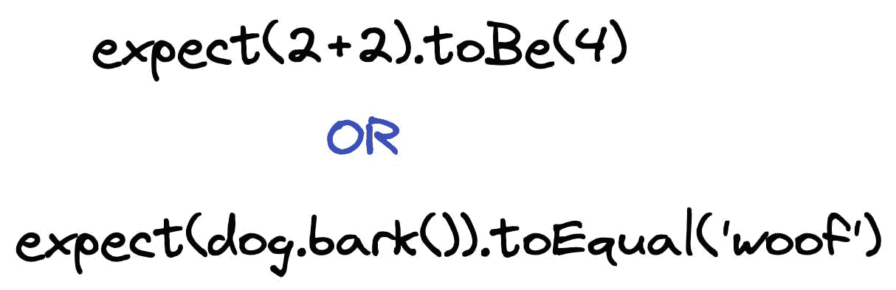
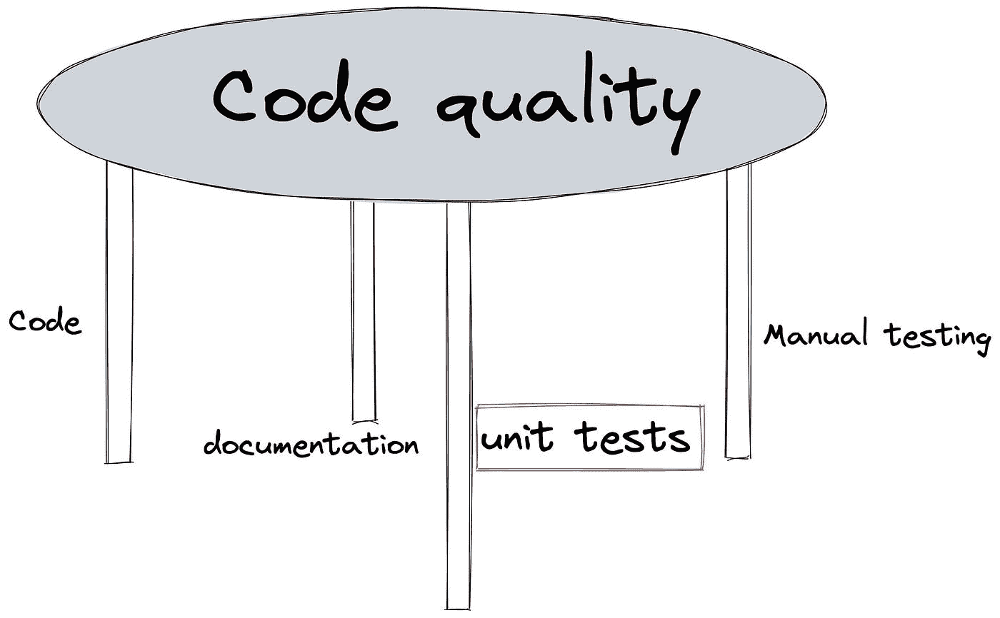

# 单元测试有什么意义？

> 原文：<https://javascript.plainenglish.io/whats-the-point-of-unit-tests-b23f5a0da0ec?source=collection_archive---------6----------------------->

## 编写单元测试的原因。

作为初级程序员，您可能会对单元测试感到困惑。更糟糕的是，用作例子的测试常常使它们的目的更加不明确。当你看到像这样的东西

你有理由怀疑是否有充分的理由花时间去写它们。下面，我展示了我写单元测试的理由。

# 什么是单元测试？

单元测试是简单的脚本，检查一个给定的单元类、函数、模块等。正在按预期工作。它们应该相当简单，涵盖了代码的快乐之路和一些边缘情况。由于我下面讨论的原因，它们有助于项目的长期成功。

# 加速开发测试

当您开始构建应用程序时，最自然的事情就是用用户界面测试代码。您可以通过编写一个为您检查代码的脚本来使这个过程更快、更可靠。有了测试，重新运行所有测试不会耗费你的精神能量；你想做多少次就做多少次。这也会缩短反馈周期，有助于你保持专注和高效。

# 发现边缘案例

编写单元测试让我思考边缘情况——所有罕见、意外或错误的情况。当你写逻辑的时候，关注快乐的道路是正常的，或者什么是正常的和预期会发生的。当您编写测试时，您可以为边缘案例设置检查，并定义在每个案例中应该发生什么。这使得您的代码在意外输入的情况下更有弹性。

# 确保您的代码由单元组成

当您向代码中添加单元测试时，您会看到哪些容易测试，哪些不容易。随着你的代码变得越来越大，越来越复杂，测试将迫使你把它分成易于管理的部分。这很好，因为它将帮助您将代码质量提升到一个新的水平。每一个承担了过多责任的部分都需要指数级的更加复杂的单元测试。在这种情况下，停下来重新思考如何组织你的逻辑是一个好主意。

# 交互式文档

您的测试将成为下一个工作代码的人的额外资源，以弄清楚它在做什么以及它应该如何工作。这是一种额外的文档，有额外的好处:

1.  它通常比实际文档中的书面描述更精确。
2.  可以针对当前代码运行测试，以确保所有语句仍然有效；你不需要依靠人来阅读、理解和复查代码。

# 未来变化的安全网

单元测试执行得如此之快，以至于在任何更新时运行它们都是显而易见的，不管变化看起来有多小。您可以设置您的存储库来运行持续集成(CI ),并且只接受通过所有测试的变更。这样，无论更新如何，您都可以确保顺利的变更集成:

*   小更新“不应该打破任何东西”
*   第三方库更新
*   试图快速而卑鄙地解决问题

单元测试保护代码库不受它们所覆盖的所有小的回归的影响。

# 摘要

单元测试是维护高质量代码的重要部分。你可以把它看作是桌子的一条腿:

当然，你可以去掉它，但这会让保持平衡变得更加复杂。编写它们，它们将帮助您实现良好的代码质量，并使您的应用程序更加安全。

*最初发布于*[*https://how-to . dev*](https://how-to.dev/whats-the-point-of-unit-tests)*。*

*更多内容请看*[*plain English . io*](http://plainenglish.io/)*。在这里报名参加我们的* [*免费周报*](http://newsletter.plainenglish.io/) *。*