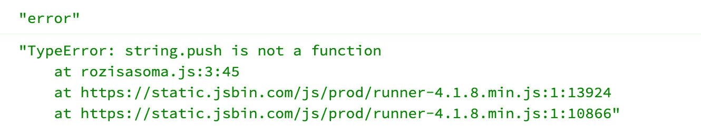

# 什么时候应该使用 splice()、slice()、substring()和 substr()？

> 原文：<https://javascript.plainenglish.io/when-do-you-use-splice-slice-substring-and-substr-f940cdde3db1?source=collection_archive---------11----------------------->

## 了解 JavaScript 内置函数—何时使用 splice()、slice()、substring()和 substr()。

大家好，欢迎来到我的博客。在这一节中，我们将讨论 JavaScript 内置函数。


Photo by [Oskar Yildiz](https://unsplash.com/@oskaryil?utm_source=medium&utm_medium=referral) on [Unsplash](https://unsplash.com?utm_source=medium&utm_medium=referral)

*   **拼接()**
*   **切片()**
*   **substring()**
*   和 **substr()**

当您想在 JavaScript 中剪切或添加一个字符串中的几个或很多字符时，有很多选项，这可能会让您感到困惑。你可能很难做出正确的选择。也许你所知道的只是它的名字和功能的简单描述。我就是这样。这就是为什么我写了这篇文章来让自己记住所有的功能以及何时使用它们。

分解一下。

在我们深入研究每个函数之前，也许您应该了解一下 **concat()** 和 **push()** 方法。你也应该知道字符串是数组的一部分。例如，我有一个如下所示的字符串:

```
const string = 'string'
```

希望你明白，分解这个变量类型，它会变成一个数组类型。大概是这样的:

```
const string = ['s','t','r','i','n','g']
```

或者，如果通过计算长度来打印变量，请使用以下方法:

```
string.length // 6
```

但是，只有当您想要合并字符串时，才应该使用 **concat()** 。如果您尝试使用 **push()** 而不是 **concat()** 将会得到以下错误:



```
error
TypeError: string.push is not a function
 at rozisasoma.js:3:45
 at [https://static.jsbin.com/js/prod/runner-4.1.8.min.js:1:13924](https://static.jsbin.com/js/prod/runner-4.1.8.min.js:1:13924)
 at https://static.jsbin.com/js/prod/runner-4.1.8.min.js:1:10866
```

*前置话题*

# concat()

假设你有一个数组变量。它包含数字，类似于:`1,2,3,4,5,6`。对于下一行，我添加了`7,8,9,10`。最后，打印变量。

```
const numbers = [1,2,3,4,5,6]
numbers.concat(7,8,9,10)
console.log(numbers) // 1,2,3,4,5,6,7,8,9,10
```

**仔细看可以看到，追加号是加在** `**6**` **后面的，是机器找到最后一个号码后加的。**

# **推()**

那么， **push()** 是做什么的呢？它将做一些类似于 **concat()** 的事情:

```
const numbers = [1,2,3,4,5,6]
numbers.push(7,8,9,10)
console.log(numbers) // 1,2,3,4,5,6,7,8,9,10
```

但是， **concat()** 和 **push()** 之间的区别在于您可以在 concat()中实现这一点

```
const string = 'string'
console.log(string.concat('s'))
```

当你用 **push()** 做的时候就不能这么做了，因为如果数据是一个**数组**的话就可以用 **push()** 。

对于数组， **concat()** 和 **push()** 函数是相似的，但对于字符串则不同。向下滚动以查看其他功能。

# 拼接()

规则是:

```
variable.**splice**(index (start from), how many element you will execute, item1,…, n)
```

使用此功能，您可以根据需要添加或删除位置。

让我们来看看下面的片段:

```
// Add Item
const flowers = ['Rose','Tulip']
flowers.splice(1, 0, Orchid)
console.log(flowers) // Rosa, Orchid, Tulip// Remove Item
a.
const flowers = ['Rose','Tulip']
flowers.splice(1, 1, Orchid)
console.log(flowers) // Rosa, Orchidb.
const flowers = ['Rose','Tulip']
flowers.splice(0, 1)
console.log(flowers) // Tulip
```

# 切片()

方法返回一个数组中选中的元素，作为一个新的数组。

`slice()`选择从给定的*开始*参数开始，到*结束的元素，但不包括给定的*结束*参数*。

`slice()`不改变原阵。

规则是:

```
*variable*.slice(*start*, *end*)
```

例如:

```
const cars = ['Toyota','Honda','Suzuki']
cars.slice(0,2)
console.log(cars) // Toyota, Honda
```

# 子字符串()

**substring()** 将返回字符串的一部分，你可以在字符串的开头、中间或结尾剪切。

规则是:

```
*variable*.substring(*start*, *length (optional)*)
```

例如:

```
const string = 'string'
console.log(string.substring(1)) // tring
```

或者您可以这样做:

```
const string = 'string'
console.log(string.substring(1,2)) // t
```

# substr()

最后但同样重要的是，您可以使用**substr()**,`substr()`方法从指定位置的字符开始提取部分字符串，并返回指定数量的字符。

规则是:

```
*variable*.substr(*start*, *length (optional)*)
```

例如:

```
const string = 'string'
console.log(string.substr(1)) // tring
```

但是如果你这样做:

```
const string = 'string'
console.log(string.substring(1,2)) // tr
```

`substr()`和`substring()`几乎相似。但是你可以注意到如上图所示的区别。

好吧，下一篇文章再见。编码快乐！

# 警惕！

如果你们来自印度尼西亚，想要越来越多地支持我写作，希望你们能从钱包里拿出一点来。你可以通过以下方式分享你的礼物:

## 萨韦里亚

[https://saweria.co/pandhuwibowo](https://saweria.co/pandhuwibowo)


## 特拉克特尔

[https://trakteer.id/goodpeopletogivemoney](https://trakteer.id/goodpeopletogivemoney)


# 构建可组合的 web 应用程序

不要构建网络整体。使用 [**Bit**](https://bit.dev/) 在 React 或 Node.js 等您最喜欢的框架中创建和组合解耦的软件组件。构建可扩展的模块化应用程序，带来强大而愉快的开发体验。

将您的团队带到 [**位云**](https://bit.cloud/) 来共同托管和协作组件，并作为一个团队来加速、扩展和标准化开发。使用**设计系统**或**微前端**尝试**可组合前端**，或使用**服务器端组件**探索**可组合后端**。

[**试一试→**](https://bit.dev/)


# 了解更多信息

[](https://blog.bitsrc.io/how-we-build-micro-front-ends-d3eeeac0acfc) [## 我们如何构建微前端

### 构建微前端来加速和扩展我们的 web 开发过程。

blog.bitsrc.io](https://blog.bitsrc.io/how-we-build-micro-front-ends-d3eeeac0acfc) [](https://blog.bitsrc.io/how-we-build-our-design-system-15713a1f1833) [## 我们如何构建一个组件设计系统

### 用组件构建一个设计系统来标准化和扩展我们的 UI 开发过程。

blog.bitsrc.io](https://blog.bitsrc.io/how-we-build-our-design-system-15713a1f1833) [](https://blog.bitsrc.io/the-composable-enterprise-a-guide-609443ae1282) [## 可组合企业:指南

### 为了在 2022 年实现这一目标，现代企业必须变得可组合。

blog.bitsrc.io](https://blog.bitsrc.io/the-composable-enterprise-a-guide-609443ae1282) [](https://bit.cloud/blog/how-to-build-a-composable-blog-l1jkl9f4) [## 如何建立一个可组合的博客

### 从头开始创建一个博客需要很多。有许多移动的部件组合在一起形成一个…

比特云](https://bit.cloud/blog/how-to-build-a-composable-blog-l1jkl9f4) [](https://bit.cloud/blog/meet-component-driven-content-applicable-composable-l24cw7ku) [## 满足组件驱动的内容:适用的、可组合的

### 自从 React 和 Angular 等技术出现以来，我们经常将术语“组件”与…

比特云](https://bit.cloud/blog/meet-component-driven-content-applicable-composable-l24cw7ku) 

*更多内容请看*[***plain English . io***](https://plainenglish.io/)*。报名参加我们的* [***免费周报***](http://newsletter.plainenglish.io/) *。关注我们关于*[***Twitter***](https://twitter.com/inPlainEngHQ)*和*[***LinkedIn***](https://www.linkedin.com/company/inplainenglish/)*。查看我们的* [***社区不和谐***](https://discord.gg/GtDtUAvyhW) *加入我们的* [***人才集体***](https://inplainenglish.pallet.com/talent/welcome) *。*