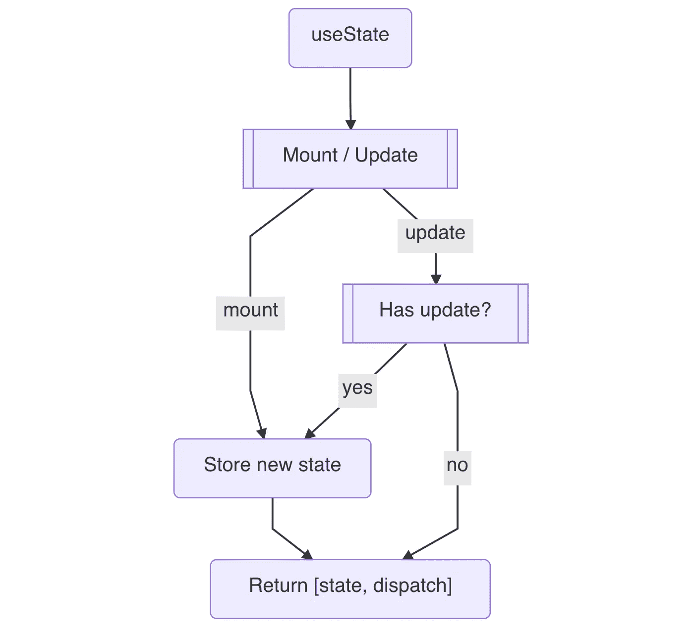

# “使用状态”何时准备新值？

> 原文：<https://javascript.plainenglish.io/when-does-usestate-prepare-the-new-value-1bd228f24d39?source=collection_archive---------12----------------------->

## 从官方 React 源代码的精简版了解 useState 钩子的工作流程。


Photo by [Ferenc Almasi](https://unsplash.com/@flowforfrank?utm_source=medium&utm_medium=referral) on [Unsplash](https://unsplash.com?utm_source=medium&utm_medium=referral)

```
const Title = () => {
  const [state, setState] = useState(initialState)
}
```

我从`preact`和`brahmos`库中读到了一些`useState`的实现。我以为我理解了`useState`的行为，直到我最终阅读了`ReactFiberHooks.old.js`下的官方版本。当然，这不是一个容易的阅读，无论如何，我咬紧牙关，在其他阅读源代码的人的帮助下:)

> 这里提到的内容已经发表在我的书《以正确的方式设计 React Hooks》中，在[亚马逊](https://www.amazon.com/Designing-React-Hooks-Right-Way-dp-1803235950/dp/1803235950/ref=mt_other?_encoding=UTF8&me=&qid=1640158953)出售。

为了理解官方的源代码，让我把它剥离一点，这样我们就可以遵循关键的工作流程，而不必在许多存储库中浏览数百行代码。

# 从源代码中学习

`useState`的框架版本可以写在下面，根据`mount`标志，它可以去`mountState`或`updateState`。

```
function useState(initialState) {
  if (mount) {
    return mountState(initialState)
  } else {
    return updateState(initialState)
  }
}
```

任何组件都需要先安装，然后根据更改进行更新。我们可以通过查看当前渲染的*纤维*的可用性来找出这个标志`mount`，它本质上是正在进行的工作*纤维*。

```
let mount = currentlyRenderingFiber === null 
  || currentlyRenderingFiber.memoizedState === null
```

本文不打算讨论纤程，所以可以说这个标志是在进入渲染函数之前给出的。

## 安装挂钩

如果在 mount 下，我们首先创建一个*钩子。*

```
function mountState(initialState) { 
    hook = mountWorkInProgressHook()
    if (typeof initialState === 'function') {
      initialState = intialState()
    }
    hook.memoizedState = initialState
    hook.queue = {
      pending: null,
      dispatch: null,
    }
    hook.queue.dispatch = dispatchAction.bind(
      null,
      currentlyRenderingFiber,
      hook.queue
    )

    return [hook.memoizedState, hook.queue.dispatch]  
}
```

之后，我们将使用`initialState`初始化内存化状态。如果它以 reducer 函数格式提供，我们将其转换为`() => initialState`。

## 派遣行动

调度操作是在装载期间设置的。这里使用`bind`将当前渲染的纤程和当前钩子队列绑定到这个函数，同时将`action`作为唯一的输入参数。

```
function dispatchAction(fiber, queue, action) {
  const update = {
    action
    next: null
  }

  const pending = **queue.pending**
  if (pending === null) {
    update.next = update;
  } else {
    update.next = pending.next
    pending.next = update
  }
  queue.pending = update **scheduleUpdateOnFiber**(fiber)
}
```

除了将这个动作添加到`queue.pending`之外，调度的另一个工作是通知纤程更新，这是通过 *React 调度器*提供的一个函数来完成的。本质上，在这个调用之后，如果系统不忙，它将重新呈现这个*纤程*，因此它将再次进入组件函数，并且它将通过`updateWorkInProgressHook`更新这个钩子，我们将在下一节介绍。

## 更新挂钩

在每个未来的渲染中，我们首先克隆一个我们在 mount 下建立的*钩子*。

```
function updateState(initialState) {
    hook = updateWorkInProgressHook()
    const queue = hook.queue let updates = queue.pending
    queue.pending = null if (updates != null) {
      const first = updates.next
      let newState = currentHook.memoizedState
      let update = first
      do {
        const action = update.action
        newState = basicStateReducer(newState, action)
        update = update.next
      } while (update !== null && update !== first)

      if (!Object.is(newState, hook.memoizedState)) {
        markWorkInProgressReceivedUpdate()
      }

      hook.memoizedState = newState
    }

    return [hook.memoizedState, hook.queue.dispatch]  
}
```

如果`queue.pending`可用，它将经历来自`dispatchAction`的每次更新，并将每个动作逐一应用到新状态。如果新的状态是不同的，我们标记它，这样这个纤程就需要更新到 DOM。然后我们将状态存储回*钩子*。我们还将`pending`重置为`null`，这样下一次渲染就不会再选择这些更新了。

> 状态需要不同才能进入*反应渲染器*。所以这里调用了 render 函数，但是我们没有得到 DOM 更新。

## 工作流程草图

工作流程可以用下面的草图来概括。



# 状态更新

最令人惊讶的是，在互联网上有很多关于 *JavaScript 闭包*如何成为我们不能在当前渲染中获得最新值的原因的讨论。因此人们对*关闭*争论颇多。但实际上，*关闭*可能不是原因。当然，我们使用*闭包*来访问该值，如下例所示。但是谁说过你可以在当前渲染中得到最新的值呢？谁说值应该总是指向正确的值，除非是指针。因此，除非你创建一个指向钩子内部`memoizedState`的指针，否则你永远不会得到最新的值:)

```
function Title() {
  const [count, setCount] = useState(0)

  const onClick = () => {
    setTimeout(() => {
      setCount(count + 1)
      console.log('clicked', count)
    }, 3000)
  }

  console.log('rendered', count) 
  ...
}
```

从我们对官方源代码的研究来看，它明确指出，在典型的路径中，新状态不是在调度期间预先计算的。

> 实际上 React 做了相当多的优化，在一个途径中，它可以通过在调度期间进行预先计算来及早进行救助，并将其存储在`eagerState`属性下。但是这个值也是无处可抢的。

因此*关闭*与否，**在新的渲染开始之前，潜在的新状态并不存在。如果你在当前渲染中费心去想那个，那是白费力气！有一种方法可以帮助你朝着正确的方向思考，那就是使用 reducer 版本。**

```
setState(v => v + 1)
```

使用上述格式有几个优点。除了允许您访问钩子下的`memorizedState`,它还暗示这是一个不会马上被调用的“回调”。更不用说`setState`函数不会在任何地方返回新值:)

另一种帮助方式是使用诸如`dispatchState`之类的名字来代替`setState`。在内部，我们已经看到*的反应*称之为调度。

# TL；速度三角形定位法(dead reckoning)

`useState`正式版不准备`setState`时的新值。相反，它会等待下一次渲染时做出决定。你甚至可以说，没有新的渲染，就没有新的状态。

*更多内容请看*[***plain English . io***](http://plainenglish.io/)