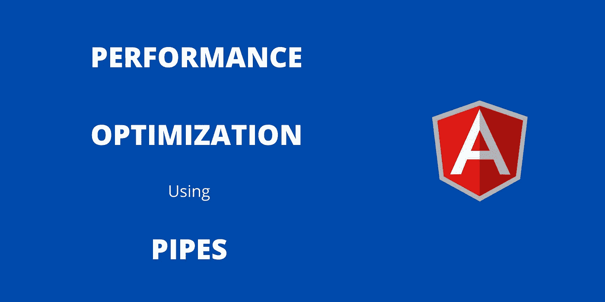

# 当 Angular 中的函数导致性能问题时

> 原文：<https://javascript.plainenglish.io/when-functions-in-angular-will-cause-performance-problem-be898002a537?source=collection_archive---------5----------------------->

## 了解函数何时导致问题，以及如何使用 Angular 中的管道来解决问题。



[在上一篇文章](/angular-performance-optimization-using-trackby-function-bd2cad4acee)中，我们已经看到了 Angular 中使用 **ngFor** 的性能问题，以及如何使用 **trackBy** 函数解决这个问题。在本教程中，我们将看到使用函数 **Angular** 的另一个性能问题。这是一个很简单的问题。但是我们很多人都没有注意到这一点。我初学 Angular 的时候还没有发现这个问题。

## **什么时候函数会导致性能问题？**

我们总是创建函数来简化我们的工作。函数本身不会在 Angular 中产生性能问题。但是如果我们使用 HTML 部分中的函数，那么有时会导致性能问题。让我们看看下面的代码，以便更好地理解。

在上面的代码中， **getRank** ()是一个函数。getRank()函数不会单独产生性能问题。但是如果我们像上面一样在 HTML 内部使用它，那么它将会引起一个问题。

为了更好地理解它，我将展示性能问题的演示。请在您的 **ts** 文件中使用以下代码。

在你的 **HTML** 文件中使用下面的代码。

保存后，使用 serve 命令预览应用程序。

1.  您可以在控制台上看到名为的**输出被打印了 10 次。实际上，我们只有 5 排。但是叫了 10 遍。这是角状脏支票的一个问题。如果你有更多的行，就会产生问题。不是叫 5 次，而是叫 10 次。**
2.  如果您点击**添加产品**按钮，那么名为文本的等级将在您的控制台上打印 10 次。表数据与按钮单击事件无关。如果你看一下 **addProduct()** 函数，没有任何代码。然而， **getRank** ()函数被调用了 10 次，即使我们没有调用或使用它。这是由于 Angular 的脏更改检测造成的。

所以如果我们在 HTML 中使用一个函数，那么这个函数会在每个活动中被调用，即使我们没有调用这个函数。这将产生性能问题。要解决这个问题，只需在 HTML 中使用管道的概念，而不是使用函数。

**使用管道:**

使用下面的命令创建一个管道。

```
ng g pipe rank
```

如下所示修改等级管道代码。

然后用 rank 管道代替 getRank()函数。

现在，调用的等级将只打印 5 次。如果我按下按钮，那么肮脏的检查不会发生在 Angular。使用管道解决了这个问题。

## **结论**

在本教程中，我们已经看到了一个函数如何在 Angular 中引起性能问题，以及如何用管道来解决它。当我们学习新技术时，我们必须更加注意解决这类问题。所有的新技术都会有这类问题。我们不可能一开始就解决所有问题。然而，一旦我们对它有了一个稳定的理解，那么我们必须优化代码以更好的方式工作。

感谢您的阅读。我希望你觉得这很有用。