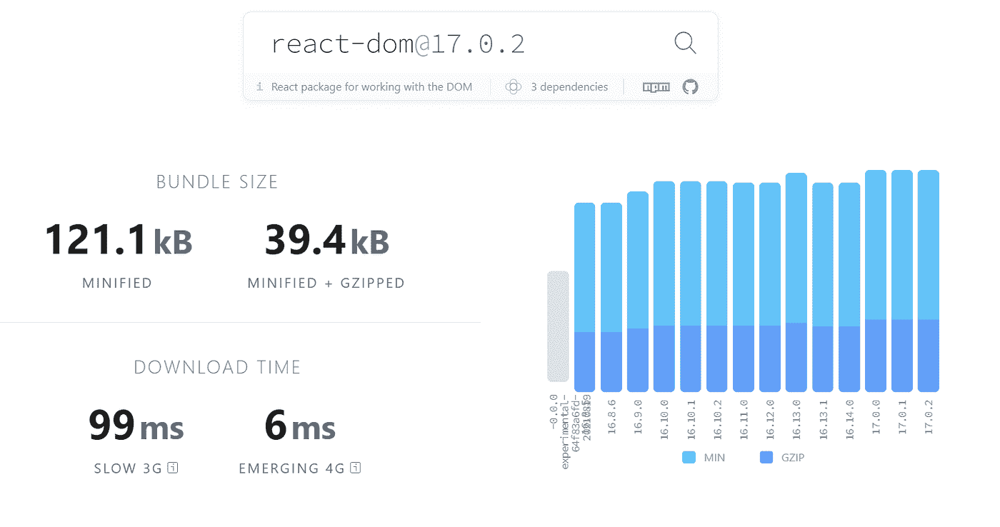

# 什么时候该用什么时候不该用 React？

> 原文：<https://javascript.plainenglish.io/when-should-you-and-shouldnt-use-react-5e31ed78e631?source=collection_archive---------20----------------------->

React’s Logo

如果你做 web 开发，你很可能知道 React 是什么。它是最著名的使用类似 HTML 的语言 JSX 构建用户界面的框架之一。

然而，React 并不是制作复杂的交互式用户界面的唯一解决方案。许多备选方案，如 Vue、Svelte 和 vanilla JavaScript，也是不错的选择。在这篇文章中，我们将讨论什么时候应该使用 React，什么时候不应该使用 React。

# React 的创作

2011 年，脸书需要一种更简单的方法来构建他们的 web 应用程序，而不浪费开发人员的时间。2011 年，脸书大学的工程师 Jordan Walke 创建了一个名为 FaxJS 的实验性网络框架。它承诺了简单的组件重用、基于状态的声明式更新，以及在客户机和服务器上无缝呈现的方式。那一年，FaxJS 首次在脸书使用。后来 FaxJS 被改进，改名为 React。React 很快被开发人员采用，并添加了更多功能，如 2013 年的 JSX，它允许开发人员使用类似 HTML 的语言编写，而不是原始的函数调用。他们还增加了 React Native 之类的东西，允许开发人员使用 React 来构建移动应用程序，以及 hooks，使 React 组件可以使用函数而不是类。所有这些创造了今天所知的 React。

# 何时使用 React

## 当你需要一个大的生态系统时

如果您正在构建一个使用许多不同包和库的应用程序，React 可能是一个不错的选择。它目前有一个最大的 web 开发框架生态系统，有像 Material UI 和 React Spring 这样有用的库。事实上，NPM 上有超过 75，000 个带有 [React 关键字](https://www.npmjs.com/search?q=keywords%3Areact)的包，这几乎是第二大框架 Vue 的三倍。React 也有一个大型的成熟社区，有很多关于 React 各个方面的教程和指南。

## 当你需要一个成熟的和广泛使用的基地

React 是成熟的，已经被许多大公司用于生产多年，如脸书、网飞、优步等等。它几乎可以保证是稳定的，因为脸书在他们的网站和应用程序上使用最新的生产版本。如果你有一个要求极其可靠和稳定的应用程序，那么 React 可能是一个不错的选择。

## 当你担心应用程序的大小时

反应会很大。仅仅通过在你的应用中添加 React，你就增加了超过 121 千字节的代码。

React’s bundle size (Source: [https://bundlephobia.com/package/react-dom@17.0.2](https://bundlephobia.com/package/react-dom@17.0.2))

这 121 千字节意味着一个快速的网站和一个缓慢加载的网站之间的区别。速度慢的网站会让你的用户更有可能离开网站。许多其他框架，如 Vue、Preact 和 Svelte，有一个小得多的包大小，可以集成而不需要创建一个慢得多的网站。

此外，如果您使用 Create React App 这样的方法，您的所有 JavaScript 都需要在您的网站呈现之前下载。这是因为 Create React App 和其他单页面 App 方法需要 React 使用下载的 JavaScript 构建 HTML，而不是提供预构建的 HTML 文件。这会让搜索引擎更难理解你的内容，从而损害搜索引擎优化，也会让用户的内容加载速度变慢。然而，有一些解决方案可以在服务器上呈现 HTML，比如 [Next.js](https://nextjs.org/) 。虽然即使你这样做了，它仍然需要一些时间来使页面变得可交互。

## 当您需要快速渲染时

当你在做一个游戏之类的 app 或者一个要求很高的创意 app 的时候，React 并不是最好的选择。这个问题源于它使用了一个虚拟 DOM。虚拟 DOM，或 vdom，是帮助使未优化的 DOM 操作更快的层。例如，让我们看一个渲染数据的例子:

在上面的例子中，即使只使用了一小段字符串，也要重新呈现整个文档。这可能会非常慢，因为 HTML 需要时间来解析和再次呈现。为了解决这个问题，React 使用了 VDOM。VDOMs 将文档的结构保存在内存中，然后使用它来计算出发生了什么变化，方法是在更新 VDOM 时检查有什么不同，从而使 HTML 中的微小变化成为可能。然而，管理虚拟 DOM 有开销，而且首先优化 JavaScript 会更快。这方面的一个例子是:

这个例子对 HTML 的修改很少，这使得它更快，并且没有 VDOM 的开销。因此，虽然 VDOM 可以让未优化的 JavaScript 运行得更快，但如果你需要顶级的渲染性能，那就不应该这么做。此外，像 Svelte 这样的一些框架将所有的 VDOM 计算转移到编译步骤中，使得输出优化的 JavaScript。

## 当您想要一种更强大的标记语言时

JSX 很好，但有时会很冗长，因为它基本上是 HTML 和 JavaScript 的混合体。虽然学习 JSX 很容易，因为它与 HTML 非常相关，但一些标记语言，如 Svelte，可以不那么冗长。Svelte 提供了更多的抽象，比如内置的条件块和反应变量。例如，当你想触发一个更新，用 Svelte，你可以只设置变量。一旦你学会了新的语法，这可以创建更简洁的代码和更少的开发工作。

# 结论

React 是一个快速建立网站的好工具。然而，它并不适合所有人。一般来说，这不是很好的表现，JSX 可以更简洁。也有许多很好的替代品，如 Vue、Svelte 和原生 JS。然而，这可能有点偏颇，因为我是一个苗条的用户。无论如何，我希望你能从中学到一些东西，感谢你的阅读。

*原载于 2021 年 8 月 20 日*[*【https://byteofdev.com】*](https://byteofdev.com/posts/when-you-should-and-should-not-use-react)*。*

*更多内容请看*[***plain English . io***](http://plainenglish.io/)