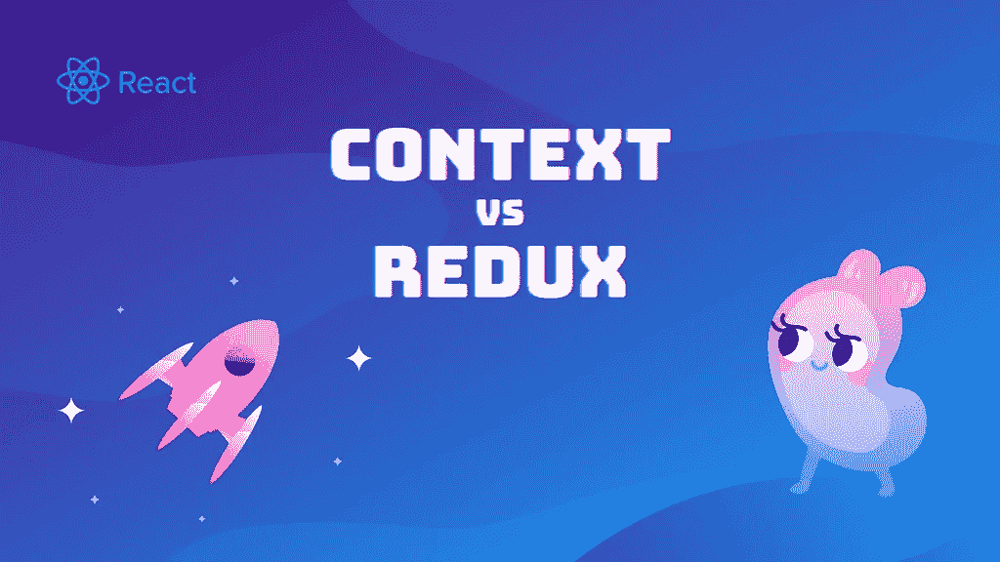

# 何时使用上下文 API vs Redux

> 原文：<https://javascript.plainenglish.io/when-to-use-context-api-vs-redux-2452ae938784?source=collection_archive---------3----------------------->

## 两者的正确用例

> 如果有人问我任何网站最重要的部分是什么，我的回答总是一样的。是**应用状态**。毕竟，是国家决定了用户将会看到什么。

在 React 中，每个组件都有其本地状态。这种状态可以用来跟踪组件内部发生的事情。但是，当我们想要跟踪应用程序整体内部发生的事情时，本地状态已经不够了。对于这些情况，我们需要使用全局状态。

要为 React 选择全局状态管理，我们有很多选项可供选择。多年来， [Redux](https://redux.js.org) 似乎是最受欢迎的选择。但是当引入上下文 API 时，开发人员开始迅速采用它。在某些场景中，他们开始用上下文替换 Redux。随着这一切的发生，一个大问题开始出现。🗽

**什么时候使用上下文 API vs Redux？**

如果你只是使用 Redux 来避免传递道具，你可以用 Context API 代替它。上下文对于在组件之间共享琐碎的状态片段非常有用。

Redux 更加强大，并提供了一组 Context 所没有的便利特性。它非常适合管理集中式状态和处理 API 请求。

# 上下文 API 和 Redux 的区别

这两个库的主要区别在于 Redux 以集中的方式处理状态的变化。另一方面，当它们发生在组件级别时，上下文处理它们。但是，为了更好地了解这两个库之间的区别，我们必须分别来看它们。

## 上下文 API

> *上下文提供了一种通过组件树传递数据的方法，而不必在每一层手动向下传递属性。*

在 React 世界中，上下文 API 是一个相当新的概念。它的主要目的是在不使用道具或动作的情况下在组件之间共享数据。它旨在共享 React 组件树的全局数据，如主题或首选语言。上下文可以显著降低应用程序中状态管理的复杂性。🚀

它有两个核心概念:

提供者的工作是定义和跟踪状态的某些部分。嵌套在`Provider`中的所有子节点都可以访问这个状态。这些孩子通常被称为消费者。`Consumer`是从上下文中访问或修改状态的每个组件`Provider`。

## Redux

> *Redux 帮你写出* ***行为一致*** *的应用，运行在不同的环境下，并且* ***易于测试*** *。将应用程序的状态和逻辑集中起来，可以实现强大的功能，如* ***【撤销/重做】*******状态持久化*** *等等。**

*Redux 是一个 JavaScript 库，有助于以集中的方式管理数据流。它存储应用程序的整个状态。任何组件都可以访问这种状态，而不必将属性从一个组件传递到另一个组件。它有 3 个核心概念:*

*动作是向 Redux 存储发送数据的事件。它们可以由用户交互触发，也可以由您的应用程序直接调用。每个动作都需要有一个唯一的类型和与之相关联的有效负载。示例操作可能如下所示。👇*

*调度一个动作将触发 reducer 运行。缩减器是一个函数，它获取当前状态，并基于它接收到的动作，返回一个新状态。*

*所有这些都发生在店内。商店只有一个责任，那就是保存应用程序状态。强烈建议在任何使用 Redux 的应用程序中只保留一个存储。*

*现在我们了解了 Redux 和 Context 是如何工作的。是时候看看他们俩的申请了。*

# *上下文 API 应用程序*

*上下文非常适合用于共享全局数据，比如当前已验证的用户、主题或用户语言。*

*现在，让我们为 React 应用程序实现跟踪`theme`属性的上下文。*

*正如您在上面的例子中所看到的，Context 不需要大量的设置和样板代码就可以工作。*

*最重要的是，它默认包含在 React 库中，因此您不必安装任何依赖项。👌*

# *Redux 应用*

*Redux 最常用于以下情况:*

*   *应用程序有大量的状态，许多组件都需要。*
*   *应用程序状态经常更新。*
*   *更新应用程序状态的逻辑很复杂。*

*为了更好地理解 Redux 的理想用例。让我们实现跟踪应用程序用户列表的状态。*

*为了初始化 Redux，我们需要将整个 App 组件包装在`Redux Provider`中，并初始化商店。*

*最后一部分是访问状态，这可以通过将组件连接到状态来完成。*

*这是展示 Redux 强大功能的一个非常简单的例子。可以想象，Redux 可以用来处理复杂得多的状态。毕竟它就是为此而生的。*

> **Redux 试图通过为我们提供一套有用的工具来简化复杂状态的管理，如 Redux 开发工具、状态持久化、异步操作等……**

# *其他状态管理工具*

*在本文中，我们试图比较 React 上下文 API 和 Redux。但是正如你可能猜到的，它们不是唯一的状态管理工具。事实上，还有许多其他工具以自己独特的方式处理状态管理。🕺🏻*

*在这一部分，我们将提到其中的一些。*

> **我们不是鼓励你使用这些工具，也不是说它们比 Redux 或 Context API 更好。我们只是想传播这个消息。**

## *反应-查询*

*React Query 是专门为处理数据获取的状态管理而开发的。它提供了许多助手，使数据抓取变得轻而易举。*

*要了解更多信息，请在这里阅读文档。*

## *报应*

*反冲是一个相当新的国家管理工具，由脸书开发。目前仍在积极开发中。在反冲中，每一片态称为一个原子，原子可以用选择器组合。您可以将原子和选择器结合起来，为您的应用程序创建独特的数据结构。*

*这里可以了解更多[。](https://recoiljs.org/)*

## *MobX*

*MobX 实现了一种基于类的方法。MobX 背后的整个想法是让状态管理“可观察”。你可以在这里阅读更多关于 MobX [的内容。](https://mobx.js.org/README.html)*

# *总结想法*

*所有 web 应用程序都需要状态管理。当我们决定如何在 React 应用程序中管理全局状态时。常见的问题是:什么时候使用上下文 API vs Redux。理解 Context API 和 Redux 的工作原理很重要。为您的使用案例选择正确的工具也很重要。👍*

**原载于*[*https://www.upbeatcode.com*](https://www.upbeatcode.com/react/when-to-use-context-api-vs-redux/)*。**

**更多内容看* [***说白了。报名参加我们的***](http://plainenglish.io/)***[***免费每周简讯在这里***](http://newsletter.plainenglish.io/) ***。*******