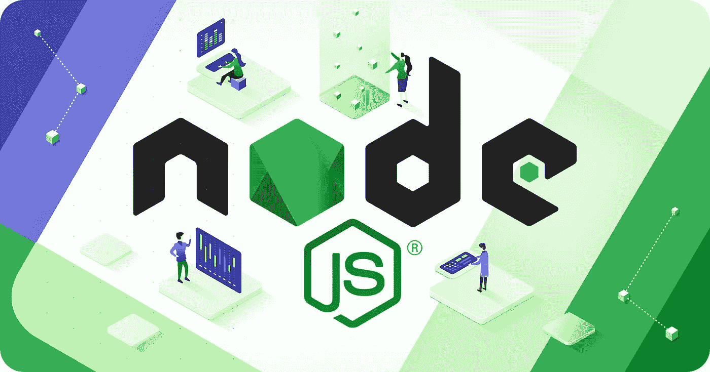

# 何时使用 Node.js

> 原文：<https://javascript.plainenglish.io/when-to-use-node-js-569f9de017b5?source=collection_archive---------13----------------------->

Node js

弄清楚使用哪种后端技术是每个中小型公司的 CEO 和 CTO 必须做出的最重要的决定之一。它决定了一个产品什么时候能上市的节奏，总成本是多少，维护的痛苦会有多大。

JavaScript 一直是最流行的客户端编程语言之一，也是常用的前端 web 开发工具。然而，它也在不同的应用领域和不同的平台上取得了进展，如 React Native、Apache Cordova/Phone Gap、NativeScript 和 Node.js，这与其他常用的 JavaScript 框架完全不同。

Node.js 是一个应用程序运行时环境，允许您用 JavaScript 编写服务器端应用程序。由于其独特的 I/O 模型，它在我们对服务器要求越来越高的可扩展和实时情况下表现出色。它也是轻量级的、高效的，并且能够在前端和后端使用 JavaScript 打开了新的可能性。毫不奇怪，如此多的大公司在生产中利用了它，包括沃尔玛、网飞、Medium、LinkedIn 或 Groupon。

为什么传奇玩家选择 Node.js 在后端使用？以下是该环境的主要优势，但在做出选择之前，您也应该考虑一些缺点。错误的决定可能会让你损失金钱，所以明智地选择吧。我不能背这个黑锅:)

# **物联网**

自 2012 年以来，当物联网的受欢迎程度急剧上升时，Node.js 已成为寻求开发其私有和公共物联网系统的企业和组织的首选解决方案之一。Node.js 作为此类网络的后端最明显的优势是它能够处理网络上数千甚至数百万个设备发出的多个并发请求和事件。

来自物联网设备的大量请求和数据不会阻塞 Node.js 服务器，因为它们的事件驱动架构和异步处理适合物联网网络上的 I/O 密集型操作。这使得 Node.js 作为这些设备和用于存储源自它们的数据的数据库之间的应用层变得很快。此外，在数据密集型场景中工作的物联网开发人员可以利用 Node.js 的低资源要求。

低内存要求使得 Node.js 可以作为软件轻松集成到 Arduino 等单板控制器中，Arduino 广泛用于构建构成物联网系统的数字设备。最后，Node 社区是物联网技术的早期采用者，为 Arduino 控制器创建了 80 多个包，为广泛用于物联网系统的 Pebble 和 Fitbit 可穿戴设备创建了多个包。

# **实时聊天**

Node.js 提供了构建任何复杂程度的实时聊天的所有基本功能。特别是，Node 有一个强大的事件 API，它有助于创建某些类型的对象(“发射器”)，这些对象定期发出由事件处理程序“监听”的命名事件。得益于这一功能，Node.js 可以轻松实现广泛用于即时消息和其他实时应用程序的服务器端事件和推送通知。Node 基于事件的架构也能很好地与 WebSockets 协议配合使用，该协议通过一个开放的连接促进了客户机和服务器之间的快速双向消息交换。通过在服务器和客户端安装 WebSockets 库，您可以实现实时消息传递，与大多数其他更传统的解决方案相比，它具有更低的开销和延迟，以及更快的数据传输。

在 Node 中，您可以通过 socket.io、ws 或 WebSockets-node 等库获得对 WebSockets 的出色支持，借助这些库，您可以轻松部署高效的实时聊天和应用程序。例如，使用 socket.io，创建一个基本的实时聊天所要做的就是在 netguru.co 4 服务器和客户端上安装 socket.io 库，并创建事件发射器和广播器，通过 WebSockets 开放连接推送消息。只需几行代码就可以实现这一基本功能。复杂的单页应用程序 Node.js 非常适合单页应用程序(SPAs ),因为它可以高效地处理异步调用和这些应用程序特有的繁重 I/O 工作负载。

Node.js 的事件循环允许“延迟”来自客户端的多个并发请求，这确保了视图之间的平滑转换和无缝数据更新。此外，Node.js 与数据驱动的 SPAs 配合得很好，在 SPAs 中，服务器充当后端，向客户端提供数据，而客户端完成所有的 HTML 呈现。此外，Node.js 对 spa 很好，因为它是用与构建 spa 时使用的许多流行的 JavaScript 框架(Ember、Meteor、React、Angular)相同的语言(JavaScript)编写的。由于 Node.js 和浏览器都使用 JavaScript，它们之间的上下文切换更少，开发人员可以在服务器端和客户端使用相同的数据和语言结构以及模块化方法。这使得 spa 的开发速度更快，可维护性更好。Node.js 的上述优势已经被网飞、LinkedIn、Medium 等知名 spa 利用。实时协作工具与实时聊天一样，Node 的异步和基于事件的架构非常适合协作应用程序。在这些应用中，许多事件和 I/O 请求同时发生。例如，几个用户可以编辑同一个段落、评论、发布消息和附加媒体。对一部分内容的更改可能只有在一系列事件之后才会应用，其中每一步都依赖于前一步。

Node 的 WebSockets 和 Event API 将确保许多用户执行的繁重 I/O 操作不会使服务器挂起，并且所有服务器端事件和数据都会按时发送回客户端。通过向客户端发送推送通知，Node.js 还将即时更新协作环境，以便所有用户都有一个统一的应用程序表示。这也正是项目管理应用 Trello 的团队使用 Node.js 栈的原因。Trello 的工程团队认为 Node.js 非常适合即时传播大量更新并保持大量开放连接，这要归功于它的事件驱动和非阻塞架构。在其他基于 Node.js 的实时协作应用中，我们还应该提到 Yammer，这是一种免费的社交网络服务，有助于企业中的私人通信。

# 流媒体应用

与远程服务器应用不同，在应用流中，程序在最终用户的本地机器上执行。应用程序流允许按需下载部分应用程序，而不会使服务器和本地计算机过载。最初，只下载引导所需的应用程序的某些部分，而其余部分可以在需要时在后台下载。当应用程序完全下载后，它可以在没有任何网络连接的情况下运行。如果您想在您的帐户中保存一些数据，应用程序可以启动服务器请求。类似地，服务器事件可以更新您的本地应用程序，而不会有太多的网络流量开销。

Node.js 非常适合开发这种流应用程序，这要归功于它的原生流 API。特别是，Node.js 有一个可读和可写流的接口，可以非常有效地处理和监控这些流。流实例基本上是 Unix 管道，允许将应用程序的部分可执行代码传输到本地机器，同时保持连接开放，以便按需下载新组件。流允许用户通过管道相互发送请求，并将数据直接传输到最终目的地。额外的好处是，流不需要缓存和临时数据，只需要一个开放的连接来将应用程序数据从一个地方传输到另一个地方。

# 微服务架构

Node.js 是开发微服务和创建易于使用的 API 来连接它们的优秀解决方案。特别是，Node.js 存储库具有 Express 和 Koa 框架，这使得为每个微服务安装几个服务器实例并为它们设计路由地址变得很容易。Node.js with Express 允许创建负责应用程序特定部分的高度灵活的模块。此外，Node.js 可以很容易地与 Docker 集成，从而允许您将微服务封装在密封容器中，以避免它们各自使用的应用程序开发环境之间的任何冲突。

使用 Node.js 做微服务也得益于 Node 的轻量级需求。带有微服务的 Node.js 显著减少了应用程序部署时间，并增强了应用程序的效率、可维护性和可伸缩性。微服务架构还有助于有效管理工程团队的分工，使他们能够在不影响应用程序其他部分的情况下完成特定任务。世界领先的在线支付系统 PayPal 成功利用了这些优势，自 2013 年以来，PayPal 一直使用 Node.js 来支持其微服务架构。PayPal 将其应用程序堆栈模块化，并将开发过程分成许多微服务，从而组织他们的团队更有效地工作。PayPal 能够扩展 Node.js，以便多个团队可以在同一个项目上工作。这一转变的结果令人震惊。PayPal 的 Node.js 应用程序可以用更少的人以两倍的速度构建。该公司已设法减少其代码基数并提高性能，其中一个核心节点应用程序可以处理的 rps(每秒请求数)是 PayPal 之前使用的 5 个 Java 应用程序的两倍。

## 结论

这里为您提供了决定是否使用 Node.js 所需的几乎所有信息。

明智地决定。