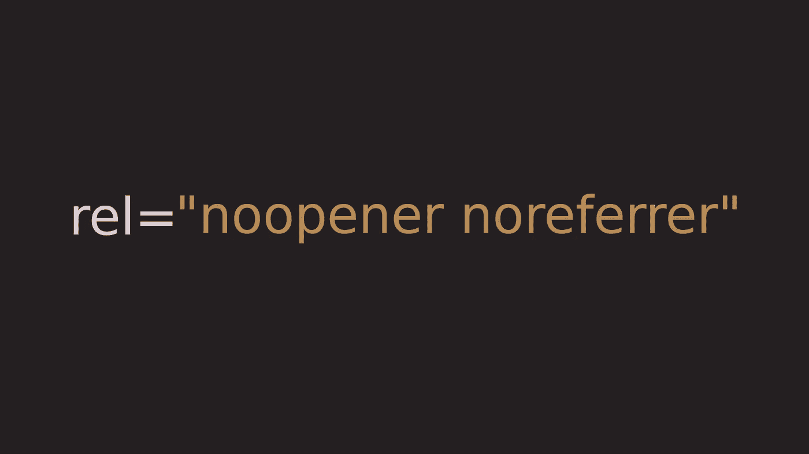
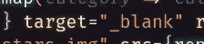
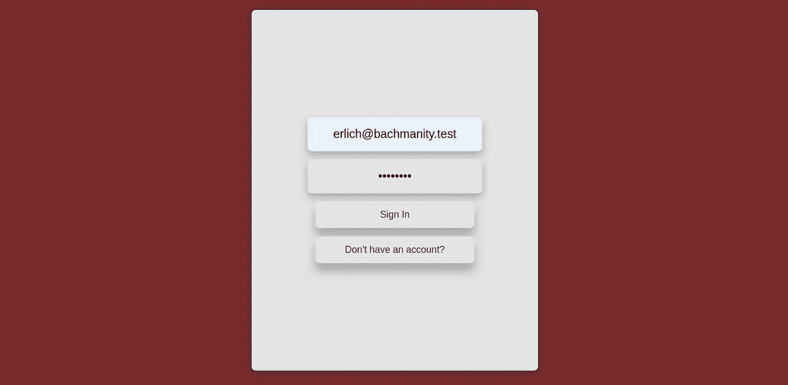
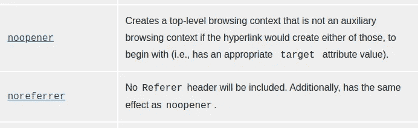

# 何时使用“noopener”或“noreferrer”以及它们之间的区别

> 原文：<https://javascript.plainenglish.io/when-to-use-noopener-or-noreferrer-and-the-difference-between-the-two-d4aa809f83f?source=collection_archive---------9----------------------->

在锚标记中，我们使用 *rel* 属性来定义当前文档和链接资源之间的关系。当在新的选项卡或窗口中打开链接的资源时(target="_blank ")，我们使用带有值 *noopener* 和/或 *noreferrer* 的 *rel* 属性。那么，为什么这很重要，为什么我们会选择一个而不是另一个…或者两个都选？

首先，让我们仔细看看 *target="_blank"* 是做什么的。使用*目标*属性的 *_blank* 值将在新的选项卡或窗口中打开链接的资源(取决于用户的设置)。它也让你链接的页面通过 *window.opener* 对象访问你的页面。这使得您的页面容易受到网络钓鱼攻击。想想*window . opener . location . replace(" http://lets gophishing . co ")*…不太好吧？

因此，现在链接的站点可以访问我们的 window.opener 对象，并且可以用一个钓鱼页面来替换我们的页面，该页面旨在欺骗用户提供用于访问我们站点的登录凭据。我们不能这样，但我们能做些什么来修复这个漏洞呢？

嗯，我们可以去掉 *target="_blank"* 。这将解决问题，我强烈推荐这条路线。

在同一个标签中打开外部链接是默认行为，除非有更好的理由，否则不应该修改。

但是，如果你有更好的理由呢？如果在一个新标签页中打开链接是绝对必要的，或者你只是希望它在一个新标签页中打开呢

这就是性开放者和性推荐者的用武之地。

值 *noopener* 和 *noreferrer* 属于 *rel* 属性，它们告诉浏览器在新标签页/窗口中打开链接时不要设置 *window.open* 属性。

*noopener* 和 *noreferrer* 的作用非常相似，唯一的区别是 *noreferrer* 也阻止浏览器发送推荐网页的地址。

这可能会使链接的页面看起来像是在接收直接流量，而不是推荐流量。

需要澄清的是，这两者对 SEO 都没有影响，但是 noreferrer 可以通过让数据看起来更直接来扭曲分析和跟踪软件中的数据。

那么，你应该使用哪一个呢？嗯，我个人会两种都用，原因很简单:兼容性。

一些老的浏览器可能不支持 *noopener* ，所以让 *noreferrer* 来帮助你。

## 结论

希望你现在对我们为什么使用*rel = " noo pener nore Ferrer "*有了更好的理解。

编码快乐！

*更多内容看*[***plain English . io***](https://plainenglish.io/)