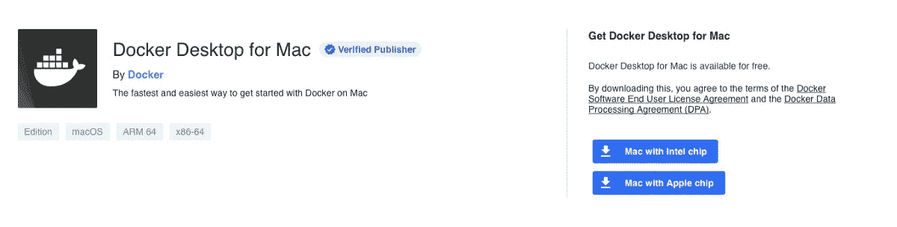

# 哪些 Docker 图像可以在 Mac M1 上使用？

> 原文：<https://javascript.plainenglish.io/which-docker-images-can-you-use-on-the-mac-m1-daba6bbc2dc5?source=collection_archive---------1----------------------->


Photo by [Matt Hardy](https://unsplash.com/@matthardy?utm_source=unsplash&utm_medium=referral&utm_content=creditCopyText) on [Unsplash](https://unsplash.com/s/photos/ocean?utm_source=unsplash&utm_medium=referral&utm_content=creditCopyText)

## Docker 改进了他们的 Mac M1 支持

几个月前，我和 Docker 一起开发了我的 [Macbook Pro (M1)](https://www.amazon.com/dp/B08N5N6RSS/ref=fs_a_mbt2_us2) 。我安装了它，但遗憾的是，我的 mac 立即崩溃了。

因为我不需要它，所以我把它放在一边。

几个月后，我需要 Docker。我装的；安装过程中一切正常。即使在尝试旋转 Docker 教程容器时，它仍然在运行🥳

## 如何在 Mac M1 上使用 Docker？



*在安装 Docker for Mac 之前，在你的终端中运行这个命令进行* [*安装 Rosetta 2*](https://support.apple.com/en-us/HT211861) *。如果你已经安装了它，你可以跳过这一步*

```
softwareupdate --install-rosetta
```

从 Docker 网站下载 [Docker for Mac](https://docs.docker.com/desktop/mac/install/) 并安装。

## **什么 Docker 图像可以在 Mac M1 上使用？**

许多码头工人图像可用于 M1。不是每个 Docker 映像维护人员都这样做的。Docker 创建的大多数官方 Docker 映像都支持 ARM64。

带有`ARM64`标签的 Docker 图像原生运行在 Mac M1 上。如果您使用 Rosetta 2，您可以运行 amd64 映像，但它们可能会导致性能问题。

支持 ARM64 的常见 Docker 图像示例如下:

*   [Ubuntu](https://hub.docker.com/_/ubuntu)
*   [Python](https://hub.docker.com/_/python)
*   [Redis](https://hub.docker.com/_/redis)
*   [Postgres](https://hub.docker.com/_/postgres)
*   [Nginx](https://hub.docker.com/_/nginx)
*   [节点 JS](https://hub.docker.com/_/node)
*   [Traefik](https://hub.docker.com/_/traefik)
*   [蒙哥](https://hub.docker.com/_/mongo)
*   [马里亚 DB](https://hub.docker.com/_/mariadb)
*   [OpenJDK](https://hub.docker.com/_/openjdk)
*   [按下](https://hub.docker.com/_/wordpress)
*   [执政官](https://hub.docker.com/_/consul)
*   [phpMyAdmin](https://hub.docker.com/_/phpmyadmin)
*   [红宝石](https://hub.docker.com/_/ruby)
*   [还有更多…](https://hub.docker.com/search?q=&type=image&architecture=arm%2Carm64)

如果您发现 Docker 图像不支持 ARM64，请转到 Github 问题页面并打开一个问题来请求 ARM64 支持，这将帮助所有人👍

## **MSSQL**

对于每个需要在应用程序中使用 MSSQL 的人来说，我发现这个图像还不支持 ARM64。这个 Docker 图像的替代图像是`mcr.microsoft.com/azure-sql-edge:latest`。我在不同的调试过程中发现了这一点，但最终让它与这张图片一起工作。

## **你是 Docker 形象维护者吗？**

> 如果您是 Docker 图像维护人员，我要感谢您的出色工作！许多人依靠你的工作，所以非常感谢❤ *️* 。

Docker 映像目前可以构建为多平台映像。我不知道将特定图像转换为多平台图像的工作量有多大。但是，Docker 提供了一种快速构建它们的简单方法。

使用`docker buildx build`命令，可以添加多个平台来支持 arm64。例如

*阅读更多关于多架构图像的* [*Docker 文档*](https://docs.docker.com/desktop/multi-arch/#build-multi-arch-images-with-buildx) *。*

# 谢谢！


读完这个故事后，我希望你学到了一些新的东西，或者受到启发去创造一些新的东西！🤗

如果我给你留下了问题或一些要说的话作为回应，向下滚动并给我键入一条消息。如果你想保密，请在 Twitter @DevByRayRay 上给我发个 DM。我的 DM 永远是开放的😁

## [通过电子邮件获取我的文章点击这里](https://byrayray.medium.com/subscribe) | [购买 5 美元的中级会员资格](https://byrayray.medium.com/subscribe)

# 阅读更多


[雷雷](https://byrayray.medium.com/?source=post_page-----daba6bbc2dc5--------------------------------)

## 荒诞的故事

[View list](https://byrayray.medium.com/list/angular-stories-24674407532a?source=post_page-----daba6bbc2dc5--------------------------------)6 stories

[雷雷](https://byrayray.medium.com/?source=post_page-----daba6bbc2dc5--------------------------------)

## 最新的 JavaScript 和 TypeScript 故事

[View list](https://byrayray.medium.com/list/latest-javascript-typescript-stories-0358ad941491?source=post_page-----daba6bbc2dc5--------------------------------)14 stories

*更多内容看*[***plain English . io***](http://plainenglish.io)