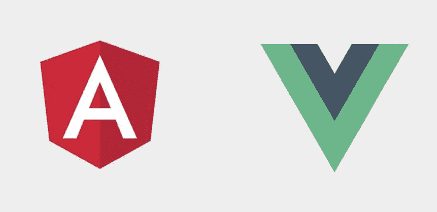

# 为你的下一个项目考虑哪个框架:Angular 还是 Vue？

> 原文：<https://javascript.plainenglish.io/which-framework-to-consider-angular-or-vue-js-for-your-next-project-96662069e8fc?source=collection_archive---------9----------------------->

Angular or Vue

网络和移动产业正在迅速发展。随着现代技术的出现，基于高性能的解决方案正在为用户提供下一代体验。新技术重新定义了开发过程，在几个阶段中，构建一个直观的前端界面已成为开发人员的下一个艰巨挑战。

毫无疑问，前端开发起着至关重要的作用，因为它有助于连接用户和增加用户参与度。为了满足构建健壮应用程序的日益增长的需求，专家们引入了几个前端框架。其中，基于 Javascript 的工具已经成为前端开发过程的趋势。

这个博客将讨论最流行的前端开发框架——angular . js 和 Vue——它们被称为前端开发行业的重大变革者。它们都很强大，提供了每个前端开发人员都应该知道的不同特性。

## 什么是有角？

Angular 是开源类型的基于脚本的 web 应用框架。它由 Google 推出，允许程序员构建动态网络应用程序。这种基于 JavaScript 的技术被认为属于平均堆栈范畴。此外，它是在 MIT 许可下形成的，也是用打字稿编写的。

它为开发人员提供了许多好处，比如可重用代码和支持第三方集成服务。

## **什么是 Vue.js**

这是一个基于轻量级的开源框架，允许开发高性能的现代、健壮的单页面应用程序。它为程序员提供了一个机会来创建渐进式用户界面，并使用不同的自定义模块和可视组件来扩展功能。

Vue。JS 由模型视图 viewmodel 支持，由尤雨溪开发，由活跃的核心团队成员维护。它是用 typescript 编写的，在 MIT 许可下发布。

## 角度的优势

**1)谷歌支持**

选择这项技术的主要原因是它提供了谷歌的长期支持，并由行业专家提供详细信息。为了保持功能，谷歌的工程师团队提出了新的改进，并向开发人员提供了下一代的进步。

这项技术曾经由行业技术专家进行更新，Google 的支持在开发人员中获得了极大的欢迎。

**2)支持单页面应用**

开发人员可以利用这项技术的另一个主要优势是它支持单页面应用程序开发。通过与 Angular 开发人员一起开发解决方案，增加本地应用程序的功能，并使用新的 web 服务器数据动态替换现有网页。这样，用户就不必浏览加载全新页面的默认方法。

它提供了页面的高负载，还支持具有交互式用户界面的不同平台。这项技术也易于维护。

**3)高度可测试性**

Angular 提供高度可测试和验证的网站以及解决方案。它允许在市场上推出可测试的和健壮的应用程序。它还提供了测试过程的单元和结束，使调试过程更加简单和快速。Jasmine、Karma 和量角器等不同的测试框架也支持这种技术来测试几种解决方案。

**4)第三方整合**

Angular 支持第三方集成服务，允许他们通过 API 轻松地将第三方功能集成到解决方案中，并提供更高级别的用户体验。通过第三方集成，该技术高度灵活，并提供高端开发进度。

## Vue.js 的优势

**未来就绪**

这个框架被称为面向未来的解决方案，因为开发人员不必不断地用更新的版本更新解决方案并修复错误。随着新版本的发布，框架默认更新。

**通俗易懂**

Vue.js 是用 JavaScript 编写的，为开发人员提供了易于阅读和理解的简洁代码。这使得任何开发人员都可以轻松地维护代码，并进一步推进开发过程。

**服务器端渲染**

Vue.js 的另一个好处是，它允许用户根据自己的喜好选择服务器端的渲染，这提高了客户端页面不同功能的速度。

## **Angular 和 Vue.js 的主要区别**

## **结论**

Angular 和 Vue.js 都是面向开发者的流行且强大的前端开发框架。它们被广泛使用，并为程序员提供高级功能来启动成功的解决方案。为了利用这些优势，开发人员应该能够根据他们的项目需求选择正确的框架。在上面的博客中，我们提到了框架和你在下一个项目中应该知道的不同之处。

*更多内容看* [***说白了. io***](http://plainenglish.io/)