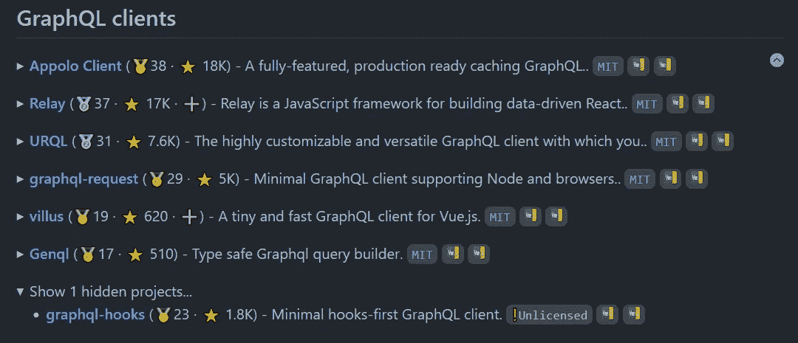

# 哪些 GraphQL 库支持 Vue 3？

> 原文：<https://javascript.plainenglish.io/which-graphql-libraries-support-vue-3-51fb35faed3c?source=collection_archive---------10----------------------->

## 关于 Vue 3 支持的状态

[Logo of Vue Apollo.](https://camo.githubusercontent.com/2bb27a02cb405dd930513ea0761115a6f5951e4230105c350cf530a66878bf30/68747470733a2f2f63646e2d696d616765732d312e6d656469756d2e636f6d2f6d61782f3830302f312a483941414e6f6f664c716a53313058643554775259772e706e67)

# 在最佳的 vue 上获得大图

支持 Vue 3 和集成的 GraphQL 库是[最佳 vue](https://github.com/fkromer/best-of-vue#graphql-clients) 的一部分。该网站定期重新生成，并根据包的元数据计算包排名。请随意退房！

[best-of-vue — GraphQL clients](https://github.com/fkromer/best-of-vue#graphql-clients)

## Vue 的 GraphQL 客户端集成

今天我将检查 GraphQL 库的 Vue 3 支持状态。根据 [Awesome Vue，有以下 libs w.r.t. GraphQL](https://awesome-vue.js.org/components-and-libraries/utilities.html#graphql) :

*   [Vue Apollo](https://github.com/vuejs/vue-apollo) :将 [Apollo GraphQL 客户端](https://www.apollographql.com/apollo-client)集成到 Vue 中。
*   [Vue Relay](https://github.com/vue-relay/vue-relay) :将 [Relay GraphQL 客户端](https://relay.dev/)集成到 Vue 中。
*   [Vuex ORM 插件 graph QL](https://github.com/vuex-orm/plugin-graphql):Vuex ORM 的一个插件，允许根据 GraphQL API 同步商店。

此外，还有

*   [vill us](https://github.com/logaretm/villus):vue . js 的小型快速 GraphQL 客户端

## 阿波罗万岁

*Vue Apollo* 是一个将 *Vue* 组件中的 [*Apollo*](https://www.apollographql.com/) 与声明式查询集成在一起的库。[版本 v4](https://github.com/vuejs/vue-apollo/tree/v4) 的 *Vue 阿波罗*兼容 Vue 2.0+和 3.0+。根据 GitHub 的讨论，这些文档似乎并不总是正确的，但是 Vue 3 支持总体上似乎是有效的:

*   [vue-阿波罗 v4 和 vue 3](https://github.com/vuejs/vue-apollo/discussions/1216)
*   这个包会很快移植到 Vue 3 吗？

## Vue 继电器

Vue 继电器的[最新发布是在 2019 年 8 月 20 日](https://github.com/vue-relay/vue-relay/releases)。 [Vue 3 已于 2020 年 9 月 18 日](https://github.com/vuejs/vue-next/releases/tag/v3.0.0) **发布。这意味着 Vue 中继还不能支持 Vue 3。**

## Vuex ORM 插件图表 QL

[*Vuex ORM*for Vue Next(v3)](https://next.vuex-orm.org/)是 [*Vuex*](https://github.com/vuejs/vuex) 的一个插件，支持对 Vuex 存储的对象关系映射访问。Vue2 的[*Vue form*是相当众所周知的。Vue 3 的 ATM **Vuex 表单还不稳定**。 *Vuex ORM* 的](https://github.com/vuex-orm/vuex-orm) [*GraphQL 插件*](https://github.com/vuex-orm/plugin-graphql) 让你通过一个 [GraphQL API](http://graphql.org/) 通过 Vuex-ORM 模型与你的服务器同步你的 Vuex 状态。**我找不到关于 GraphQL 插件**的 Vue3 支持状态的信息，所以我在 GitHub 中提出了一个[问题。](https://github.com/vuex-orm/plugin-graphql/issues/186)

## 绒毛

[Villus](https://villus.logaretm.com/) 是 Vue.js **的小型快速 GraphQL 客户端，支持 Vue 3** 。绒毛可以安装到 vue 3 项目中([安装在 Vue 3 项目中(vue@3.0.11)](https://github.com/logaretm/villus/issues/119) ，[安装在 Vue 3 中](https://github.com/logaretm/villus/issues/78))[支持组合 API](https://villus.logaretm.com/guide/setup#composition-api) 。

## 结论

如果你有时间做实验，你可以试试*绒毛。*绒毛*肯定有支持 Vue 3 的。如果您遇到 w.r.t. GraphQL 功能集的限制，您仍然可以切换到 *Vue Apollo* 。在《阿波罗》中，可能不是所有的东西都能在 ATM 上工作。然而一般来说，最好还是坚持使用 *Vue Apollo* ，因为它拥有最完整的 GraphQL 支持。*

*更多内容看*[***plain English . io***](http://plainenglish.io)