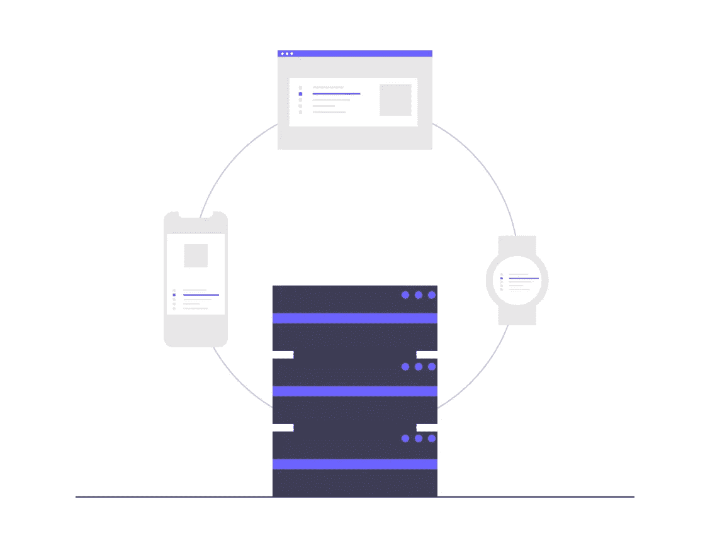

# 为什么所有的 React 开发者都应该尝试 Next.js

> 原文：<https://javascript.plainenglish.io/why-all-react-developers-should-try-next-js-a7db2b0eb838?source=collection_archive---------7----------------------->

如果这篇文章引起了你的兴趣，那么很有可能你已经知道如何使用 React，并且听说过 Next.js 是什么。如果这个图书馆适合你，你还是犹豫不决。

今天我将试着向你们展示为什么 Next.js 如此神奇！

# 是关于什么的？

Next.js 是由 [Vercel](https://vercel.com/) 创建的 React 库。如果你有使用 Vue 的经验，那么你可以和 Nuxt.js 比较一下。它提供了标准的 React 体验和许多额外的特性。

Next.js 的一些**关键特性**是:

*   最佳化
*   内置 API
*   内置路由器
*   服务器端渲染

# Next.js 优化了哪些部分？

更好的问题是“哪些部分没有优化？”。

接下来，js 设法将已经很快的 React 库带到另一个层次。如果我不得不选择一个优化的组件放在聚光灯下，它肯定是下一个图像组件[**！**](https://nextjs.org/docs/basic-features/image-optimization)

图像组件是常规 HTML `img`组件的扩展。如果您在 Next.js 中使用优化的图像，您的图像将自动被**延迟加载**。这意味着它们只在需要时才被加载和渲染。这样你的页面性能就不会受到影响！

# 内置 API？

是的，你没看错！Next.js 是一个前端库，内置了 [API-routes](https://nextjs.org/docs/api-routes/introduction) 。这意味着，从技术上来说，你可以在一个项目中编写**你的整个应用**、前端和后端**。**

不过要小心这一点，因为 API-routes 确实缺少一些您可能需要的基本特性。例如，API-routes 只接受来自相同来源的请求，这意味着您不能从应用程序外部访问它们。

# 内置路由器

如果您以前使用过 regular React，那么您就会知道管理路由和路径名是多么痛苦。Next.js 通过给你一个自动生成的路由器来解决这个问题！当你创建一个新的 Next.js 项目时，会有一个名为`pages/`的**特殊目录**。你放在那个文件夹**里的每一个`.jsx`或者`.txs`T22 文件**都会变成一个新的路径！

例如，如果您有一个路径为`/pages/hello.jsx`的文件。Next.js 会在`/hello`自动新建一条路线。你可以用**路线参数**、**子路线**和更多的参数建立非常复杂的设置！

# 服务器端呈现

这个功能花了我一些时间来理解，但是一旦你掌握了它，它就是一个惊人的功能！

**Regular React 是客户端渲染的**意味着客户端需要获取所有数据并显示出来。这有一些优点和警告。

第一次加载你的页面会更快，因为没有任何数据要加载，但它也会破坏你的搜索引擎优化，因为搜索引擎的爬虫不能确定你的页面内容。

另一方面，Next.js 使得从服务器端呈现页面变得非常容易。虽然**初始加载可能会花费更长一点的时间**，但是你不会用难看的框架加载器来打扰用户，而且**对**你的 **SEO** 也很好！

Next.js 为此提供了三种方法。

## getStaticProps

> 在以下情况下，您应该使用`getStaticProps`:
> 
> 呈现页面所需的数据在用户请求之前的构建时就可用。
> 
> 数据来自一个无头 CMS。
> 
> 数据可以公开缓存(不是特定于用户的)。
> 
> 页面必须预先渲染(用于 SEO)并且非常快— `getStaticProps`生成 HTML 和 JSON 文件，这两个文件都可以由 CDN 缓存以提高性能。

简而言之，对于需要从外部源加载但对每个用户都一样的数据，使用`getStaticProps`，这意味着它可以被缓存。

## getStaticpaths

> 如果你在静态预渲染使用动态路径的页面，你应该使用`getStaticPaths`。

简而言之，当您需要在页面上呈现动态路径时，请使用`getStaticPaths`。

## getServerSideProps

> 只有当您需要预先呈现一个页面，并且该页面的数据必须在请求时获取时，您才应该使用`getServerSideProps`。首字节时间(TTFB)将比`getStaticProps`慢，因为服务器必须计算每个请求的结果，如果没有额外的配置，CDN 无法缓存结果。

`getServerSideProps`很容易和`getStaticProps`混淆。
简而言之，对每个用户不同的数据使用`getServerSideProps`，对每个人相同的数据使用`getStaticProps`！

# 完成

在我看来，这 4 个特点使它完全值得进行转换！你觉得我错过了什么或者还有什么问题吗？欢迎**在评论中告诉我**！

祝你有创意的一天！💙