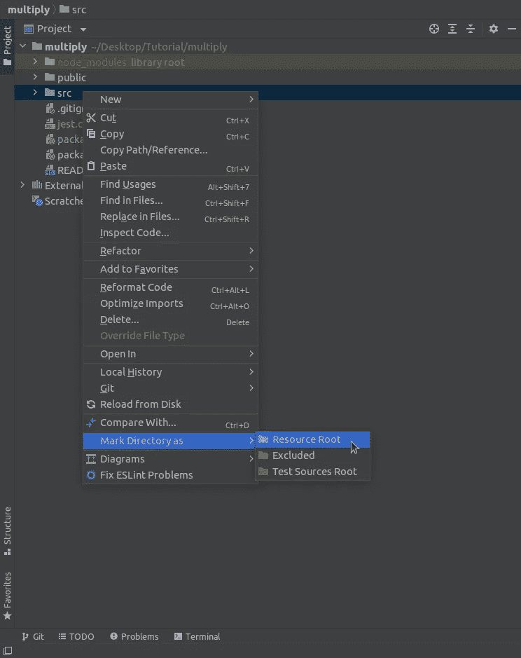
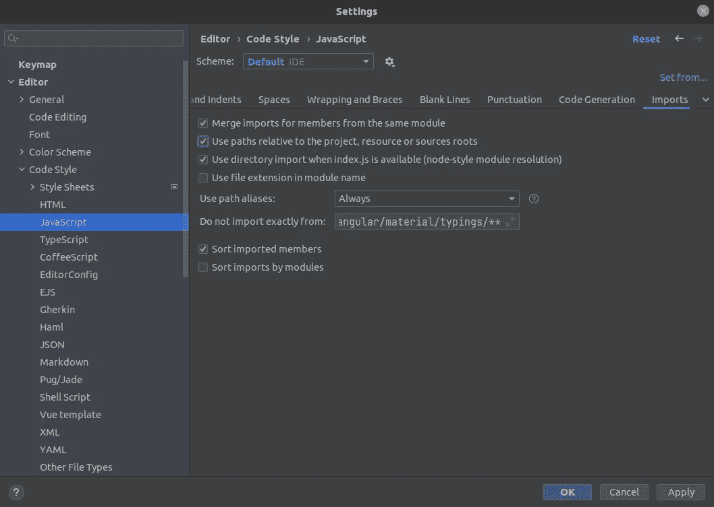
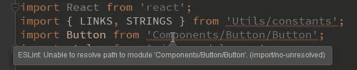
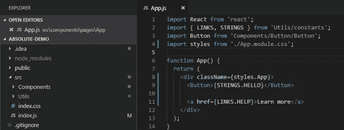

# 为什么以及如何在 React 中使用绝对导入

> 原文：<https://javascript.plainenglish.io/why-and-how-to-use-absolute-imports-in-react-d5b52f24d53c?source=collection_archive---------0----------------------->

## 前端

## 在 React 中保持代码整洁的简单方法


Photo by [Ketut Subiyanto](https://www.pexels.com/@ketut-subiyanto?utm_content=attributionCopyText&utm_medium=referral&utm_source=pexels) from [Pexels](https://www.pexels.com/photo/crop-faceless-man-packing-box-with-scotch-tape-4246109/?utm_content=attributionCopyText&utm_medium=referral&utm_source=pexels)

使用绝对导入来更好地组织 React 项目是一个很好的方法。相对导入在重构过程中很难遵循和打破。随着项目的增长，绝对导入更容易管理您的项目。忘记这篇文章后的长期相对进口。这是我的第 40 篇中型文章。

# 问题是

如果你的项目的文件夹结构很复杂，你需要在里面**往上**走怎么办？在您的组件内部，您有看起来像下面的相对导入示例的导入。

```
import {MyComponent} from ‘../../../../components/MyComponent’;
```

您可以通过更改导入您的`MyComponent`的组件的路径来中断上述导入。让我们假设您决定将`MyComponent`移到它自己的文件夹中。然后你需要更新项目中所有的导入，并在所有的导入中添加一个额外的`../`。相对进口有更多的问题。

*   很难重构
*   随着你越陷越深，情况变得越来越糟。
*   如果需要提取代码作为 NPM 模块在外部使用，则需要更改整个代码库。

# 绝对进口

通过使用绝对导入，您可以将一些文件夹作为别名，如下所示:

```
import {MyComponent} from ‘components/MyComponent’;
```

绝对进口有一些优势。

*   没有`../../../../hell`。因此更容易打出进口。
*   轻松地将导入的代码复制粘贴到项目的另一个文件中，而不必修改导入路径。
*   它又短又甜

以下示例是一个具有相对导入的文件。

使上面文件中的导入更加漂亮。

因此，如何使用带有 ReactJs 的绝对导入呢？

## 使用 TypeScript

如果您需要在您的 Typescript 应用程序中设置绝对导入，请在项目的根目录中添加/更新您的`tsconfig.json`文件。然后需要更新文件中的编译器选项`baseUrl`。

## 使用 JavaScript

设置 Typescript 的绝对导入和设置 JavaScript 的绝对导入几乎是相同的过程。在项目的根目录下创建`jsconfig.json`文件。然后，您需要更新以下代码片段。

现在，您可以像这样导入组件。

```
import {MyComponent} from ‘components/MyComponent’;
```

您也可以使用编译器选项`paths`。也许你想别名你的`component`文件夹。为此，您需要设置您的`tsconfig.json`或`jsconfig.json`，如下所示:

```
{
  "compilerOptions": {
    "baseUrl": "./",
    "paths": {
      "@component/*": ["src/components/*"],
    }
  }
}
```

现在，您可以从组件文件夹中导入组件，如下所示:

```
import {MyComponent} from ‘@component/MyComponent’;
```

够了吗？

嗯，不…你需要让你的 IDE 变得智能，以理解文件中的绝对导入。在这里，我将提到前 2 个 ide 的进展。那些是 VS 代码和 WebStrom。

## 对于 VS 代码

VS 代码足够聪明，可以理解`tsconfig.json`，或者说`jsconfig.json`文件。Intellisense 和跳转到源代码在绝对导入时工作良好。

所以，你可以按照上面的流程。

## 对于 WebStrom / IntelliJ Idea

在项目窗口中选择 src 文件夹，并右键单击它。选择选项**将目录标记为**，然后选择**资源根**选项。



现在进入**设置**->-**编辑器-**->-**代码样式**->-**JavaScript**和**-**选择**导入**标签页。然后检查**使用相对于项目、资源或源根的路径**。



现在 WebStrom 知道绝对进口指向哪里。不会有任何警告，自动完成/跳转到源代码将工作。这意味着自动导入机制使用绝对导入。

如果你和我一样是个严格的开发者，就用 Airbnb 的 ESLint config 之类的吧。

## 使用 ESLint

Create React 应用程序也有一个 ESLint 设置，但它有一个最小的规则集。Airbnb 使用 eslint-plugin-import ，该插件检查未定义的导入。当你打算使用 Airbnb 的 ESLint 配置时，它会给出如下所示的错误:



您可以通过在 ESLint 配置中添加`settings`属性来修复这个错误。你导入的那个设置点可能是相对于`src`文件夹的。因此，您需要在`.eslintrc`文件中添加更新您的 ESLint 配置，如下所示:

你不需要安装任何 NPM 模块来避免 ESLint 错误，添加`settings`道具就足够了。

## 按照惯例

长期以来，Webpack 一直支持绝对导入。当你命名你的别名文件夹时，你需要使用 PascalCase/CamelCase，因为这是在 [Webpack](https://webpack.js.org/configuration/resolve/#resolvealias) 中遵循的惯例。



# 结论

绝对导入可能会让新开发人员困惑一段时间。如果他们理解它，那么它很容易使用。因此，我建议在您的自述文件中包含几行关于导入机制的内容，或者您可以链接到本文。在我发表这篇文章后，我不打算改变任何内容。我希望你喜欢这个小技巧，以便更好地组织你的 React 项目。

祝编码愉快！😃

*更多内容请看*[***plain English . io***](http://plainenglish.io/)