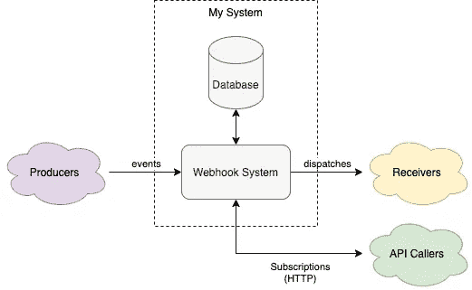

# 为什么以及何时应该使用 console.error()

> 原文：<https://javascript.plainenglish.io/why-and-when-you-should-use-console-error-58d600b924d0?source=collection_archive---------9----------------------->

## 以及为什么和什么时候你不应该

Think about who you’re telling game over — just because the player failed doesn’t mean the game failed. Photo by [Sigmund](https://unsplash.com/@sigmund?utm_source=unsplash&utm_medium=referral&utm_content=creditCopyText) on [Unsplash](https://unsplash.com/s/photos/error?utm_source=unsplash&utm_medium=referral&utm_content=creditCopyText)

几个月前，我在阅读 HTTP 状态代码时——就像人们不经意间所做的那样——偶然发现了两点:

1.  返回代码 418 是“我是茶壶”。这是一个愚人节玩笑——嗯，就像我们这些书呆子能开的玩笑一样。文末我会有链接。
2.  4xx 响应针对客户端导致的故障，而 5xx 响应针对服务器导致的故障。这些是不同的。

我内心深处知道这一点，但直到我从事一个特定的项目，我才意识到这种区别背后的智慧，以及它为什么重要。**错误处理** —开发和工程的区别— **需要理解所有参与者在系统中扮演的角色。**不同的错误原因需要不同的处理，包括记录警告和错误。

如果你读过“停止使用 console.log！”文章，那么就把这个当做第二步。在工程中，不在于知道方法是否存在——ide 会为您做到这一点——而在于知道何时使用它们。

## 你的系统里有哪些演员？

在工作中，我正在构建一个 webhook 通知系统，这样第三方就可以收到关于产品内部发生的事件的通知。我用它作为一个例子，因为它有许多演员，不同类型的互动，也因为它是我的首选。

生产者将事件推送到我的系统。开发人员和我从事同样的产品。

**API 调用者**是扩展我的产品的其他公司编写的第三方应用程序(HTTP 客户端)。对我的 API 的请求是由用户在设置时在其应用程序中触发的。开发人员从事不同的产品，可能和我在不同的公司工作。

**接收器**是每当我从生产者那里听到一个事件时，从我的系统接收 HTTP 请求的服务器。在这种情况下，我的系统是 HTTP 客户端，他们的是 HTTP 服务器。拥有 API 调用者的人也拥有接收者。

**Webhook 系统操作员**是管理和支持系统的人员，他们试图保持系统的更新和可用性。与这些人交流的最常见方式是通过日志，尽管我们也有指标和警报。(我们碰巧实践了 DevOps，这意味着开发人员和操作人员在同一个 scrum 团队——或者，在我们的例子中，是同一批人。)

最后，我们有**支持团队成员**。他们对帮助 API 调用者在调用时诊断问题感兴趣。他们也看日志，虽然不是同一个日志。

让我们通过一些错误来说明正确的错误处理。

## API 调用程序缺少参数

当告诉我的系统第三方想要接收事件时，API 调用者忘记包含我的系统发布事件的 URL。这个错误是 API 调用者的错误。如你所料，我们返回一个 400 错误。

我们应该记录吗？**是的，因为支持**。API 调用者可能会尝试诊断这个 400 错误，并呼叫支持人员寻求帮助。在这种情况下，日志可能包含更多信息。(出于安全原因，尽量避免在 API 响应中将堆栈跟踪发送回客户端，因为行号的相关性可能会将包版本泄露给第三方，从而暴露系统中的漏洞)

既然支持是我们想要记录的主要原因，我们应该在“信息”处记录。

**旁注:为什么日志级别很重要？**

您可以——也想——配置您的应用程序，以**不同的方式对待不同的日志级别**。例如，我们在开发环境之外禁用调试日志，这对 **PII 合规性**很有帮助。我们还有一个系统，如果出现几个“错误”日志，或者出现大量“警告”日志，它会**寻呼** **操作员**(例如，在凌晨 3 点被电话叫醒)，因此问题可以得到解决。

**横向注释:如何获得不同的日志级别？**

在 Python 中，查看核心`logging`包；在 Java、SLF4J(或任何时下流行的东西——Java 中有太多的日志包，我的 IDE 自动完成功能很混乱)；在 Node 中，您可以“monkeypatch”控制台对象。您也可以使用一个包，尽管您使用的其他包可能不支持日志包。

## API 调用方请求失败:无法访问数据库

出了问题，只有操作员才能解决。我们希望他们尽快恢复可用性，即使是凌晨 3 点。他们需要被呼叫。

在这种情况下，我们记录一个错误。

我对 API 的经验法则是**如果你返回一个 5xx** (表示服务器错误)，错误级别的**日志。对于事件驱动的系统，如果您因为系统中的某个问题而进入死信队列，错误日志可能是合适的。**

## 生成器发送了一个无效事件

这个比较棘手。这是我们产品的错误，但不是我的团队的错误。

我们选择“警告”,因为在我们的情况下，这可能是有人在开发，而不是上游致命错误的结果。此外，在生产者系统上工作的开发人员处于不同的时区——他们的工作发生在我们睡觉的时候——所以我们不想在那个时候被分页。他们可以看到我们的日志，所以他们可以寻找“警告”来调试他们的问题，或者我们可以在双方都方便的时候帮助他们。

如果我们看到大量的“警告”日志，我们仍然会被分页，所以我们仍然会被生产。

因为如果这个问题发生在 prod 中，我们可能能够恢复它，所以我们将它发送到死信队列，以便我们可以在问题解决后赶上进度。

## 向接收人发送派单时出错

这可能是接收者的错，也可能是我们的错。可能第三方接收器正在经历断电或维护窗口，或者过载。或者，也许第三方开发商只是想收支平衡。或者，也许我们这边的网络变化正在破坏我们发送请求的能力。我们并不总是能区分这两者(尽管有时我们能)。

在我们不确定的情况下，我们记录“警告”，因为我们不想被寻呼，如果只是因为一些坏的接收器而发生的话。如果我们因为我们这边的错误而一次看到一大堆这样的错误，那么我们在“警告”日志上的更高的阈值就会呼叫我们。

# 结论

只是因为它是一个错误并不意味着它是你的错误。错误处理期间适当级别的日志记录是为了解决支持、操作、合规性和系统接口问题。不要只是`console.log`，也不要只是`console.info`、`console.error`等。；在**右水平**处登录**右原因**。

## 如约而至:“我是茶壶”

*   MDN 上的信息太多了:[https://developer . Mozilla . org/en-US/docs/Web/HTTP/Status/418](https://developer.mozilla.org/en-US/docs/Web/HTTP/Status/418)
*   更简短更有趣:[https://httpstatuses.com/418](https://httpstatuses.com/418)