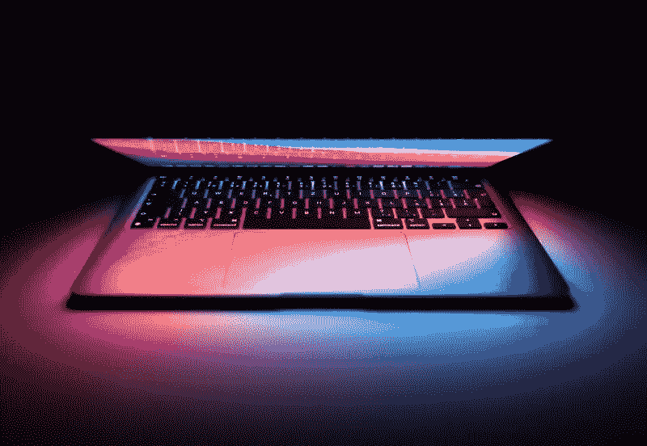

# 为什么很多开发者如此钟情于 MacBook？

> 原文：<https://javascript.plainenglish.io/why-are-many-developers-so-in-love-with-the-macbook-58ea38b58c86?source=collection_archive---------1----------------------->

## 我用了一台 MacBook Pro 两年后的评估。

Photo by [Martin Katler](https://unsplash.com/@martinkatler?utm_source=medium&utm_medium=referral) on [Unsplash](https://unsplash.com?utm_source=medium&utm_medium=referral)

2018 年圣诞节后不久，我给自己买了一台 MacBook Pro。

这台小小的 13 英寸笔记本电脑是我买过的最贵的东西。我花了一年多的时间为它存钱。这个时候，我是一个破产的学生。你可以想象我对这个决定考虑得有多透彻。

现在用了 2.5 年，什么都不后悔。购买这种昂贵的技术是我做过的最好的决定之一。我终于明白为什么那么多开发者喜欢 MacBook 了。但这是为什么呢？

以下是所有对我们有益的东西。

# 恰到好处的键盘

在我买 MacBook 的 3 年前，我制造了我的第一台 Windows PC。作为输入设备，我花了 170 美元买了一个机械键盘。我喜欢这个键盘。当我换成 MacBook 的时候，我很喜欢它。

我的 MacBook 一代已经有了第二或第三版的苹果蝴蝶键盘。诚然，这种键盘技术的第一代相当臭名昭著，因为它不存在对污垢和灰尘的抵抗力。然而，在第二代或第三代，情况要好得多。

我喜欢这个键盘。超级精准，手感优雅，按键很容易按。清洁也很容易(我的手出汗很多，哈哈)。

起初，许多人被按下一个键所需的微小压力淹没了。然而，你很快就习惯了，并开始欣赏它。

那时使用我的机械键盘经常会导致几个小时的疼痛。另一方面，在 MacBook 上，长时间打字不会太累。

# 操作系统

在买 MacBook 之前，我曾经想过一件事:为什么一台 MacBook 的操作系统如此“封闭”，却有那么多开发者在用它？

我以为 MacOS 就像这些儿童玩具电脑(还记得这些伟易达的东西吗？).我错了。macOS 是一个强大的开放平台。也许不像 Linux 那样可定制，而是一些天赋正常的人可以毫无问题地使用的东西。

Mac 操作系统基于 Unix。因此，我们可以从 Linux 机器上运行几乎所有我们知道的命令。在我看来，这是一个巨大的好处。是的，在 Windows 上，如果你想执行 Bash 脚本，你可以安装 Linux 子系统。我用了好几年了。尽管如此，macOS 的原生支持比 Windows 上的 Linux 子系统要简单得多。

除了 Unix 基础的优势之外，还有其他优势。

对我来说，操作系统感觉很棒。它易于使用，易于理解，如果有问题，官方文档非常棒。与 macOS 不兼容定制的神话相反，事实上，你可以做很多事情。我为系统设置安装了几个插件。例如，系统顶栏中的菜单指示器提供了有关 CPU 负载、网络流量等的详细信息。

# 也许是世界上最好的触控板

笔记本电脑本质上只为一件事而生:无论你去哪里，都可以随身携带。你的笔记本电脑在火车上，飞机上，厕所里，或者你奶奶家都是你的。

问题是:不是在任何地方，我们都可以使用外接鼠标。对于我的旧 Windows 笔记本电脑，这种情况已经结束了。没有鼠标的空间？不要用我的笔记本电脑。

触控板是一个迷因，对于许多笔记本电脑来说仍然如此。MacBook 的情况并非如此。

触控板甚至非常好，我从来不用鼠标。它很精确，手感很好，足够大，对许多手势都很敏感，使使用 MacBook 变得容易得多。一些苹果粉丝对触控板如此着迷，以至于他们为 iMac 购买了一个外置触控板，而不是鼠标。

# 可靠性

MacBook Pro 的图像(至少在软件方面)非常可靠。我同意这一点。原因很简单:虽然 Windows 和其他操作系统可以在各种机器上运行，但 MacOS 只为苹果的机器量身定制。当然，这可能会使优化变得更加容易，从而简化新 Mac 的设置。

# 设计

我是好营销的受害者。我说出来了。苹果在营销 MacBooks 和 MAC 系列产品方面做得非常好。他们活动的核心动机是:Mac 不是一台普通的电脑。Mac(书)是更有价值、更优雅、更适合创作者的东西。我相信这一点——这种特殊的感觉持续了很久。

我喜欢 MacBook 的设计、稳定性和整体感觉。对我来说，这种感觉是富有成效的——使用你认为优雅和值得的设备会给你一种感激和力量的感觉。是的，你可能会认为我疯了——然而，我认识的许多 Mac 用户都有同样的感觉。

除了 MacBook 设计的美学方面，还有一个实际的好处:这款电脑非常耐用。由于其稳定性，无论您去哪里，它都是您随身携带的理想机器。有一次，我的 MacBook 不小心撞到了墙上，只在墙上撞出了一个小洞。

# 访问专有软件

对于网络开发者来说，有一个关于浏览器的巨大挑战:Safari。尽管我们热爱 Chrome 和基于它的一切，但真正的客户有不同的看法。凭借其约 20%的市场份额，网络开发者在构建网络应用时不能忽视 Safari。

除了构建网络应用，macOS 对于构建另一种应用也是必不可少的:IOS 应用。即使你没有使用苹果的工具进行开发——在应用商店发布应用程序也需要一台 macOS 机器。

我知道许多人几乎讨厌苹果的软件政策。我能理解。然而，抱怨不会完成应用程序。如果你想在 IOS 上发布或者在 Safari 浏览器中测试，你需要一台 macOS 机器。

# 您仍然可以访问 Windows 或 Linux

MacBooks 不是单向的。除了 macOS，你可以在上面自由安装其他操作系统。Windows 或 Linux 是 macOS 的两个典型替代或补充。所以，当你买 MacBook 的时候，你不必说再见。

感谢您的阅读！

**如果你想加入 Medium 同时支持我:
你可以在这里** ***购买订阅** [**。**](https://louispetrik.medium.com/membership)

**附属链接。如果你使用这些链接购买一些东西，我会赚取佣金，但没有额外的费用给你。非常感谢！*

# 来源

[1]:[https://www . statista . com/statistics/272697/market-share-desktop-internet-browser-](https://preactjs.com/guide/v8/switching-to-preact/)

*更多内容请看*[***plain English . io***](http://plainenglish.io/)