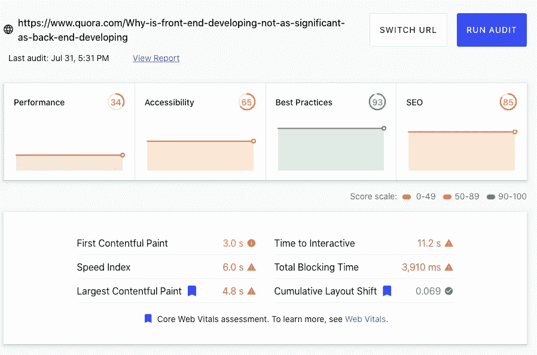

# 为什么后端不优于前端

> 原文：<https://javascript.plainenglish.io/why-backend-isnt-superior-to-frontend-ff18494834fe?source=collection_archive---------18----------------------->

## 前端和后端一样有价值的 3 个原因。

Photo by [fauxels](https://www.pexels.com/@fauxels?utm_content=attributionCopyText&utm_medium=referral&utm_source=pexels) from [Pexels](https://www.pexels.com/photo/photo-of-man-sitting-in-front-of-people-3184299/?utm_content=attributionCopyText&utm_medium=referral&utm_source=pexels)

*前端简单。后端是真正的交易。呈现数据有多难？*

我两个都做过。棱角分明的 Spring Boot。两者都有好的一面，也有障碍。

这就是前端作为后端有价值的原因。

# 前端很复杂

您创建了一个 REST 端点。前端调用该端点。前端呈现数据。*简单的东西。*表示是标记，抓取是内置特性(fetch API)，样式是次要问题。我们可以得出结论， ***前端就是简单的*** 。

***无*** 。前端担心原生标记。前端担心可访问性。前端担心用户体验。 ***前端复杂。***

Report of Quora — web.dev

我们只是触及了表面。即使是知名网站也存在性能检查的问题。绘画时间，互动时间，速度指数。这些影响到 UX。没有客户喜欢一个缓慢的网站。

前端和后端需要同样的关注。前端担心用户，他们的体验，并改善外观。后端担心核心、数据建模，并向前端提供正确的数据。对于工作应用程序来说，这两者都是必不可少的。

你应该活在两个世界里。最近工作的 React 团队。他们有 CORS 的问题。他们不知道出了什么问题。这个问题导致错过了最后期限。即使你是前端开发人员，也要了解后端的基础知识。

# 前端变成了真正的编程

***前端开发者有一份轻松的工作。*** 他们使用 React 模板。他们有框架。他们过得很轻松。

***后端开发者磨。*** 我们创建 REST 端点。担心缓存。我们管理环境。我们关心真正的软件架构。我们做艰苦的工作。

我开发了一个企业角度应用程序。棱角分明很难。你必须管理状态，创建组件，考虑数据。也增加了造型。这非常容易。更像是黑魔法让一切运转起来。

后端运行在服务器上。前端服务于客户端设备。客户在 IE 中访问你的网站。顾客有一定的残疾。*好的前端开发者满足客户需求。*

***好的前端——更多的收益。***

*Pinterest 减少了 40%的感知等待时间，这* [*增加了 15%的搜索引擎流量和注册量*](https://medium.com/@Pinterest_Engineering/driving-user-growth-with-performance-improvements-cfc50dafadd7) *。*

*当* [*自动分析将页面加载时间减少一半*](https://www.digitalcommerce360.com/2010/08/19/web-accelerator-revs-conversion-and-sales-autoanything/) *时，他们的销售额增加了 12%到 13%。*

后端是真正的交易。前端把钱带进来。顾客应该是第一位的。没有好的前端，优秀的后端就没有意义。 ***你会去一家菜肴很棒，但服务员很差的餐厅吗？这同样适用于应用程序和网站。***

你的服务是一个 API？前端不用担心。想到 [**幽灵厨房**](https://www.cloudkitchens.com/blog/ultimate-guide-to-ghost-kitchens-in-2021/) 。糟糕的交付——不关你的事。你的餐厅继续收到订单。食物很棒——你的餐馆会活下去的。当不涉及前端时，后端才是真正的交易。

# 后端开发者学不来前端

前端打印数据。我们发送的数据。演示很简单。我们可以学习呈现数据。*后端开发者可以学习前端。*

前端开发人员使用 JavaScript 获取数据。JavaScript 没那么难。毕竟我们在做真正的编程。*后端开发者可以学习 JavaScript。*

***我们学不了前端。*** 我正在做棱角分明的 6。天知道现在什么是棱角分明。你不能一直了解最新的发展。前端世界的速度更快。

现代前端开发人员避免使用 JavaScript。他们使用 Typescript、 [Elm](https://elm-lang.org/docs) 或其他上标。学习 JavaScript 会有帮助，但对 **Typescript** 没有帮助。我们脱离了前端循环。

坚持做你最了解的事情，后端。

你跟不上这个速度。前端继续前进。后端发展没那么快。擅长一个堆栈，变得具体。

特定的知识是你无法接受训练的知识。如果社会能训练你，它也能训练其他人，取代你。[**](https://twitter.com/naval/status/1002103360646823936)

*前端开发者学不会后端。他们很难理解数据结构、算法和其他概念。我不希望前端开发人员加入我的团队。我想他们对我们的想法是一样的。*做自己* ***最了解的事情，创造更好的软件。****

## *外卖食品*

*后端并不比前端优越。前端也不优于后端。*

*我们都在战壕里。我们都需要满足客户的需求。我们都喜欢编码。我们应该一起工作，而不是相互对抗。*

**更多内容请看*[***plain English . io***](http://plainenglish.io/)*