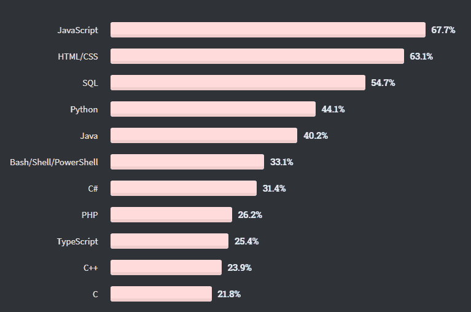

# 为什么选择 MEAN Stack 进行 Web 和移动应用开发？

> 原文：<https://javascript.plainenglish.io/why-choose-mean-stack-for-web-and-mobile-app-development-b0d22b810f24?source=collection_archive---------12----------------------->

## **12 个有趣的理由:为什么你应该为你的下一个网络和移动应用选择 MEAN Stack】**

毫无疑问，21 世纪是一个数字化的时代，无论是小型企业还是大型企业都投入资源、金钱、时间和精力来构建一个应用程序，为他们的业务增加竞争优势。

虽然 app store 和 play store 上已经有 550 万个应用程序，但构建一个集成了正确技术的独特应用程序已经成为企业的一个大问题。

在这个竞争激烈的市场中保持领先的一个独立解决方案是雇用最好的应用程序开发人员，并选择标准化和一致的顶级技术堆栈。

然而，从头开始开发一个应用程序需要大量的工具和技术来帮助最小化开发时间和精简资源。因此，使用各种技术的独特组合来确保更快、更高效的移动和 web 应用程序开发是一种常见的做法。

好消息是，现在有大量的软件栈可用，包括 LAMP、Ruby on Rails 等，它们可以让您为应用程序构建一个健壮、动态的后端和前端。但在所有这些中，MEAN Stack 脱颖而出，成为开发人员和企业中最苛刻的堆栈，可以解决所有与 web 应用程序开发相关的挑战。它不仅适用于包括领先企业和初创企业在内的各种业务，而且因为它基于 JavaScript，所以更容易使用。

在接下来的几分钟里，我们将探讨为什么为您的下一个企业应用程序开发选择 MEAN Stack 是一个明智的决定。

> **在此之前，让我们先了解一下 Stack 到底代表什么意思！**

## **均值叠加:了解基本概况**

MEAN Stack 是一系列基于 JavaScript 的技术，广泛用于构建动态网站和 web 应用程序。它是一个开源的全栈 JavaScript 框架系列，包括 MongoDB(数据库系统)、Express(后端 web 框架)、Angular(前端框架)。和 Node.js(后端运行时环境)。这些框架是开发复杂应用程序的理想组合。

这些技术是在不同的时间点出于不同的目的开发的，但是今天，MEAN Stack 已经将它们组合在一起，并且非常清楚地将它们用于应用程序开发项目。

在开发项目中使用 MEAN Stack 的最大好处是所有的框架都使用单一的编程语言，即 JavaScript。尽管 web 应用程序开发依赖顶级编程语言，但不出所料，JavaScript 仍保持着最常用编程语言的地位。

[Image Source](https://insights.stackoverflow.com/survey/2020#most-popular-technologies)

我们都很熟悉这样一个事实，即 JavaScript 在网站开发方面一直以提供最佳服务而闻名。但是有了 Angular、Node.js、MongoDB 和 Express 这样的框架，它在使 web 应用程序更加高效和现代化方面也取得了很大进展。

由于 MEAN Stack 基于 JavaScript，因此，它允许 [**移动应用程序开发公司**](https://www.xicom.ae/services/mobile-app-development/) 构建一个无缝工作于特定服务器端和客户端执行环境的解决方案。由于它在创建健壮、快速和可维护的 web 和移动应用程序方面的出色灵活性，MEAN Stack 非常受欢迎。

# **4 个 Web 开发框架让 MEAN Stack 成为赢家**

这些年来，对 MEAN Stack 开发的需求大幅增加，因为它可以构建健壮、快速且易于维护的 web 和移动应用程序。企业总是希望雇佣懂 JavaScript 和 MEAN Stack 技术的应用程序开发人员，比如 MongoDB、Express、Angular 和 Node.js。

因此，让我们从一些角度来看一下 MEAN 的首字母缩写词，并了解它们是如何支持 MEAN Stack 并吸引企业采用它来开发 web 应用程序的。

## **1。Node.js 和 Express (Web 服务器和后端开发框架)**

[根据这项调查](https://insights.stackoverflow.com/survey/2020#most-popular-technologies)，Node.js 是构建企业应用程序时使用的框架和编程语言的首选。

[Image Source](https://insights.stackoverflow.com/survey/2020#most-popular-technologies)

MEAN Stack 的 Node.js 和 Express.js 框架为 web app 开发做了一个完美的结合。所有从前端到后端的用户请求都将通过 Express。作为 Node.js 的框架，Express 可以与 Node.js 无缝协作，并有助于通过 MEAN 堆栈进行数据传输。

此外，Node.js 还提供了使用 MongoDB 作为均值堆栈的数据库，Node.js 中内部 web 浏览器的可用性可以帮助您建立 DBMS(数据库管理系统)。因此，它已经被业界的大公司如 LinkedIn、SAP、微软所采用。

Node.js 在 web 开发方面的强劲竞争对手是 Laravel 和 Rails，但是 Node.js 在该领域保持了强势地位，如下图所示。

[Image Source](https://stackshare.io/stackups/laravel-vs-nodejs-vs-rails)

## **2。MongoDB(数据库系统)**

MongoDB 是支持这种堆栈的最受欢迎的存储单元之一。它有效地存储数据，并在需要时检索它们。由于 MEAN Stack 和 MongoDB 都是基于 JavaScript 语言，但是任何一家 [**web 开发公司**](https://www.xicom.ae/solutions/web-development/) 都可以在存储或检索过程中将数据从一种编程语言转换成另一种语言，而无需改变编程语言。

这种数据库管理系统的杰出结构能够更好地存储数据。它使用文档类型的系统，并最小化使用表格的需求，因此在 web 应用程序开发中，数据库的可伸缩性和性能非常容易。

## **3。**角形(前端框架)

在 MEAN Stack 中，“A”代表 Angular，这是这个堆栈的真正主干。当纯粹专注于 web 框架时，我们看到 jQuery 仍然是王者，但年复一年地慢慢让位于 [Angular](https://insights.stackoverflow.com/survey/2020#most-popular-technologies) 。

[Image Source](https://insights.stackoverflow.com/survey/2020#most-popular-technologies)

Angular.js 还是最大的 Angular，是 UI 开发广为人知的前端 JavaScript 框架。它帮助开发人员为用户创造一种交互式体验。最重要的是，Javascript 库有助于用户请求从 Angular 平滑过渡到 MEAN Stack 的 Node.js。

**简而言之:**所有这 4 个框架的结合使 MEAN Stack 成为构建无缝运行在多个平台上的 web 应用的首选技术。你所需要的就是 [**雇佣一个应用开发者**](https://www.xicom.ae/solutions/hire-developers/) ，他拥有丰富的 JavaScript 知识和使用 MEAN Stack 开发渐进式应用的经验。

# **12 个令人信服的理由:为什么您应该为您的下一个项目选择 MEAN Stack？**

毫无疑问，MEAN Stack 已经成为全球网络和移动应用开发的热门技术。尽管它很受欢迎，但这种技术组合对于企业应用程序开发的潜力还是引发了一些问题。如果您也想使用这种技术堆栈来创建企业应用程序，但不确定它如何能够简化开发动态和快速加载应用程序的过程，那么下面是对您的深刻见解。

> **在这里，我列出了一些为企业开发选择平均堆栈的有趣理由:**

1.  **开发成本更低，交付速度更快**

每个企业都想保持竞争力，用 MEAN Stack 编码整个项目意味着你需要雇佣一个懂 Javascript 语言的 web 开发人员。你不必和一个精通不同语言的庞大开发团队一起工作。

这意味着用同一种语言工作的更好的团队沟通将提高生产力并减少摩擦。如果你把所有的因素都记下来，你就可以降低开发成本，同时保证更快的交付。

2.**网络应用的高性能**

企业应用程序开发需要巨大的投资、时间和精力。因此，作为企业应用程序的所有者，有一件事你永远也不想妥协，那就是应用程序的性能，并始终致力于提供无缝的用户体验。

而在用 MEAN Stack 开发 app 的同时，你可以毫无疑问的拥有优秀的 app 性能。MEAN Stack 拥有一系列高性能的 Javascript 技术，可以帮助开发缺乏想象力的 web 应用程序，这些应用程序具有原生容器，可以提供特定于平台的体验。

所以，当你在 MEAN Stack 里有了专家 [**软件开发公司**](https://www.xicom.ae/) 的专业知识，必然会有性能优秀的 app。

3.**可重用性使速度更快**

由于 Node.js 的非阻塞架构，MEAN Stack 开发速度快，可重用。

此外，Angular.js 已经是一个开源的 JavaScript 框架，对于开发人员来说，测试、可靠性和应用程序的维护变得非常容易。

4.**确保高灵活性**

通常，在应用程序开发完成后，开发人员会访问不同的平台来构建一个应用程序，并在多个平台上进行测试。

然而，当使用 MEAN Stack 开发应用程序时，您可以毫无困难地开发、测试和介绍应用程序。此外，一旦您为这些功能中的任何一个选择了它，它还允许您添加额外的信息。MongoDB 提供了完整的集群支持以及自动复制。

5.**单一语言用法**

选择 MEAN Stack 而不是其他技术的主要原因是因为它们在整个开发过程中使用单一语言，即服务器端和客户端都使用单一语言。由于 MEAN Stack 的所有缩写都是用 Javascript 编写的，web 应用程序开发过程变得更加简单和简洁。

如果考虑 MEAN Stack 的另一个竞争对手，那么 LAMP 会是另一个选择。但是那样的话，你就需要雇佣一个 [**的 web app 开发公司**](https://www.xicom.ae/solutions/web-development/)

有了在服务器上用 PHP 编写应用程序的经验，可以在客户端使用 SQL 和 JavaScript 查询 MySQL 数据。

现在比较一下，管理用单一语言编写的所有东西更容易集中精力还是使用多种技术用于不同的目的？当然，Javascript 无处不在，因此，你们中的大多数人都喜欢平庸的堆栈。

6.**易找技能**

有了 Node.js、Express 和 Angular，您就可以在开发人员的世界中获得最优秀的人才。所以雇佣一个网络开发人员意味着获得一个多任务者，而不必因为冗长的雇佣程序而耗尽自己的精力。

了解 MEAN Stack 的开发人员可以拥有前端和后端技术的专业知识。拥有 MongoDB 这样的 DBMS 的技能将是完美的锦上添花。

7.**云兼容**

关于 MEAN Stack 最好的部分是它在开发过程中使用库和公共存储库，这最终有助于降低整体开发成本。

此外，MongoDB 在应用程序中使用了云功能，从而降低了磁盘空间成本。

8.**MVP 开发和可扩展性的理想选择**

在选择确保理想的可扩展性和构建机会的技术堆栈时，MEAN Stack 将推动您构建可扩展的编程解决方案。

由于在栈内部有无数的额外结构、库和可重用模块是可访问的，因此，可以进行一些即时的安排，这节省了开发，并使使用 MEAN Stack 加速开发过程变得更加容易。此外，虽然 MEAN Stack 改变了整个企业应用程序开发流程，但并不令人疲惫，因此初创公司喜欢将这种堆栈用于应用程序开发。

9.**免费开源组件**

选择 MEAN Stack 进行 web 应用程序开发的最大原因是，它的所有组件都是免费的、开源的，并且可以更频繁地升级。它允许开发者根据自己的需求定制代码，Node.js 提供了丰富的 JavaScript 模块库。

10.**全球扩展社区支持**

MEAN 是一项全球知名的技术，已被全球各地的开发人员用于多个项目。

基于 JavaScript，MEAN 拥有充满活力和积极的开发者，他们已经提出提升到一个稳定和包容的社区。你所需要的只是谷歌一个问题，你可以找到完整的程序解决方案，即使是新手开发者也很容易获得。

这是因为 MEAN Stack 是开发人员的演示工具，您可以毫不费力地选择它。

11.**适合实时应用**

实时应用程序被称为交互式应用程序，可以帮助您让客户保持更长时间的参与，例如视频会议应用程序。

所以在这里，Node.js 帮助 MEAN Stack 实现了实时应用的兼容性，许多领先的行业巨头都承认了这一点。LinkedIn、沃尔玛等大品牌都在使用 Node.js 开发实时应用。

12.**使用 JavaScript 符号**

在使用 MEAN Stack 开发的情况下，您肯定会在 Angular 和 Node.js 中使用 JSON 格式来存储数据。这种格式是大型项目的理想选择，可以确保数据的无缝管理。换句话说，如果你选择与一家 [**应用程序开发公司**](https://www.xicom.ae/services/mobile-app-development/) 合作，那么专家将在整个应用程序中使用 JSON 格式，并减少重新格式化数据的需要。

> **那么，你怎么说，MEAN Stack 对应用开发没用吗？**

如果你仍然不相信，那么看看均值堆栈的架构，了解它是如何工作的…

## **MEAN Stack 的架构:这个栈到底是怎么工作的？**

由最流行和最有潜力的 JavaScript 框架组成，MEAN Stack 就像一台润滑良好的机器。它是一个高效的系统，可以提供出色的用户体验，让您的业务更上一层楼。

*我们来了解一下如何！*

在 JavaScript 中，Angular 是一种客户端语言，因此每当客户端发出任何请求时，它总是会通过 Angular。

接下来，该请求进入 Node.js，这被认为是作为服务器端语言的第 2 阶段。

接下来，请求移动到表示向数据库发出请求的位置。一旦 Express 发出请求，MongoDB 就会检索所有数据并将响应返回给 Express。

*同理，Express 返回 Node.js 的响应，然后最后到达 Angular。*

*听起来很酷！*

## **何时选择开发项目的平均堆栈？**

现在，即使在阅读了 MEAN Stack 的特征(这些特征已经给出了选择它作为企业应用程序开发项目的强有力的理由)以及它的每个框架如何为这个堆栈做出贡献之后，你们中的许多人仍然处于两难境地，即您可以选择使用 MEAN Stack 开发什么类型的项目？

MEAN Stack 是创建应用程序、动态 spa、复杂业务应用程序、社交媒体应用程序、web 应用程序、企业应用程序等的完美技术选择。

> **MEAN Stack 可以在不同类型的 app 中使用，例如；**

*   面向大数据的 Web 应用
*   实时应用
*   流媒体应用
*   企业复杂应用
*   二级商业应用

> 下面是平均堆栈的真实使用案例:

*   脸谱网
*   照片墙
*   油管（国外视频网站）
*   网飞
*   PayTM
*   Tumblr
*   福布斯（美国出版及媒体集团）
*   闪烁（光）

MEAN 的使用完全取决于你选择为项目雇佣的技术专家的技能。这完全取决于他们的技能和专业知识——他们如何从中获得最大收益。还有，要看项目的规模和大小。

# **结论**

总结这篇博客，可以公平地说，MEAN Stack 技术正在不断改进，并且带来了更多的东西。为了以最佳方式利用 MEAN Stack 的力量，值得雇用一家 [**移动应用开发公司**](https://www.xicom.ae/services/mobile-app-development/) ，他们可以使用 MEAN Stack 的迷人特性创建安全的 web 应用和其他应用。

所以，如果你真的打算开发一个 web 应用，那么不要错过一个技术平台，它可以帮助你为你的企业获得更快、更安全、更便宜的应用。

*更多内容请看*[*plain English . io*](http://plainenglish.io/)